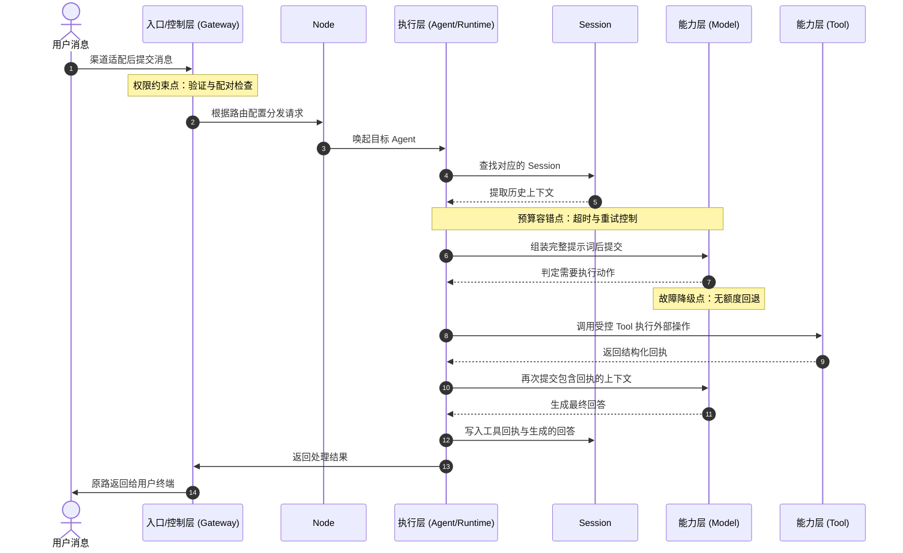

## 1.2 架构与核心概念

本节给出 OpenClaw 的工程化架构视图，目标回答四个问题：系统如何分层、系统包含哪些核心组件、一次请求如何流转、故障应先查哪一层。

### 1.2.1 四层架构

OpenClaw 可以抽象为四层，每层职责独立，便于扩展和排障。这种分层的核心目的是实现组件的“可插拔”与“可替换”：渠道可变、模型可换、工具可扩展，但其核心控制规则和运行语义保持稳定。本小节将详细介绍这四个层级，包括入口层、控制层、执行层和能力层。

#### 1. 入口层：协议适配与事件接入

入口层是 OpenClaw 接触外部世界的最前端，具备多渠道收件箱（Multi-channel inbox）特性。其主要职责是接收来自于各种[原生渠道](../03_minimal_loop/README.md)（如 WhatsApp、Telegram、Slack、Discord、Signal、BlueBubbles、Microsoft Teams、Matrix 等）的原始通信事件，并将其统一转换为 OpenClaw 内部认知的通用事件格式。该层屏蔽了各种底层协议（包括 Webhooks、WebSockets 或轮询机制）的差异，确保上层业务无需关心用户所在平台的特性。相关渠道的接入与拓展详见[多渠道分发与多智能体协作](../07_multi_agent/README.md)。

#### 2. 控制层：全局中枢与安全门控

控制层是系统的防火墙与流量调度总枢纽。所有经过入口层转换的请求，都必须在这里接受检阅。核心组件 [Gateway](../09_gateway_protocol/README.md) 基于独立且统一的 WebSocket 网络构建，不关心消息具体内容，只负责确认“来者何人”、“去向何方”以及“有何权限”。它执行终端配对、身份鉴权、速率拦截以及多智能体路由（Multi-agent routing），直接决定请求是否允许进入核心执行资源区。在部署架构上，Gateway 还可以自动化集成 Tailscale Serve/Funnel 或 SSH 隧道进行[安全的远程服务暴露](../08_automation_ops/8.3_remote_access.md)。

#### 3. 执行层：推理引擎与会话驱动

一旦请求通过 Gateway 门控，便交由底层基于 RPC 模式运行的 [Pi Agent 引擎](../10_agent_loop/README.md) 处理。这是整个智能体系统的大脑。执行层的核心任务包括：通过[会话标识（Session）](../06_context_memory/6.1_sessions.md)提取历史语境，将系统配置与当前诉求拼装为结构化提示词，并唤起大模型的推理循环。

其强大的 Session 模型不仅支持通过专有工具链实现智能体间的直接协作，还在安全上进行了硬隔离——针对群组或非主渠道的请求启用 [Docker 沙箱机制（Docker sandboxing）](../11_reliability_security/11.4_guardrails.md)，防止越权操作宿主机。

更重要的是，当模型触发外部工具调用意图时，运行环境负责暂停推理、执行工具命令、获取回调并将其再次注入循环。同时它还掌控了超时、重试与终止等运行时策略。

#### 4. 能力层：可替换的基础底座

能力层是提供具体生产力的基础设施聚合单元。其中包括两部分：一是[大语言模型供应商](../04_config_models/README.md)；二是承接具体外部动作的[工具集](../05_tools_skills/README.md)。在 OpenClaw 原生生态中，最具特色的工具基础设施包括：独立的 [浏览器管控能力（Browser control）](../05_tools_skills/5.4_browser_nodes.md)、由智能体驱动的视觉交互工作区（Live Canvas）、支持跨设备协同的 macOS/iOS/Android 端侧设备节点（Device nodes，提供相机抓取、屏幕录制等原生能力），以及始终在线的实时语音唤醒模式（Voice Wake 和 Talk Mode）。在架构中，模型负责输出意图，而工具负责将其转化为行动及其反馈。它们作为可插拔单元，不断为执行层输出动能。

### 1.2.2 五大核心对象

对应上述的四层架构，系统中的所有抽象名词最终都落实为以下五个核心对象，它们决定了系统的配置、排障与扩展切入点：

- **Gateway（网关）**：位于控制层，是系统的入口总闸与路由中枢。负责身份验证、终端配对和连接管理。它只处理"谁能连、消息交给谁"，不参与任何提示词组装或推理逻辑。
- **Agent（智能体）**：位于执行层，不只是一个语言模型的封装，而是一个完整的任务执行单元。它定义了记忆如何拼接（Session 策略）、哪些工具可以使用（工具策略）、以及默认的模型选择，从而具备领域专家级的行动意图。
- **Node（节点）**：业务隔离与资源分区单元。通过 Node 可以将不同业务隔离调度，避免跨业务的资源争用和权限击穿。
- **Tool（工具）**：位于能力层，大模型与外部系统交互的受控执行单元。每个 Tool 都有标准化的输入输出契约和明确的失败语义。
- **Session（会话）**：位于执行层，将零散交互串联为有状态对话的核心机制。Session 负责维系历史记忆，将之前的对话成果提取并注入到当前请求的上下文中。

### 1.2.3 请求流转与协作逻辑

为了理解系统如何实际流转数据，必须追踪一次标准请求的完整生命周期。以下通过一个简单的场景（用户发送消息查询情况）来还原五大对象的协作流程，并标注出潜在的安全与性能约束所在。

图 1-1：一次请求的核心流转路径与四大组件协作

在上图的流程中：
1. **步骤 ①②③**：用户消息到达，**Gateway** 完成身份验证与配对检查，根据路由配置将请求分发到对应的 **Node**。
2. **步骤 ④⑤⑥⑦**：目标 **Agent** 被唤起，查找用户 **Session** 提取记忆，组装提示词发送至模型。本环节包含了预算容错控制。
3. **步骤 ⑧⑨⑩⑪**：模型在意图推理后，决定外部动作，触发 **Tool** 并获取回执。此阶段受故障降级策略的保护。
4. **步骤 ⑫⑬⑭**：模型根据回执生成最终文本，写入 Session，通过 Gateway 抛回终端。

### 1.2.4 分层排障锚点与配置速查表

由于架构严格分离，排障可采用“由外到内扫描”策略。每个核心对象一旦配置不当或发生故障，都有典型的业务表现。下表合并了分层排障锚点与配置症状：

| 层级与核心对象 | 核心功能与职责 | 典型故障表现与排障方向 |
| --- | --- | --- |
| **入口层 (Channels)** | 将各渠道协议整合为标准事件 | 日志缺乏流入记录；客户端反复“连接断开”。排查：Webhook 配置、网络连通性。 |
| **控制层 (Gateway/Node)** | 连接保持、全局鉴权、路由边界 | 系统内“秒级红信拒绝” (Unauthorized)，但不报错给模型。排查：终端配对文件、路由拓扑、访问限制。 |
| **执行层 (Agent/Session)** | 拼接记忆、重试管理、沙箱隔离 | 思考极长报错、死循环死锁、完全无上下文、回答偏离角色。排查：Context 长度、Agent JSON 配置、Compaction 压缩参数。 |
| **能力层 (Tool/Model)** | 外部交互、生成补全 | 无动作响应、收到 429 限流报错、调用未释放。排查：模型额度、工具元数据、探活探针。 |

综合来看，若遇到“间歇性缓慢且幻觉增加”，应首查 **执行/能力层**；如果“无任何动作响应甚至秒拒”，首先追溯 **入口/控制层**。
