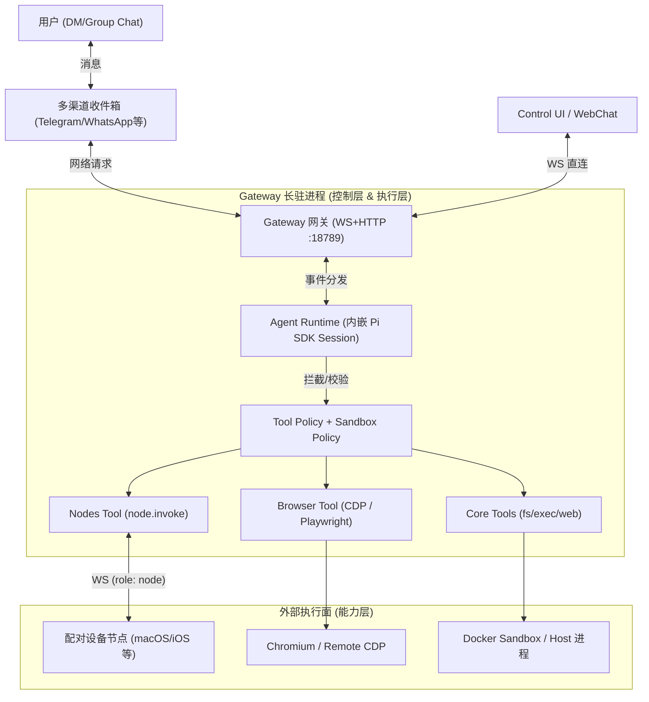
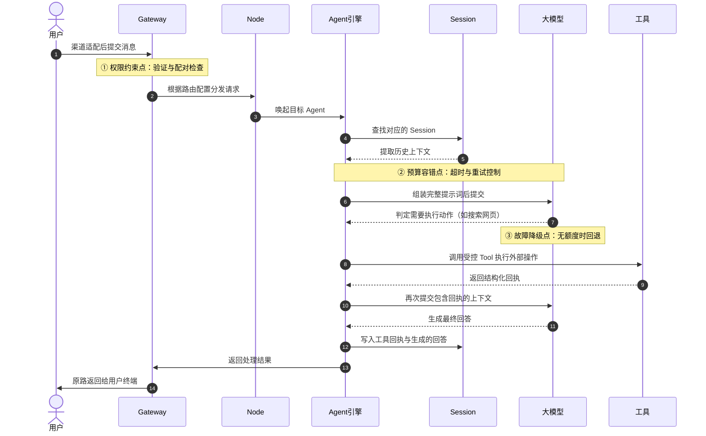
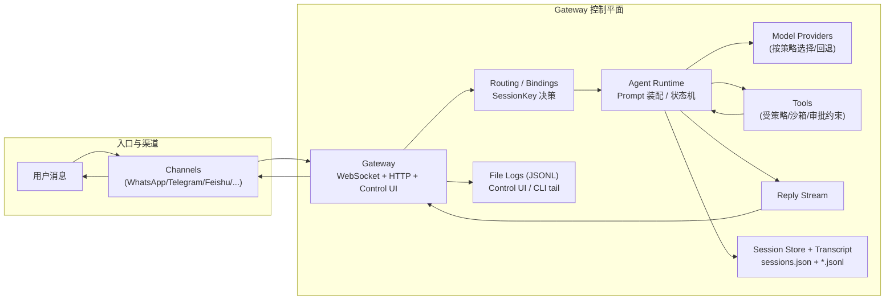

## 1.2 架构与核心概念

本节解释 OpenClaw 的系统架构——它由哪些部分组成、每部分负责什么、一条消息如何从渠道到达模型再返回用户、出了问题应该先查哪里。

如果你只想快速上手，可以先跳到 [第 2 章安装配置](../02_setup/README.md)，等遇到问题时再回来查阅本节。

---

### 1.2.1 一个比喻：系统像一座公司大楼

在深入技术细节之前，先用一个类比建立直觉：

> 把 OpenClaw 想象成一座公司大楼。
>
> - **门卫室（入口层）**：所有来访者（来自 Telegram、WhatsApp、Control UI 等）都要在这里登记，把各自的证件（不同协议）统一转成内部通行证（标准事件格式）。
> - **前台 / 保安（控制层 Gateway）**：核验身份，确认"你有没有权限进入"，决定把你带去哪个部门，并记录所有出入日志。
> - **工位区（执行层 Agent + Session）**：具体干活的地方。接到任务后，查阅历史记录（Session），整理完整背景，召唤大模型思考，调用所需工具，最后写好回答。
> - **工具箱 / 外部供应商（能力层）**：工位区的员工能调用的资源——各家大语言模型供应商、文件系统、浏览器、远端设备等。

这四层就是 OpenClaw 的**四层逻辑架构**。后文会逐层展开。

---

### 1.2.2 两个视角：物理部署 vs. 功能分层

同一套系统，可以从两个角度来描述：

**视角一：物理形态（部署角度，三个平面）**

OpenClaw 运行时，实际上只有三个进程/部署单元：

| 平面 | 是什么 | 主要职责 |
|---|---|---|
| **Gateway（长驻网关进程）** | 系统唯一的长驻服务，监听 18789 端口 | 接受所有外部连接、鉴权、路由、托管 Control UI |
| **Agent Runtime（内嵌执行时）** | **运行在同一个 Gateway 进程内**，不是独立进程 | 模型调用、工具循环、流式输出、会话持久化 |
| **扩展面（Skills / Plugins / Device Nodes）** | 可以是本地文件、本地 TS 模块，或通过 WebSocket 接入的远端设备 | 为 Agent 提供额外能力：技能脚本注入、功能插件注册、跨设备操作（截图、摄像头、SMS 等）|

> **注意**：这里的 **Device Node（设备节点）** 指的是通过 WebSocket 接入的远端设备（如 macOS/iOS/Android 设备）。它与后文"五大核心对象"里的 **Node（路由节点）** 是**不同的概念**，后者是 OpenClaw 的逻辑配置单元，用于隔离不同业务/用户群组的权限与资源。

**视角二：功能分层（流程角度，四层）**

从一条消息的流转路径来看，可以清晰地划出四层职责：

- **入口层**：协议适配，将各渠道消息统一格式化
- **控制层**：鉴权、路由、全局策略管控（由 Gateway 实现）
- **执行层**：推理、记忆、工具调用（由 Agent Runtime + Session 实现）
- **能力层**：提供"力气"——模型调用与工具执行（由 LLM 供应商 + Tool 系统实现）

两种视角并不矛盾——它们只是看同一个系统的不同切面。**物理形态**帮助你理解如何部署和运维，**功能分层**帮助你理解请求如何流转和如何排障。

下图展示了 Gateway 如何作为单点控制面，串联外部入口与执行底座：

```mermaid
graph TD
    User["用户 (DM/Group Chat)"] <--> |"消息"| ChatProv["多渠道收件箱 (Telegram/WhatsApp等)"]
    ChatProv <--> |"网络请求"| Gateway["Gateway 网关 (WS+HTTP :18789)"]
    ControlUI["Control UI / WebChat"] <--> |"WS 直连"| Gateway

    subgraph GatewayProcess ["Gateway 长驻进程 (控制层 & 执行层)"]
        Gateway <--> |"事件分发"| AgentRuntime["Agent Runtime (内嵌 Pi SDK Session)"]
        AgentRuntime --> |"拦截/校验"| Policy["Tool Policy + Sandbox Policy"]

        Policy --> CoreTools["Core Tools (fs/exec/web)"]
        Policy --> BrowserTool["Browser Tool (CDP / Playwright)"]
        Policy --> NodesTool["Nodes Tool (node.invoke)"]
    end

    subgraph ExecutionSurface ["外部执行面 (能力层)"]
        NodesTool <--> |"WS (role: node)"| PairedNode["配对设备节点 (macOS/iOS 等)"]
        BrowserTool --> Chrome["Chromium / Remote CDP"]
        CoreTools --> HostEnv["Docker Sandbox / Host 进程"]
    end
```

**图 1-1：Gateway 作为控制平面，串联外部渠道与内部执行层**

> 看这张图的重点：注意 Agent Runtime 是**嵌在 Gateway 进程内部**的（见灰色框），不是独立的进程。所有外部请求（无论来自 Telegram 还是 Control UI）都必须经过 Gateway 这一个入口。

---

### 1.2.3 四层架构详解

#### 1. 入口层：协议适配与事件接入

入口层是 OpenClaw 的"翻译官"。它接收来自 WhatsApp、Telegram、Slack、Discord、Signal、BlueBubbles、Microsoft Teams、Matrix 等渠道的消息，将各自的底层协议（Webhook、WebSocket、轮询等）统一转换为 OpenClaw 内部的标准事件格式。

上层业务无需关心用户来自哪个平台——消息进了入口层就已经"说同一种语言"了。多渠道接入详见 [第 7 章多渠道分发](../07_multi_agent/README.md)。

#### 2. 控制层：全局中枢与安全门控

控制层的核心是 [Gateway](../09_gateway_protocol/README.md)。它只做一件事：**决定请求能不能通过，以及通过后去哪里**。

具体来说，Gateway 负责：
- **终端配对与身份鉴权**：确认"来者何人"，拒绝未授权连接
- **速率拦截**：防止滥用
- **路由分发**：根据配置把请求交给对应的 Agent
- **日志记录**：所有出入记录在此留存

Gateway 不参与任何提示词拼装或模型调用——它只管"门"，不管"门里发生什么"。

此外，Gateway 还可以集成 Tailscale Serve/Funnel 或 SSH 隧道，实现[安全的远程服务暴露](../08_automation_ops/8.4_remote_access.md)。

#### 3. 执行层：推理引擎与会话驱动

请求通过 Gateway 后，交给 [Pi Agent 引擎](../10_agent_loop/README.md)处理。执行层是系统的"大脑"，负责：

1. 通过 [Session（会话）](../06_context_memory/6.1_sessions.md)提取历史上下文
2. 将系统配置与当前请求拼装为完整的提示词
3. 调用大模型推理
4. 如果模型决定使用工具，暂停推理、执行工具、把结果重新注入循环
5. 控制超时、重试与终止策略

针对群组或非主渠道的请求，执行层还会启用[可插拔沙箱](../11_reliability_security/11.4_guardrails.md)（支持 Docker、OpenShell、SSH 三种后端），防止越权操作宿主机。

#### 4. 能力层：可替换的基础底座

能力层提供两类资源：

- **大语言模型供应商**：执行层调用的"大脑"，可按策略选择与回退（详见 [第 4 章](../04_config_models/README.md)）
- **工具集（Tools）**：执行具体外部操作，包括文件系统、Shell 命令、浏览器（Browser control）、Device Node 设备（截图、录屏、SMS 等），以及 Live Canvas（智能体可编辑的 HTML 工作区）

工具作为可插拔单元，模型输出意图，工具将其转化为行动。详见 [第 5 章工具与技能](../05_tools_skills/README.md)。

---

### 1.2.4 五大核心对象

系统中所有的配置、排障与扩展，最终都落实在以下五个核心对象上。理解这五个对象，就能找到任何问题的切入点（各术语详见[附录 A 术语表](../appendix/glossary.md)）：

| 对象 | 所在层 | 一句话职责 |
|---|---|---|
| **Gateway（网关）** | 控制层 | 系统的"门"：鉴权、路由、连接管理，不参与推理 |
| **Node（路由节点）** | 控制层 | 业务隔离与资源分区单元，将不同业务/用户群组的请求隔离调度，防止跨业务权限击穿 |
| **Agent（智能体）** | 执行层 | 完整的任务执行单元：定义记忆拼接方式（Session 策略）、可用工具范围（工具策略）和默认模型选择 |
| **Session（会话）** | 执行层 | 将零散交互串联为有状态对话：负责维系历史记忆，并将其注入当前请求的上下文 |
| **Tool（工具）** | 能力层 | 大模型与外部系统交互的受控执行单元，有标准化的输入输出契约和明确的失败语义 |

> **关于 Node 的两种含义**：在上表中，Node 指的是**路由节点**（逻辑配置单元）。在 1.2.2 节讲物理部署时提到的"Device Node（设备节点）"是指通过 WebSocket 接入的远端设备，两者完全不同，请注意区分。

---

### 1.2.5 请求流转：追踪一条消息的完整生命周期

理解架构最好的方式是追踪一次真实请求。下面以"用户在 Telegram 发消息，智能体查了一个网页后回复"为例，还原完整流转过程：

```mermaid
sequenceDiagram
    autonumber
    actor User as 用户
    participant Gateway
    participant Node
    participant Agent as Agent引擎
    participant Session
    participant Model as 大模型
    participant Tool as 工具

    User->>Gateway: 渠道适配后提交消息
    Note over Gateway: ① 权限约束点：验证与配对检查
    Gateway->>Node: 根据路由配置分发请求
    Node->>Agent: 唤起目标 Agent
    Agent->>Session: 查找对应的 Session
    Session-->>Agent: 提取历史上下文
    Note over Agent,Model: ② 预算容错点：超时与重试控制
    Agent->>Model: 组装完整提示词后提交
    Model-->>Agent: 判定需要执行动作（如搜索网页）
    Note over Model: ③ 故障降级点：无额度时回退
    Agent->>Tool: 调用受控 Tool 执行外部操作
    Tool-->>Agent: 返回结构化回执
    Agent->>Model: 再次提交包含回执的上下文
    Model-->>Agent: 生成最终回答
    Agent->>Session: 写入工具回执与生成的回答
    Agent->>Gateway: 返回处理结果
    Gateway->>User: 原路返回给用户终端
```

**图 1-2：一次请求的核心流转路径（含三个关键约束点）**

分步解读：

1. **步骤 ①②③**：消息到达，Gateway 验证身份与配对，按路由把请求交给对应 Node 下的 Agent。
2. **步骤 ④⑤⑥⑦**：Agent 从 Session 提取历史记忆，拼装提示词，发送给模型。这里有超时与重试控制。
3. **步骤 ⑧⑨⑩⑪**：模型推理后决定调用工具（如搜索），执行完后把结果回传给模型。此阶段受故障降级策略保护。
4. **步骤 ⑫⑬⑭**：模型根据工具回执生成最终回答，写入 Session，通过 Gateway 返回给用户。

---

### 1.2.6 分层排障：出了问题先查哪里

由于四层职责严格分离，排障可以采用"**由外到内**"策略——先检查入口层，再控制层，再执行层，最后能力层。

| 层级与对象 | 核心职责 | 典型故障表现 | 排查方向 |
|---|---|---|---|
| **入口层 (Channels)** | 协议适配、事件统一 | 日志无任何流入记录；客户端反复"连接断开" | Webhook 配置、网络连通性 |
| **控制层 (Gateway/Node)** | 鉴权、路由 | 请求被秒拒（Unauthorized），但模型没收到任何消息 | 终端配对文件、路由配置、访问限制 |
| **执行层 (Agent/Session)** | 记忆拼接、推理、重试 | 推理时间超长、死循环、回答完全脱离上下文或偏离角色 | Context 长度、Agent 配置、Compaction 压缩参数 |
| **能力层 (Tool/Model)** | 外部执行、模型补全 | 无动作响应、收到 429 限流、工具调用未释放 | 模型额度、工具元数据、探活探针 |

**两个常见症状的快速定位**：
- **"间歇性回答缓慢且越来越离谱"** → 先查**执行/能力层**（上下文过长、模型降级）
- **"发消息完全没反应，或瞬间被拒"** → 先查**入口/控制层**（鉴权失败、路由配置错误）

完整的排障检查清单见[附录 C](../appendix/troubleshooting_checklist.md)。

---

### 1.2.7 端到端消息链路图（全局视图）

最后，用一张全局图汇总完整的数据流向，包括存储、日志和回复路径：

```mermaid
flowchart LR
  subgraph Inbound["入口与渠道"]
    U["用户消息"] --> CH["Channels<br/>(WhatsApp/Telegram/Feishu/...)"]
  end

  subgraph GatewayProcess["Gateway 控制平面"]
    CH --> GW["Gateway<br/>WebSocket + HTTP + Control UI"]
    GW --> ROUTE["Routing / Bindings<br/>SessionKey 决策"]
    ROUTE --> RUN["Agent Runtime<br/>Prompt 装配 / 状态机"]
    RUN --> MODEL["Model Providers<br/>(按策略选择/回退)"]
    RUN --> TOOL["Tools<br/>(受策略/沙箱/审批约束)"]
    RUN --> OUT["Reply Stream"]
    RUN --> STORE["Session Store + Transcript<br/>sessions.json + *.jsonl"]
    GW --> LOGS["File Logs (JSONL)<br/>Control UI / CLI tail"]
  end

  OUT --> GW --> CH --> U
  TOOL --> RUN
```

**图 1-3：端到端消息链路图（含存储与日志路径）**

---

### 1.2.8 延伸：基于 π 的极简运行底座

> 本节属于选读内容，适合希望深入理解系统设计哲学的读者。

为什么一套看似简单的核心能支撑复杂的、可中断、可长期运行的智能体系统？答案在于 OpenClaw 直接建立在 **[π (pi)](https://github.com/badlogic/pi-mono/)** 的极简执行骨架之上。

OpenClaw 将"智能体"严格限制在**语义决策**这一层，让系统真正"跑"起来的，是底层三件事：

**1. 事件：系统唯一的语言**

π 中，一切行为皆为事件（工具调用、用户输入、状态变化等）。事件只是一个结构体，没有隐藏逻辑。无论是模型推理的结果还是人工介入，全都进入同一个事件循环统一调度——系统里没有"偷偷发生"的动作。

**2. 执行器：能力的最小单元**

执行器（Executor）只做一件事：接收事件 → 操作状态 → 返回结果。事件类型与执行器显式绑定，没有隐式路由，复杂性被压到最小。

**3. 状态机：连续性的来源**

框架保存的是"状态"而不是"智能"。状态机的推进逻辑显式定义——哪些事件能触发哪些状态变化——因此系统的连续性有保障。即便没有智能体，这个运行闭环依然能独立工作。

**少，不是因为能力不足，而是为了减少假设。** π 只专注于三件事：**事件如何流动、状态如何变化、执行如何调度**。将 Agent 各阶段的决策结果注入这套状态机，便自然衍生出能长时间运行、随时中断与恢复的智能体系统。
