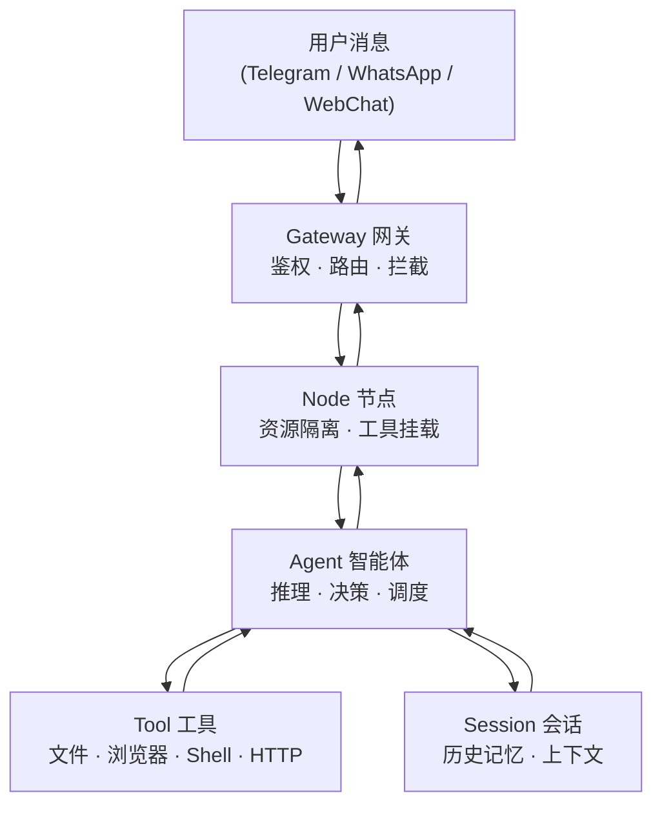

## 1.3 核心概念速览

在深入使用之前，只需记住 5 个名字：**Gateway、Node、Agent、Tool、Session**。

**图 1-1：五个核心概念及其关系**

| 概念 | 一句话说清楚 |
|---|---|
| **Gateway（网关）** | 系统的"门"，负责接受来自各渠道的消息、验证身份、决定把请求交给哪个节点 |
| **Node（节点）** | 业务隔离与资源分区的逻辑单元，携带自己的工具集和模型配置，是权限隔离的最小边界。注意与"Device Node（设备节点）"区分，后者指通过 WebSocket 接入的远端物理设备 |
| **Agent（智能体）** | 真正"干活"的单元，调用大模型思考，决定下一步该用哪个工具，并把结果整理后回复 |
| **Tool（工具）** | Agent 的"手"，具体执行操作——比如读一个文件、打开一个网页、调用一个 API |
| **Session（会话）** | Agent 的"记忆本"，把多轮对话的历史保存下来，让 AI 记得"之前说过什么" |

### 它们之间的包含关系

一个 Gateway 下可以配置多个 Node（比如一个用于客服业务、一个用于内部运维），每个 Node 可以挂载不同的 Agent 和 Tool 集合，每个 Agent 在处理用户请求时会创建或复用一个 Session。用一句话概括这个层级：

> **Gateway → Node → Agent → Tool / Session**
>
> 网关路由到节点，节点分派给智能体，智能体调用工具并依赖会话保持记忆。

### 一条消息的极简旅程

当你在 Telegram 里对机器人说"帮我查一下今天的天气"，会发生什么？

1. 消息先到达 **Gateway**——它验证你的身份，确认你有权限使用这个服务。
2. Gateway 根据路由规则把请求转发到合适的 **Node**——比如你家里那台 24 小时在线的小服务器。
3. Node 上的 **Agent** 被唤醒，它读取 **Session** 里的历史记录（你昨天问过的城市），然后调用天气查询 **Tool**。
4. Tool 返回天气数据，Agent 把结果整理成人话，沿着 Node → Gateway → Telegram 的路径回复给你。

整个过程可能只需要几秒钟，但背后涉及鉴权、路由、推理、工具调用、上下文管理五个环节——这正是后续各章逐一展开的内容。

### 概念与章节映射

读完本节，你已经认识了五个核心角色。它们各自在哪里被深入讲解？

| 概念 | 深入章节 | 你会学到什么 |
|---|---|---|
| Gateway | [第九章](../09_gateway_protocol/README.md) | 控制平面架构、WebSocket 协议、事件幂等、设备配对 |
| Node | [第九章](../09_gateway_protocol/README.md) | 路由节点的定义、业务隔离与资源分区（见 9.1 架构全景） |
| Agent | [第十章](../10_agent_loop/README.md) | Agent Loop 内核、提示词装配、工具执行、流式输出 |
| Tool | [第五章](../05_tools_skills/README.md) | 内置工具、技能与插件、工具策略与沙箱 |
| Session | [第六章](../06_context_memory/README.md) | 会话与状态持久化、上下文窗口、记忆与压缩策略 |

---

记住这五个名字就够了，本书后面会逐章深入讲解每个概念的配置和工作原理。

想深入了解架构细节？请参见 [9.1 架构全景与核心对象](../09_gateway_protocol/9.1_architecture_overview.md) 和 [10.1 请求流转与分层排障](../10_agent_loop/10.1_request_lifecycle.md)。
