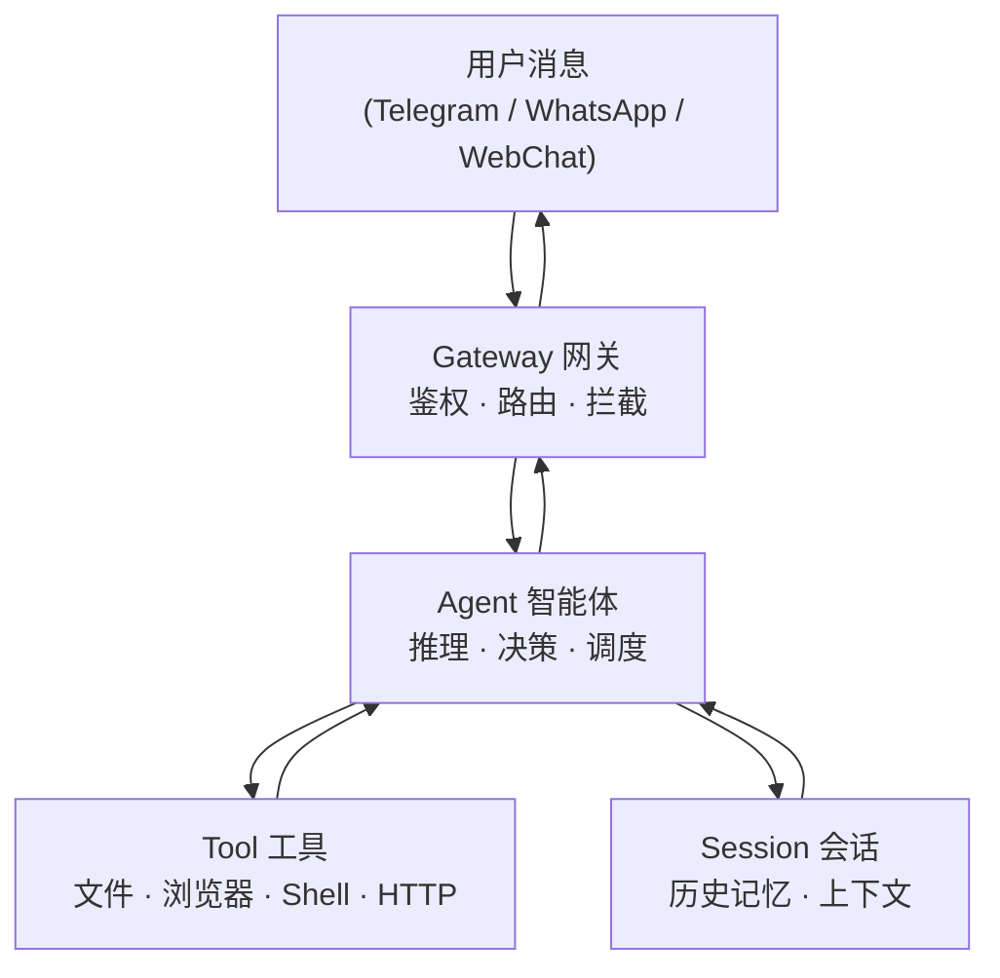

## 1.3 核心概念速览

在深入使用之前，只需记住 4 个名字：**Gateway、Agent、Tool、Session**。

**图 1-1：四个核心概念及其关系**

| 概念 | 一句话说清楚 |
|---|---|
| **Gateway（网关）** | 系统的“门”，负责接受来自各渠道的消息、验证身份、决定把请求交给哪个智能体 |
| **Agent（智能体）** | 真正“干活”的单元，调用大模型思考，决定下一步该用哪个工具，并把结果整理后回复 |
| **Tool（工具）** | Agent 的“手”，具体执行操作——比如读一个文件、打开一个网页、调用一个 API |
| **Session（会话）** | Agent 的“记忆本”，把多轮对话的历史保存下来，让 AI 记得“之前说过什么” |

---

记住这四个名字就够了，本书后面会逐章深入讲解每个概念的配置和工作原理。

想提前了解架构细节？请参见[架构深入（选读）](../03b_architecture_deep/README.md)。
