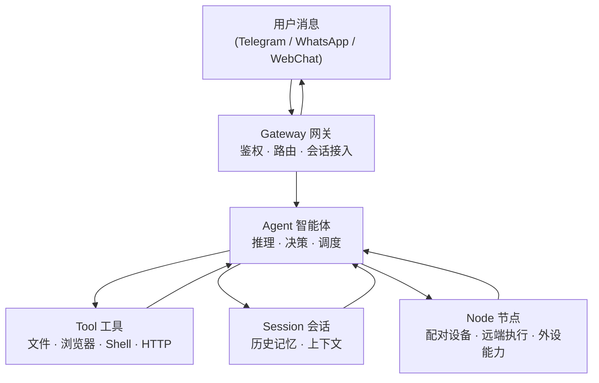

## 1.3 核心概念速览

在深入使用之前，只需记住 5 个名字：**Gateway、Agent、Tool、Session、Node**。

图 1-1：五个核心概念及其关系

| 概念 | 一句话说清楚 |
|---|---|
| **Gateway（网关）** | 系统的“门”，负责接受来自各渠道的消息、验证身份、维护连接状态，并把请求送入控制面 |
| **Agent（智能体）** | 真正“干活”的单元，调用大模型思考，决定下一步该用哪个工具，并把结果整理后回复 |
| **Tool（工具）** | Agent 的“手”，具体执行操作——比如读一个文件、打开一个网页、调用一个 API |
| **Session（会话）** | Agent 的“记忆本”，把多轮对话的历史保存下来，让 AI 记得“之前说过什么” |
| **Node（节点）** | 通过 WebSocket 接入 Gateway 的设备或执行端点，用于承载摄像头、屏幕、通知、远端执行等能力；它不是消息路由的主分区概念 |

### 它们之间的包含关系

在当前设计中，核心链路是 **Gateway → Agent → Tool / Session**。Node 是可选的外设或执行端点——只有当你接入摄像头、手机、远端执行能力等设备时，这些设备才会通过 Node 参与到 Agent 的调度链中。用一句话概括：

> **Gateway → Agent → Tool / Session（Node 按需接入）**
>
> 网关接入消息与控制面，智能体完成推理与调度，工具和会话分别承担执行与上下文；Node 只在设备能力或远端执行场景中出现。

### 一条消息的极简旅程

当你在 Telegram 里对机器人说“帮我查一下今天的天气”，会发生什么？

1. 消息先到达 **Gateway**——它验证你的身份，确认你有权限使用这个服务。
2. Gateway 将这条消息送入合适的 **Agent** 和对应 **Session**——让系统知道“该由谁处理”和“要不要带上历史上下文”。
3. **Agent** 读取 **Session** 里的历史记录（你昨天问过的城市），然后调用天气查询 **Tool**。
4. Tool 返回天气数据，Agent 把结果整理成人话，沿着 Gateway → Telegram 的路径回复给你。

如果这次任务还需要调手机摄像头、读取桌面通知或在远端设备上执行动作，相关能力会通过 **Node** 暴露给 Agent。

整个过程可能只需要几秒钟，但背后涉及鉴权、路由、推理、工具调用、上下文管理五个环节——这正是后续各章逐一展开的内容。

### 概念与章节映射

读完本节，你已经认识了五个核心角色。它们各自在哪里被深入讲解？

| 概念 | 深入章节 | 你会学到什么 |
|---|---|---|
| Gateway | [第九章](../09_gateway_protocol/README.md) | 控制平面架构、WebSocket 协议、事件幂等、设备配对 |
| Agent | [第十章](../10_agent_loop/README.md) | Agent Loop 内核、提示词装配、工具执行、流式输出 |
| Tool | [第五章](../05_tools_skills/README.md) | 内置工具、技能与插件、工具策略与沙箱 |
| Session | [第六章](../06_context_memory/README.md) | 会话与状态持久化、上下文窗口、记忆与压缩策略 |
| Node | [第九章](../09_gateway_protocol/README.md) | 配对设备、远端执行端点与设备能力接入 |

---

记住这五个名字就够了，本书后面会逐章深入讲解每个概念的配置和工作原理。

想深入了解架构细节？请参见 [9.1 架构全景与核心对象](../09_gateway_protocol/9.1_architecture_overview.md) 和 [10.1 请求流转与分层排障](../10_agent_loop/10.1_request_lifecycle.md)。
