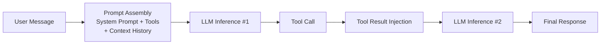

## 1.5 适用边界与风险认知

在决定引入 OpenClaw 之前，有必要先建立清醒的预期。本节从“适合做什么”、“不适合做什么”、“有哪些风险”和“Token 成本”四个维度帮助你做出明智的选型判断。

### 1.5.1 OpenClaw 适合做什么

OpenClaw 的核心竞争力在于**自托管 + 多渠道 + 工具执行**三位一体。以下场景是它的最佳发力点：

- **跨渠道统一入口**：通过 Telegram、WhatsApp、Discord、Slack、飞书等渠道统一接入，让团队或个人在习惯的聊天工具中直接调度 AI 完成任务（渠道配置详见[第七章](../07_multi_agent/README.md)）。例如，一个电商售后智能体同时接入 WhatsApp、Telegram 和官网 Web 插件，能根据私有知识库解答退换货政策，并自动调用 Jira 或 Zendesk 的 API 提交售后工单。
- **本地执行与数据主权**：所有数据和执行过程留在自有基础设施上，适合对数据隐私有严格要求的场景（如内网运维、敏感文档处理）。
- **带权限防护的内部工具链**：连接内部知识库及基础设施流转链，允许授权用户通过自然语言触发配置拉取与审核操作。例如，部署在 Slack 上的研发助手可通过 GitLab 和 Kubernetes 插件读取日志并返回摘要，但如果模型试图执行 `kubectl delete pod` 等高危命令，网关会因权限不足而严格拦截。
- **长时间运行的自动化任务**：结合 Cron 定时任务和 Webhook 触发器，让智能体 7×24 小时常驻运行，主动执行巡检、数据拉取、定期报告等任务（Cron 配置详见[8.2 定时作业](../08_automation_ops/8.2_cron_jobs.md)）。例如，自动代码审查智能体可在代码提交时触发安全扫描，待 30 分钟后扫描完成并通过 Webhook 回调时自动唤醒，结合代码上下文生成评审建议。
- **复杂工具编排**：内置数十种工具（文件系统、Shell 执行、HTTP 请求、浏览器操作、数据库查询等），支持智能体在多步推理中灵活调用和组合（完整工具清单见[第五章](../05_tools_skills/5.1_tool_inventory.md)）。
- **安全研究与沙箱实验**：提供细粒度的沙箱隔离机制，适合作为智能体安全研究的实验平台（沙箱配置详见[第十一章](../11_reliability_security/11.4_guardrails.md)）。

### 1.5.2 OpenClaw 不适合做什么

没有任何工具是银弹。以下场景中 OpenClaw 可能不是最优选择：

- **纯对话问答**：如果只需一个聊天助手回答日常问题，直接使用 ChatGPT、Claude 或 DeepSeek 的客户端即可，无需架设 Gateway。
- **零运维的托管服务**：OpenClaw 是自托管项目，用户需要自行负责服务器维护、进程守护、版本升级和故障排查。如果团队没有基本的运维能力或意愿，云端 SaaS（如 Anthropic 的 Claude API）会是更省心的选择。
- **大规模企业级多租户**：OpenClaw 当前定位偏向个人或小团队的隔离环境。如果需要完整的企业级 RBAC、多租户隔离、SLA 保证和商业支持，建议评估专业的企业级平台。
- **对延迟极度敏感的实时系统**：每次工具调用都涉及 LLM 推理，响应延迟通常在秒级。对于需要毫秒级响应的场景（如高频交易、实时游戏），传统的规则引擎更合适。
- **已有成熟工作流的简单自动化**：如果任务逻辑固定且清晰（如“收到邮件 → 转发到 Slack”），Zapier 或 n8n 等工具更高效，不需要引入 LLM 的推理开销。

### 1.5.3 Agent 的”裹挟效应”

值得关注的是 Agent 对工作方式可能带来的结构性冲击。当同行开始用 AI 24 小时接单、自动规划路线时，效率差距可能迫使更多团队跟进采纳——这种现象被称为”裹挟效应”。OpenClaw 这类自托管 Agent 平台正是这一趋势的基础设施之一。

同时，Agent 可能改变部分商业逻辑：在信息检索和方案比选等场景下，Agent 倾向于按结构化指标（性价比、响应速度等）进行决策，而非受视觉营销影响。这意味着传统的流量漏斗模型在某些 Agent 驱动的场景下可能需要调整。当然，当前 Agent 的决策质量仍高度依赖 prompt 设计和工具编排，远未达到完全自主最优决策的程度。对于正在评估 OpenClaw 的团队，这既是机会（率先建立 Agent 能力），也是提醒（需要认真对待部署后的安全和治理问题）。

### 1.5.4 风险认知

部署和使用 OpenClaw 时，需要对以下风险有清醒认识：

**安全风险**

OpenClaw 赋予 AI 执行 Shell 命令、读写文件、发送消息等能力。这本质上是一种**推理能力与执行权限的错配**——当前 LLM 的推理可靠性尚不足以匹配它被授予的操作权限。一旦出现 Prompt Injection 或配置不当，可能造成：文件误删、敏感信息泄露、未授权的外部请求等。务必：
- 启用沙箱模式（`sandbox.mode: “all”` 或 `“non-main”`），限制执行面（详见[第十一章 安全护栏](../11_reliability_security/11.4_guardrails.md)）。
- 对高危工具启用 `tools.elevated` 审批机制，要求人工确认后才执行（详见[第五章 工具策略](../05_tools_skills/5.2_tool_policy.md)）。
- 通过 `dmPolicy` 严格控制谁可以与智能体对话（详见[第三章 配对与分组](../03_minimal_loop/3.4_pairing_groups.md)）。

**模型幻觉风险**

LLM 可能生成看似合理但实际错误的输出。在 OpenClaw 中，这种幻觉不只是“说错话”，还可能导致“做错事”——比如执行错误的数据库查询或向错误的对象发送消息。建议在关键业务场景中设置人工审批环节。

**服务可用性风险**

OpenClaw 依赖外部的模型 API（如 Anthropic、OpenAI）。当 API 服务中断、限速或密钥过期时，智能体将无法工作。建议配置多个 Provider 的 Failover 策略（参见第四章）。

**版本兼容性风险**

OpenClaw 采用 CalVer 版本号（如 `2026.2.26`），迭代速度较快。升级时可能遇到配置字段变更或行为差异。建议在测试环境验证后再升级生产，并保留回滚方案。

### 1.5.5 Token 成本：一个容易被低估的开销

这是许多新用户最容易忽视的问题。**OpenClaw 的每一次交互都会消耗模型 API 的 Token，而 Token 就是真金白银。**

#### 为什么 OpenClaw 比普通聊天更费 Token

在普通的 ChatGPT/Claude 对话中，Token 消耗 = 用户输入 + 模型输出。但在 OpenClaw 中，一次看似简单的请求可能经历多轮推理循环：

每一轮推理都会重新发送完整的系统提示、工具定义和上下文历史。一条简单的用户消息可能触发 2-5 轮推理，每轮消耗数千 Token。

#### 典型的 Token 消耗构成

| 组成部分 | 每轮消耗 | 说明 |
|---------|---------|------|
| 系统提示 | 500-1000 tokens | 智能体的角色定义和行为指令 |
| 工具定义 | 200-500 tokens | 每个挂载的工具都需要描述 |
| 上下文历史 | 500-5000 tokens | 随对话轮数增长，是最大的成本来源 |
| 用户消息 | 50-1000 tokens | 实际的用户输入 |
| 模型输出 | 100-2000 tokens | 推理结果和工具调用参数 |
| 工具返回值 | 100-2000 tokens | 工具执行结果注入上下文 |

以 Claude Sonnet 4.6 为例（定价请参考供应商最新公告，以下为估算参考值：约 $3/百万输入 Token，$15/百万输出 Token），一次涉及 2 轮工具调用的交互，总消耗约 8000-15000 Token，成本约 $0.03-0.10。看似不多，但如果智能体常驻运行并频繁交互，**月度账单可能达到数十甚至上百美元**。

#### 控制成本的实用建议

- **精简工具集**：只挂载当前场景需要的工具，减少每轮的工具定义开销。
- **合理配置会话重置**：通过 `session.reset` 定期清理上下文，防止历史消息无限膨胀。
- **善用模型分层**：简单任务用 Haiku 4.5（$1/百万输入 Token），复杂推理再用 Sonnet 或 Opus。配置 Failover 实现自动降级。
- **启用提示缓存**：利用 Anthropic 的 Prompt Caching 功能，对重复的系统提示和工具定义可节省最高 90% 的输入 Token 成本。
- **监控用量**：定期检查 API Provider 的用量面板，设置预算告警，避免意外超支。

> **经验法则**：如果一个任务可以通过传统脚本或 API 调用完成（如定时拉取数据），就不要让 LLM 介入。**只在需要自然语言理解、模糊决策或多步推理的环节使用智能体**，其余部分用确定性代码实现。这是控制 Token 成本的根本原则。
