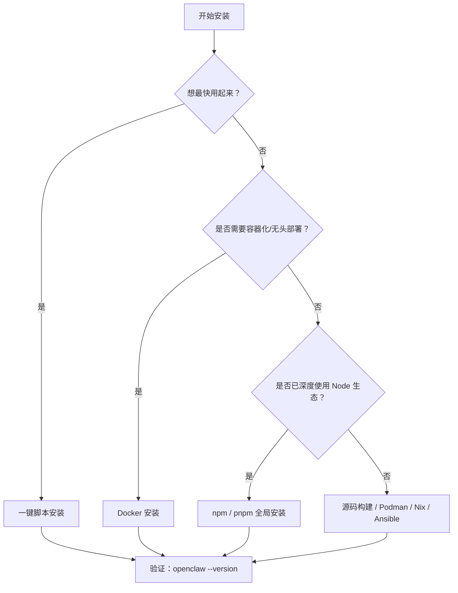

## 2.2 安装 OpenClaw

> **预计耗时**：10–20 分钟（取决于安装方式和网速）

本节介绍如何在你选择的环境中安装 OpenClaw。我们为首次用户推荐**一键安装脚本**，原因有三：首先它自动处理依赖与版本选择，避免你被 npm 版本冲突困扰；其次它最快获得可工作的系统；第三，如果后来你发现需要容器化或源码定制，可以先跑通这条路，再迁移到其他方式。这样的顺序避免了初装就掉进“工具选择困境”。

### 2.2.1 推荐安装方式：一键安装脚本

最简单快捷的安装方式是执行官方的一键安装脚本。

**前置检查**

执行脚本前，请先快速确认：

- 你已经读过[第2.1节系统要求](2.1_requirements.md)，并通过了**必须项**的检查（Node.js 版本、网络连通性）
- 网络访问 `openclaw.ai` 无阻碍（某些内网或企业 WiFi 需配置 HTTP 代理；如不确定，运行 `curl -v https://openclaw.ai/install.sh` 测试）
- 如在 WSL 环境，确认已启用 WSL2（而非 WSL1），可用 `wsl --list --verbose` 查看

**开始安装**

macOS / Linux：

```bash
curl -fsSL https://openclaw.ai/install.sh | bash
```

**Windows (PowerShell)**

在 PowerShell 中运行以下命令：

```bash
iwr -useb https://openclaw.ai/install.ps1 | iex
```

### 2.2.2 验证安装结果

安装后建议立即做一次最小验证（确保命令可用且 PATH 正确，更多 CLI 命令见[附录 E 命令速查表](../appendix/command_cheatsheet.md)）：

```bash
openclaw --version
openclaw --help
```

### 2.2.3 替代安装方式

如果一键脚本不适用于你的环境，以下是其他安装方式。

> [!TIP]
> **首次部署只选一条路径跑通。** 如果你的目标只是先成功进入 Dashboard 并完成首轮对话，不要同时比较 npm、Docker、源码和运维化方案。最短成功路径永远优先，其余路径留到你确认需要容器化、自托管或定制化时再看。

如果你不确定该选哪一种，可以先按下面的决策树判断：



图 2-1：OpenClaw 安装方式选择决策树

#### 2.2.3.1 使用 npm 安装

如果你熟悉 Node 生态，或者需要在特定流程中进行精确版本控制，也可以直接使用 `npm`、`pnpm` 或 `bun` 进行全局安装。

```bash
# npm 全局安装
npm install -g openclaw@latest

# pnpm 全局安装
pnpm add -g openclaw@latest
pnpm approve-builds -g
```

建议：测试与生产环境不要长期依赖 `latest`。更稳妥的做法是固定到明确版本，并把版本号写进交付文档与回归清单。

```bash
npm install -g openclaw@<version>
```

#### 2.2.3.2 Docker 安装

适合容器化、无头部署或需要隔离网关环境的场景。官方文档把 Docker 作为**可选安装路径**；如果你只是在本机快速跑通，普通安装流程通常更直接。

**前置要求**：Docker Desktop 或 Docker Engine（含 Docker Compose v2），至少 2 GB 内存。

**快速安装（推荐）**：在 **OpenClaw 源码仓库根目录** 执行自动化脚本（不是本书仓库根目录），会自动完成镜像构建、引导向导、启动网关并生成 Token：

```bash
./scripts/docker/setup.sh
```

可通过环境变量自定义行为，例如启用沙箱和预装扩展：

```bash
export OPENCLAW_SANDBOX=1
export OPENCLAW_EXTENSIONS="diagnostics-otel matrix"
./scripts/docker/setup.sh
```

也可使用官方预构建镜像跳过本地编译：

```bash
export OPENCLAW_IMAGE="ghcr.io/openclaw/openclaw:latest"
./scripts/docker/setup.sh
```

官方 Docker 文档强调：上面的 setup 脚本会先做 onboarding，把 gateway token 写入 `.env`，再启动 `openclaw-gateway`。如果你只想跳过本地编译，可以保留 `OPENCLAW_IMAGE`，继续走同一脚本。

**手动安装**：如果不使用自动化脚本，可在 OpenClaw 源码仓库根目录依次执行以下命令。它更适合已经明确需要自定义镜像或拆开各步骤调试的读者，不是首次安装的推荐起点：

```bash
docker build -t openclaw:local -f Dockerfile .
docker compose run --rm --no-deps --entrypoint node openclaw-gateway dist/index.js onboard --mode local --no-install-daemon
docker compose run --rm --no-deps --entrypoint node openclaw-gateway dist/index.js config set gateway.mode local
docker compose run --rm --no-deps --entrypoint node openclaw-gateway dist/index.js config set gateway.bind lan
docker compose run --rm --no-deps --entrypoint node openclaw-gateway dist/index.js config set gateway.controlUi.allowedOrigins '["http://localhost:18789","http://127.0.0.1:18789"]' --strict-json
docker compose up -d openclaw-gateway
```

> [!NOTE]
> 官方文档里，`openclaw-cli` 是网关启动后的后置工具容器。对首次 Docker setup 来说，应先用 `openclaw-gateway` 容器完成 onboarding 和配置写入，再启动 gateway。

**安装后验证**：浏览器访问 `http://127.0.0.1:18789/`，从 `.env` 文件获取 Token 并在控制台 Settings 的鉴权字段中粘贴。可通过健康检查端点确认网关状态：

```bash
curl -fsS http://127.0.0.1:18789/healthz
curl -fsS http://127.0.0.1:18789/readyz
```

本书仓库不包含上述 Docker 部署脚本与容器文件，更多配置选项详见 [官方 Docker 安装指南](https://docs.openclaw.ai/install/docker)。

#### 2.2.3.3 其他方式（源码构建、Podman、Nix、Ansible）

适用于开发定制或特定运维场景，请参阅 [官方安装文档](https://docs.openclaw.ai/install) 获取对应指引。

### 2.2.4 环境变量与路径覆盖

与路径覆盖直接相关的核心环境变量如下（尤其适用于多实例或非标准部署）：

- `OPENCLAW_HOME`：设置内部路径解析的主目录。
- `OPENCLAW_STATE_DIR`：覆盖可变状态存储目录。
- `OPENCLAW_CONFIG_PATH`：覆盖配置文件路径。

除此之外，当前官方文档还明确了环境变量加载顺序：进程环境 > 当前工作目录 `.env` > `~/.openclaw/.env` > `openclaw.json` 的 `env` 块 > 可选 shell 导入（`OPENCLAW_LOAD_SHELL_ENV=1`）。因此，不要把这里误解成“OpenClaw 只认识这三个环境变量”。

详见 [官方环境变量文档](https://docs.openclaw.ai/help/environment)。

### 2.2.5 版本升级与治理

要升级到新版本，如果你使用的是一键脚本安装，可以重新运行脚本；如果使用的是包管理器，只需重新运行全局安装命令并指定 `<version>` 标签（或 `@latest`）即可。

```bash
npm install -g openclaw@<version>
```

升级策略的目标不是单纯用上新版本，而是确保升级可验证、可回滚（版本号规则与配置迁移详见[附录 版本映射与升级指南](../appendix/version_mapping.md)）：

- 先回归再升级：每次升级后，至少覆盖 `health`、`status`、渠道探针与模型探针。
- 出问题先回滚：如果新版本异常，直接全局安装上一稳定版本（例如 `npm install -g openclaw@<旧版本号>`），再做差异定位。

> **踩坑实录：Node 版本引发的诡异症状**
>
> 一位社区用户报告 `openclaw` 安装成功但启动时持续报 `SyntaxError: Unexpected token`。排查三小时后发现系统默认 Node 是 v16（通过 `nvm` 遗留），而 OpenClaw 要求 Node.js 22.14.0 或更高，推荐 Node.js 24。教训：安装前务必执行 `node -v` 确认版本，尤其是使用 nvm 或 volta 等版本管理器的环境。
