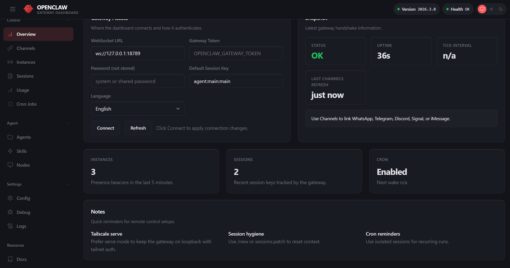

## 2.3 初始化向导与首轮配置

本节介绍通过官方 onboarding 向导生成最小配置，并完成基础交互验证。

### 2.3.1 运行初始化向导（CLI）

执行以下命令启动向导。官方推荐使用 `--install-daemon` 参数，它不仅会生成工作区配置文件，还能自动安装后台守护进程（如 macOS 的 LaunchAgent 或 Linux/WSL2 的 systemd 用户服务）。

```bash
openclaw onboard --install-daemon
```

> **提示**：带与不带 `--install-daemon` 参数的主要区别在于是否自动配置系统的**后台守护进程**：
> - **带参数**（推荐）：不仅生成工作区配置文件（如 `~/.openclaw/workspace`），还会自动注册并安装系统后台服务（如 macOS 的 LaunchAgent 或 Linux 的 systemd），保障 Gateway 服务在机器重启后也在后台持续运行，适合长期使用。
> - **不带参数**（仅运行 `openclaw onboard`）：只生成配置文件并完成初始化，不会注册系统后台服务。每次需要使用时可能需要手动启动，更适合本地临时试用或验证。


### 2.3.2 向导配置项解析与避坑指南

在向导的系列提问中，实测验证出的一条对排错压力最小的“黄金路径”如下：

1. **Onboarding mode** 选 `QuickStart`：让你以最小配置量快速跑起来。默认绑定在本地 `127.0.0.1:18789` 并且关闭 Tailscale 外部暴露。
2. **模型与 Auth (Model/Auth)**：建议绑定 Anthropic API Key 或 OpenAI。若使用其他兼容供应商，可根据提示输入。
3. **搜索引擎 (Search provider)**：用于赋予 Agent 联网搜索的能力（如检索最新文档、新闻等）。免费且推荐的选项是 **Tavily**（需要去其官网注册获取一个免费的 API Key），或者也可以根据你已有的服务选择 Google Custom Search、Bing 等。如果暂时不想配置，也可以选择 `Skip for now`，但不配置会影响 Agent 绝大多数需要联网查询和实时验证的任务。
4. **技能配置 (Skills)**：用于挂载官方或社区提供的基础能力包（例如专门处理版本控制的 `github`，或是针对游戏分发的 `gog`，以及常用的 `clawhub` 等）。为保证初始化环境干净，**强烈建议首次配置时选择 `Skip for now`**，等基础链路跑通后，再根据需要通过控制台按需挂载特定的技能，从而避免一上来因为某个扩展包解析失败导致整个流程卡住。
5. **工作区 (Workspace)**：默认生成在 `~/.openclaw/workspace`，用于存放 Agent 的核心数据。建议保持默认。
6. **渠道 (Channels)** 选 `Skip for now`：这是极大降低挫败感的关键。先把自带的 Dashboard（控制台）跑通，确认大模型和基础环境都没问题，后续再从容配置飞书或 WhatsApp 等渠道。

向导结束时会自动进行 Health check（健康检查），并**自动启动一次** Gateway。

> **注意**：如果初始化时未使用 `--install-daemon` 参数，后续在关闭终端或重启电脑后，需要手动执行 `openclaw gateway` 来启动服务，然后才能继续正常使用。

### 2.3.3 访问 Dashboard 并完成首轮对话

向导走通并且后台 Gateway 启动后，不要急着去做复杂开发！这一步的核心是通过自带的 **Control UI (Dashboard)** 完成初始化对话（Bootstrap）。

在终端执行以下命令直接打开本地控制台，或者在浏览器访问 `http://127.0.0.1:18789/#token=<TOKEN>`：

```bash
openclaw dashboard
```

打开控制台后（如有鉴权提示请使用带 token 的分享链接），你将看到如下的 Gateway Dashboard 状态与控制界面，整体结构如下方面板示例所示：



图 2-1：Dashboard 界面概览

在 Dashboard 的对话框中，主动输入一段话，给 Agent 定好边界：

1. **你是谁**：描述你的职位标签。
2. **它将扮演什么角色**：例如“我的日常文档处理助手”。
3. **冒烟测试**：抛出一个立即可验证且无需私域知识的请求。

**具体例子：一次成功的初始化对话**

```text
你好！我是一名普通的上班族，平时事情比较多容易忘。
请你扮演我的日常效率助手，遵守以下规则：
1. 给出的建议要接地气，符合普通人的生活实际
2. 回答尽量简短、结构化，不要长篇大论
3. 遇到专业名词，请用大白话向我解释

作为冒烟测试，请给我一个今天就能执行的 5 条待办日常清单，
按优先级排序，用 Markdown 格式返回。
```

如果在 Dashboard 中看到了类似如下结构化、贴近生活的回复，恭喜你，基础安装完全成功：

```markdown
## 今日 5 条待办日常清单

1. **确定今日最重要的一件事**（优先级：最高）
   在开始一天日程前，先写下今天必须完成的那唯一一件核心任务。

2. **集中处理未读信息**（优先级：高）
   划出 15-30 分钟专用时间，统一回复重要消息。
...
```

如果收到的是乱码、无响应或者报错，请回退检查网络与 API Key。

### 2.3.4 工作区引导文件一览

完成首轮对话后，打开 `~/.openclaw/workspace` 目录，你会发现 `openclaw onboard` 已经从内置模板生成了一组 Markdown 文件。这些文件构成了智能体的**引导系统**（Bootstrap Context）：每次会话启动时，Gateway 会自动读取它们并注入到系统提示词中，让智能体在“醒来”的第一时间就知道自己是谁、用户是谁、应该做什么。

```text
~/.openclaw/workspace/
├── AGENTS.md        # 工作区主页：启动清单与行为红线
├── SOUL.md          # 人格定义：价值观、沟通风格、边界
├── USER.md          # 用户档案：姓名、时区、偏好、背景
├── IDENTITY.md      # 智能体元数据：名称、形象、emoji
├── TOOLS.md         # 环境备忘：本地设备名、SSH 主机、语音偏好
├── HEARTBEAT.md     # 心跳巡检清单（可选，留空则跳过心跳调用）
├── BOOTSTRAP.md     # 首次运行的入职脚本（完成后自动删除）
└── memory/          # 记忆目录（按日期存放对话摘要）
```

各文件的职责与读取时机如下：

| 文件 | 一句话定位 | 何时读取 | 详细章节 |
|---|---|---|---|
| **AGENTS.md** | 工作区的“首页”。规定了会话启动时应依次读取哪些文件、哪些操作需要先征求用户同意、以及群聊中的发言准则。 | 每次会话 | — |
| **SOUL.md** | 智能体的“性格说明书”。定义核心价值观（务实、有主见、先动手再提问）、隐私边界、沟通风格。 | 每次会话 | [3.3.4](../03_minimal_loop/3.3_agent_persona.md) |
| **USER.md** | 用户档案。记录姓名、称呼、时区、工作背景和个人偏好，随交互逐步丰富。 | 每次会话 | — |
| **IDENTITY.md** | 智能体自身的元数据。存放名称、形象类型、语气风格和代表 emoji，在首次 Bootstrap 对话中由智能体自行填写。 | 每次会话 | — |
| **TOOLS.md** | 环境级工具备忘。记录本地特有的设备名、SSH 别名、TTS 语音偏好等，与可共享的技能定义分离。 | 每次会话 | — |
| **HEARTBEAT.md** | 心跳巡检的任务清单。智能体在收到周期性心跳轮询时读取并执行其中的检查项；文件为空则直接回复 `HEARTBEAT_OK`。 | 仅心跳轮询 | [8.3](../08_automation_ops/8.3_heartbeat.md) |
| **BOOTSTRAP.md** | 首次运行的“入职脚本”。引导智能体与用户完成自我介绍、填写 IDENTITY.md 和 USER.md，完成后智能体会自行删除此文件。 | 仅首次运行 | — |

**不同运行模式下的加载策略**

并非每次都加载全部七个文件。Gateway 会根据当前运行模式筛选所需子集，以节约上下文预算：

- **常规会话（完整模式）**：加载全部引导文件，总量上限约 150,000 字符，单文件上限 20,000 字符；超限时按“保留头部 70% + 尾部 20%”的策略智能截断。
- **心跳轮询（轻量模式）**：仅加载 HEARTBEAT.md，其余文件跳过，将 token 消耗控制在最低。
- **定时任务（Cron）**：不加载任何引导文件，任务提示词自包含所需上下文。
- **子智能体调用**：加载 AGENTS.md、SOUL.md、IDENTITY.md、USER.md、TOOLS.md 五个文件，排除 BOOTSTRAP.md 和 HEARTBEAT.md。

> [!TIP]
> 这些文件都是普通 Markdown，可以随时用任何编辑器修改。智能体自身也会在交互过程中主动更新它们（例如心跳期间整理 MEMORY.md）。如果你修改了 SOUL.md 或 AGENTS.md，下一次新会话就会立即生效——无需重启 Gateway。

### 2.3.5 首轮验收标准

建议通过自带的诊断工具进行检查：

```bash
# 检查 Gateway 运行状态
openclaw gateway status

# 执行体检验证配置
openclaw doctor
```

在诊断通过后，说明“模型与基础控制链路”已经打通。下一节将详细介绍如何对运行在后台的 Gateway 进行监控、日志排查与深度可用性验证。

下一节入口：[2.4 守护进程与可用性验收](2.4_gateway_service.md)
