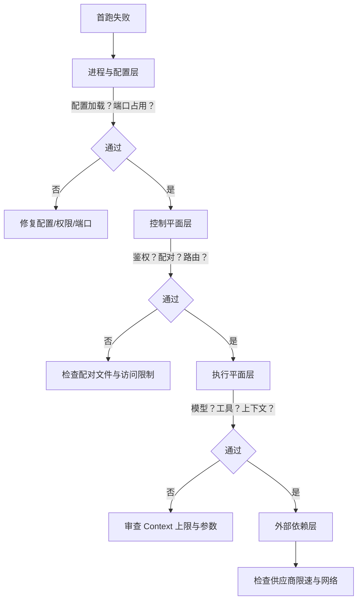

## 2.4 服务化启动与可用性验收

在上一节中，我们通过 `Hatch in TUI` 模式完成了模型的基础连通与初步的“前台交互”冒烟测试。然而，在实际生产和长期使用场景中，我们需要将 OpenClaw 作为后台独立运行的进程或容器守护进程（Daemon）。本节将介绍如何进行服务进程视角的启动，并提供最小验收与排障路径。

### 2.4.1 启动前检查：先让错误在最外层暴露

在正式作为后台服务启动前，建议先做一次“体检”，以避免把配置错误伪装成模型不稳定或网络问题。

```bash
openclaw doctor
```

若体检提示配置文件未加载或语法错误，请优先回看配置路径与格式（JSON5 的注释与尾逗号是高频坑）。配置文件默认路径可参考 [openclaw.json 结构与配置优先级](../04_config_models/4.1_config_system.md)。

### 2.4.2 启动与日志观察：先确认进程与监听稳定

启动方式取决于安装形态（本地进程、Docker、systemd 等），具体命令可能随版本演进而变化：如果你发现本节的某条命令在你的版本里不存在，先运行同级命令的 `--help` 找到等价入口，再回到本节的验收点核对结果。

建议在首次拉起时先做两件事。

- 保持日志可见：至少能看到最近 200 行关键事件。
- 明确监听点：能确认服务已监听并持续健康。

```bash
openclaw logs --tail 200

# 可选：实时跟随结构化日志（便于用 jq 按 trace 回放）

openclaw logs --follow --json
```

如果日志中出现反复重启、反复加载配置失败、反复鉴权失败等信号，应先停下来做分层排查，不要立刻接入外部渠道。

## 2.4.3 最小可用性验证：先验证控制链路，再接入渠道

首次验证建议遵循从内到外。

1. 验证服务健康与关键组件加载。
2. 验证至少一个渠道处于可用状态或可被初始化。
3. 再通过 Control UI 或 WebChat 做一次最小交互验证。

操作示例：检查渠道状态。

```bash
openclaw channels status
```

操作示例：如果使用 [Telegram 或 WhatsApp](../07_multi_agent/7.1_telegram_whatsapp.md) 等外部渠道，先按渠道章节完成登录或令牌配置，再进行消息验证。

### 2.4.4 分层排查：用证据把故障定位到层级

当首跑失败时，建议按层级定位。下面的流程图展示了“由近到远（从进程与配置到外部依赖）”的四层排查路径：



图 2-1：首跑失败时的四层排查路径

1. 进程与配置层：配置未加载、语法错误、权限不足、端口占用。
2. 控制平面层：鉴权失败、配对未完成、路由归属异常、策略拒绝。
3. 执行平面层：模型调用失败、工具超时、上下文预算失控。
4. 外部依赖层：供应商限流与超时、网络抖动、外部系统不可用。

操作示例：用结构化日志按 trace_id 回放一条失败链路，先确认失败发生在哪个阶段。

说明：为简化示例，本文将运行日志统一写作 `runtime.log`，实际路径以你的配置与环境为准；定位方法可参考第 3 章的[常用诊断命令与日志排障](../03_minimal_loop/3.2_diagnostics.md)

说明：以下示例需要安装 `jq`。

```bash
cat runtime.log | jq -c 'select((.trace_id // .traceId)=="t-...") | {ts, stage, event, err_type, cost_ms, trace: (.trace_id // .traceId)}'
```

（关于各阶段的深层原理与排障，可参考：[10.1 入口排队](../10_agent_loop/10.1_entry_queue.md)、[10.2 提示词组装](../10_agent_loop/10.2_prompt_assembly.md)、[11.2 冷却与止血机制](../11_reliability_security/11.2_rotation_cooldown.md)）
