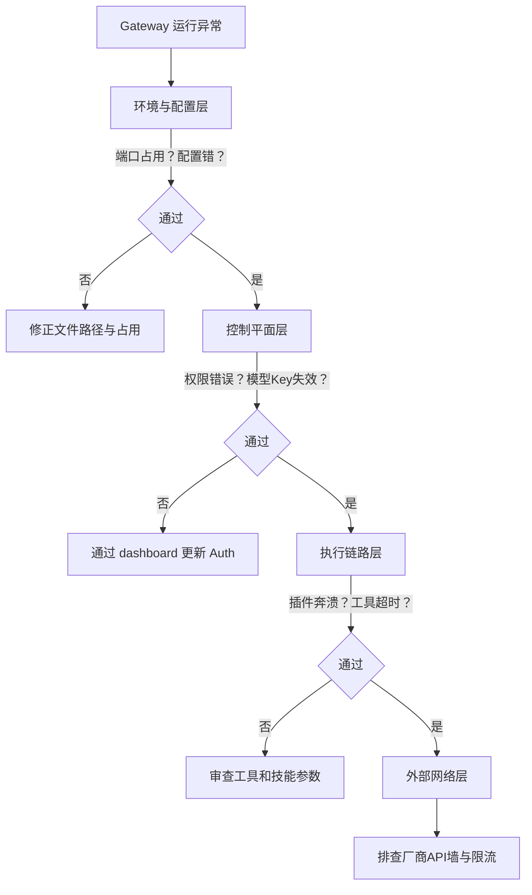

## 2.4 守护进程与可用性验收

在之前使用 `openclaw onboard --install-daemon` 初始化后，OpenClaw Gateway 会自动被配置为开机启动的系统级守护进程（如 macOS 的 LaunchAgent 或 Linux 的 systemd 用户服务）。本节介绍如何验证和管理这个后台服务进程。

### 2.4.1 启动前检查与前台试运行

如果未安装守护进程，或需要进行临时调试，可以直接在前台运行 Gateway：

```bash
# 在前台启动 Gateway，并在控制台实时输出日志
openclaw gateway --port 18789
```

配置与体检：让错误在最外层暴露

```bash
openclaw doctor
```

若体检提示配置文件未加载或语法错误，请优先回看配置路径与格式。环境变量如 `OPENCLAW_HOME` 与 `OPENCLAW_CONFIG_PATH` 也可以用来覆盖默认路径。

### 2.4.2 后台服务管理与状态查看 

当你通过 `--install-daemon` 模式部署后，OpenClaw 可以直接通过自带的 CLI 工具来管理后台状态，无需额外安装如 `pm2` 这类的第三方进程管理工具。

```bash
# 查看 Gateway 当前的后台运行状态与关键端口
openclaw gateway status
```

如果进程状态显示异常，可以按系统平台去检查对应的后台日志。

> **提示**：不同环境自动注册的服务名称可能不同，Linux 下通常为 `sudo systemctl status openclaw` 或是当前用户的 `systemctl --user status openclaw`，但通过 CLI 包装命令最为独立通用。

建议在服务确认运行后，进一步确认 Gateway 的控制面运行：

```bash
openclaw logs --tail 200

# 可选：实时跟随结构化日志
openclaw logs --follow --json
```

如果日志中出现反复重启或鉴权失败等信号，应先停下来做分层排查。

### 2.4.3 最小可用性验证：测试通信能力

验证 Gateway 功能的最快方式是通过 CLI 直接向某个支持 Channel 发送一条测试消息：

```bash
# 请将 Target 换为实际可触达的账号标识（如被绑定的 WhatsApp）
openclaw message send --target +15555550123 --message "Hello from OpenClaw Dashboard"
```

这证明从进程加载到路由调用是无阻的。再通过 Control UI 开展可视化对话。

### 2.4.4 分层排查架构概览

当首跑失败时，按以下四层“由近到远”的路径进行快速定位：



后续的高级配置（含模型替换与渠道接入）可参阅第 4 到 7 章。
