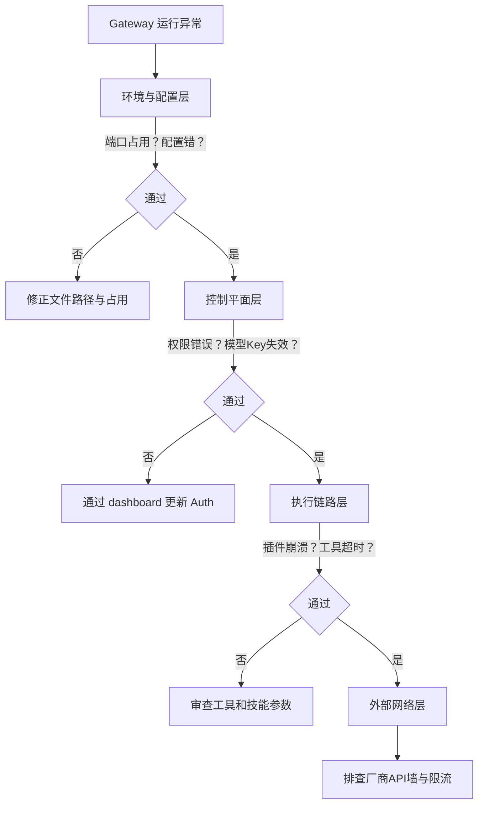

## 2.4 守护进程与可用性验收

在通过 `openclaw onboard --install-daemon` 初始化后，OpenClaw Gateway 会自动被配置为开机启动的系统级守护进程（如 macOS 的 LaunchAgent 或 Linux 的 systemd 用户服务）。本节介绍如何验证和管理这个后台服务进程。

### 2.4.1 启动前检查与前台试运行

如果未安装守护进程，或需要进行临时调试，可以直接在前台运行 Gateway：

```bash

# 在前台启动 Gateway，并在控制台实时输出日志
openclaw gateway --port 18789
```

配置与体检：让错误在最外层暴露

```bash
openclaw doctor
```

若体检提示配置文件未加载或语法错误，请优先回看配置路径与格式。环境变量如 `OPENCLAW_HOME` 与 `OPENCLAW_CONFIG_PATH` 也可以用来覆盖默认路径。

### 2.4.2 后台服务管理与状态查看

当你通过 `--install-daemon` 模式部署后，OpenClaw 可以直接通过自带的 CLI 工具来管理后台状态，无需额外安装如 `pm2` 这类的第三方进程管理工具。

```bash

# 查看 Gateway 当前的后台运行状态与关键端口
openclaw gateway status
```

如果进程状态显示异常，可以按系统平台去检查对应的后台日志。

> **提示**：不同环境自动注册的服务名称可能不同，Linux 下通常为 `sudo systemctl status openclaw` 或是当前用户的 `systemctl --user status openclaw`，但通过 CLI 包装命令最为独立通用。

建议在服务确认运行后，进一步确认 Gateway 的控制面运行：

```bash
openclaw logs --limit 200

# 可选：实时跟随结构化日志
openclaw logs --follow --json
```

如果日志中出现反复重启或鉴权失败等信号，应先停下来做分层排查。

### 2.4.3 最小可用性验证清单

验证 Gateway 功能无需依赖任何外部渠道集成。请依次执行以下检查项，确保本地基础链路完整可用：

1. **CLI 可用性检查**

```bash
openclaw --version
```

确认 OpenClaw CLI 已正确安装。

2. **配置与依赖检查**

```bash
openclaw doctor
```

输出应无 ERROR 级别警告，所有关键依赖已就位。

3. **进程健康检查**

```bash
openclaw health --json
```

返回 `{"status": "healthy"}` 或类似的正常状态表示，证明 Gateway 进程存活且健康。

4. **后台服务运行确认**

```bash
openclaw gateway status
```

确认后台守护进程正在运行，端口已绑定。

5. **控制台可访问性检查**

```bash
openclaw dashboard
```

浏览器自动打开控制台界面。如未自动打开，通常可访问 `http://localhost:18789`。

6. **模型响应能力检查**

在 Dashboard 控制台对话框中输入"你好"，确认收到来自 LLM 的正常回复。这证明了从进程加载到推理引擎的完整链路畅通。

7. **日志正常性检查**

```bash
openclaw logs --limit 10
```

确认日志输出中不存在 ERROR 级别条目。如有报警级别日志，应参考[分层排查架构](#244-分层排查架构概览)逐步定位。

---

完成以上验证后，本地基础链路已确认可用。渠道接入（如 Telegram、WhatsApp、飞书等）的配置与验证将在[第七章](../07_multi_agent/README.md)展开。

### 2.4.4 分层排查架构概览

当首跑失败时，按以下四层"由近到远"的路径进行快速定位：


```mermaid
flowchart TD
  start["Gateway 运行异常"] --> L1["环境与配置层"]
  L1 -->|"端口占用？配置错？"| L1ok{通过}
  L1ok -->|"否"| fix1["修正文件路径与占用"]
  L1ok -->|"是"| L2["控制平面层"]
  L2 -->|"权限错误？模型Key失效？"| L2ok{通过}
  L2ok -->|"否"| fix2["通过 dashboard 更新 Auth"]
  L2ok -->|"是"| L3["执行链路层"]
  L3 -->|"插件崩溃？工具超时？"| L3ok{通过}
  L3ok -->|"否"| fix3["审查工具和技能参数"]
  L3ok -->|"是"| L4["外部网络层"]
  L4 --> fix4["排查厂商API墙与限流"]
```

后续的高级配置（含模型替换与渠道接入）可参阅第 4 到 7 章。
