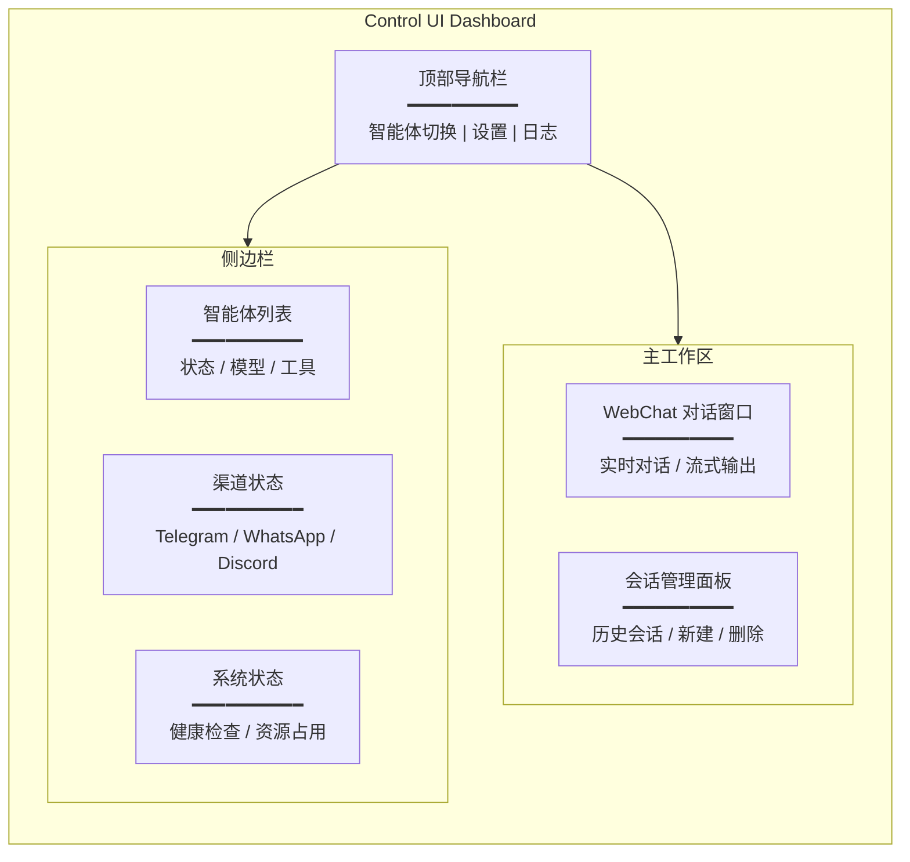

## 3.1 控制台与 WebChat 快速上手

本节以官方 Web 端为准建立最小闭环：先用 CLI 确认网关健康，再用 Dashboard 打开 WebChat 做一次最小交互验证，并把“新设备访问需要批准”这类常见拦截纳入排障路径。目标是让渠道接入之前就具备一条稳定、可复验的本地基准线。

### 3.1.1 为什么先从 Dashboard 与 WebChat 开始

外部渠道接入会引入大量外部变量：平台限流、回调重试、网络抖动、群聊噪声等。先用本地 Dashboard 与 WebChat 验证主链路，有两个直接收益。

- 把问题分层：如果本地 WebChat 能跑通，外部渠道失败更可能是渠道配置或平台侧问题。
- 建立证据链：本地交互更容易复现，日志与 trace 更完整。

官方建议的桌面端入口是 Dashboard，通常运行在 `http://127.0.0.1:18789/` 等本地地址。

### 3.1.2 打开 Dashboard：端口、入口与常见拦截

操作步骤建议如下。

### 3.1.2a Dashboard 功能分区概览

Dashboard 是 Control UI 的核心入口，包含多个功能区协同工作。以下是 Dashboard 主体结构与各分区职责：



**图 3-0：Dashboard 功能分区示意**

各分区职责说明：

- **顶部导航栏**：快速切换智能体、访问全局设置、查看实时日志流。
- **主工作区**：包含 WebChat 对话窗口与会话管理，是日常交互的中心。
- **侧边栏 - 智能体列表**：展示所有已配置智能体的状态、当前绑定模型及可用工具集。
- **侧边栏 - 渠道状态**：实时展示各外部渠道（如 Telegram、WhatsApp、Discord）的连接状态，便于快速定位渠道故障。
- **侧边栏 - 系统状态**：网关进程健康、资源占用情况、数据库连接等基础设施指标。

在排障流程中，建议先从侧边栏的"系统状态"确认基础设施健康，再从"渠道状态"检查外部依赖，最后进入 WebChat 做交互验证。

1. 先确认服务健康。

```bash
openclaw health --json
```

2. 打开 Dashboard。

```bash
openclaw dashboard

# 或直接在网关机器上打开：
# http://127.0.0.1:18789/
```

默认情况下，Dashboard 运行在 `http://127.0.0.1:18789/`。

常见拦截：新浏览器或新设备首次访问需要批准。若 Dashboard 提示设备待批准，可按官方流程列出并批准设备（命令与字段以实际版本为准，参考 onboarding 指南）。

```bash
openclaw devices list
openclaw devices approve <ID>
```

### 3.1.3 WebChat 的交互与流式：看得见的过程更容易排障

WebChat 的关键价值在于把过程暴露出来：模型请求是否发出、工具是否被提议与执行、输出是否在流式返回。对排障而言，最重要的是把每次交互与日志里的 trace 对齐。

操作建议：开启结构化日志并保持可见。

```bash
openclaw logs --follow --json
```

### 3.1.4 最小闭环测试用例

建议用可复验的测试用例验证最小闭环，而不是随意发问。

**测试用例 1：健康链路确认**

- 动作：先执行 `health`，再打开 Dashboard。
- 预期正常输出：
  ```json
  {
    "status": "ok",
    "gateway": "running",
    "uptime": 12345,
    "channels": {
      "telegram": "connected",
      "whatsapp": "connected"
    },
    "models": {
      "default": "gpt-5"
    }
  }
  ```
- Dashboard 访问成功，无设备待批准提示。

**测试用例 2：最小交互**

- 动作：在 WebChat 输入 `请只输出一个 JSON：{"pong": true}`。
- 预期正常输出：
  ```
  {"pong": true}
  ```
- 对应日志片段（结构化日志）：
  ```json
  {
    "timestamp": "2026-03-06T10:30:45.123Z",
    "level": "info",
    "event": "request_received",
    "session_id": "sess_abc123",
    "message": "请只输出一个 JSON：{\"pong\": true}"
  }
  {
    "timestamp": "2026-03-06T10:30:47.456Z",
    "level": "info",
    "event": "response_sent",
    "session_id": "sess_abc123",
    "response": "{\"pong\": true}",
    "duration_ms": 2333
  }
  ```

**测试用例 3：流式输出可验证**

- 动作：输入 `请分 5 步输出一个排障计划，每步不超过 20 字`。
- 预期正常输出（流式返回）：
  ```
  1. 确认服务健康 ✓
  2. 检查渠道连接状态 ✓
  3. 查询最近日志错误 ✓
  4. 验证模型权限与配额 ✓
  5. 隔离问题根源 ✓
  ```
- 预期日志表现：
  - 发现 5 条 `chunk_sent` 事件，每条对应一个步骤。
  - 若延迟 >5s，查看日志中是否有 `tool_call_pending`、`model_waiting` 等迹象。
  - 若完全卡住，查看是否有 `error` 或 `timeout` 事件。
