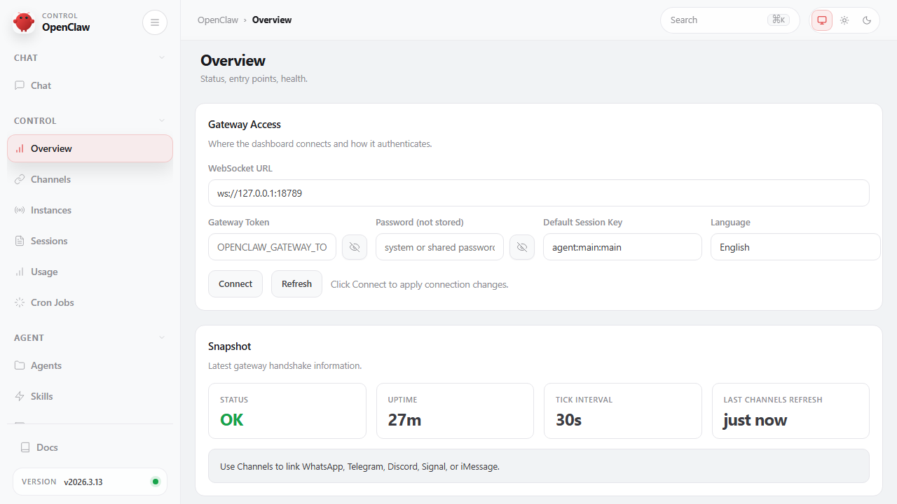
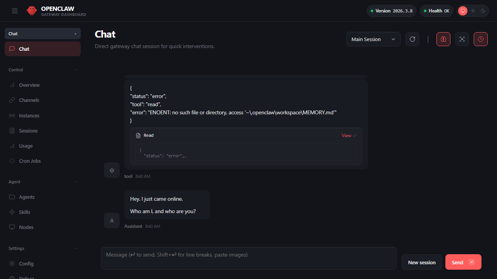
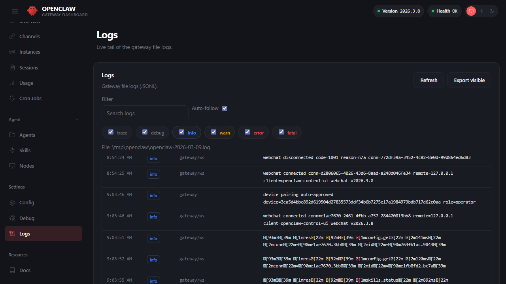

## 3.1 控制台与 WebChat 快速上手

本节以官方 Web 端为准建立最小闭环：先用 CLI 确认网关健康，再用 Dashboard 打开 WebChat 做一次最小交互验证，并把“新设备访问需要批准”这类常见拦截纳入排障路径。目标是让渠道接入之前就具备一条稳定、可复验的本地基准线，以验证核心功能正常运行。

### 3.1.1 为什么先从 Dashboard 与 WebChat 开始

外部渠道接入会引入大量外部变量：平台限流、回调重试、网络抖动、群聊噪声等。先用本地 Dashboard 与 WebChat 验证主链路，有两个直接收益。

- 把问题分层：如果本地 WebChat 能正常运行，外部渠道失败更可能是渠道配置或平台侧问题。
- 建立证据链：本地交互更容易复现，日志与 trace 更完整。

官方建议的桌面端入口是 Dashboard，通常运行在 `http://127.0.0.1:18789/` 等本地地址。

### 3.1.2 打开 Dashboard：端口、入口与常见拦截

Dashboard（Control UI）是 OpenClaw 的 Web 管理中心。根据当前源码与官方文档，左侧栏稳定的一级分组仍是 **`Chat`、`Control`、`Agent`、`Settings`**，另外底部有独立的 `Docs` 外链入口。下面先给出当前常见页面，再聚焦本章最常用的几个页面。

> [!TIP]
> **第一次跑通时，只需要记住 3 个页面：** `Chat` 用来做最小交互，`Overview` 用来确认网关健康，`Logs` 用来对照排障。其余页面先知道它们存在即可，不必在首轮验收前逐个理解。

#### 左侧导航结构

**Chat**——对话交互入口。

- **Chat**（`/chat`）：WebChat 对话窗口。支持会话选择、新建会话、流式输出。右上角提供 Thinking 开关（显示模型推理过程）和 Focus Mode（隐藏导航栏专注对话）。本章核心交互入口。

**Control**——运行状态与运维监控。

- **Overview**（`/overview`）：网关总览页。上方为 Gateway Access 连接信息（WebSocket URL、Token、Session Key、语言设置），下方为 Snapshot 快照卡片（Status、Uptime、Tick Interval、Sessions 数量等）。排障时从此页面确认网关健康状态。
- **Channels**（`/channels`）：渠道状态一览。显示已接入的 WhatsApp、Telegram、飞书、Slack 等渠道的连接状态与配置。详见[第七章](../07_multi_agent/README.md)。
- **Instances**：当前界面中的实例视图，用于查看当前连接到控制面的实例状态。
- **Sessions**（`/sessions`）：活跃会话键与每会话默认值管理页。可查看最近活跃的 `session key`、Token 用量与 `thinking` / `verbose` / `reasoning` 等覆盖项。详见[第六章 6.1 会话模型](../06_context_memory/6.1_sessions.md)。
- **Usage**：当前界面中的用量视图，用于查看系统的资源或调用用量汇总。
- **Cron Jobs**（`/cron`）：定时任务管理。支持查看、新增、启用/禁用和手动触发定时任务。详见[第八章 8.2 定时任务](../08_automation_ops/8.2_cron_jobs.md)。

**Agent**——智能体配置与能力管理。

- **Agents**（`/agents`）：智能体配置中心。左侧为智能体列表，右侧为详情面板。进入某个智能体后，内部提供子面板切换：Overview（身份与模型选择、回退模型配置）、Files（AGENTS.md / SOUL.md / USER.md / TOOLS.md / MEMORY.md 等指令文件编辑）、Tools（工具目录与 allow/deny 策略控制）、Skills（已安装技能开关与工作区技能管理）、Channels（渠道绑定）、Cron（智能体级定时任务）。详见[第四章](../04_config_models/README.md)和[第五章](../05_tools_skills/README.md)。
- **Skills**（`/skills`）：全局技能管理。安装、启用/禁用技能包，更新 API 密钥。详见[第五章 5.3 技能与插件](../05_tools_skills/5.3_skills_plugins.md)。
- **Nodes**（`/nodes`）：设备与节点管理。查看已配对设备、批准待配对设备、管理执行审批。详见[第九章 9.5 渠道配对](../09_gateway_protocol/9.5_pairing_trust.md)。
- **Dreams**：记忆整理与 dreaming 相关状态页。是否显示与当前配置和插件状态有关。

**Settings**——系统配置与调试。

- **Config**（`/config`）：配置编辑器。以表单或原始 JSON 模式查看和编辑 `openclaw.json`，带 schema 校验和实时预览。详见[第四章 4.1 配置体系](../04_config_models/4.1_config_system.md)。
- **Debug**（`/debug`）：调试工具。当前更贴近“status/health/models/heartbeat 快照 + Event Log + 手动 RPC 调用”的综合调试页，而不是通用的事件重放中心。
- **Logs**（`/logs`）：实时日志查看器。读取网关日志文件，支持过滤、关键词搜索与自动跟随。排障时对比日志与交互输出。
- **Docs**：文档入口。当前源码里它作为侧边栏底部的外链入口出现，不属于 `Settings` 组内的 tab。

> **版本说明**：Dashboard 当前采用分组导航；可见分组为 `Chat`、`Control`、`Agent`、`Settings`，另外侧边栏底部还有独立的 `Docs` 外链入口。具体子页面名称和是否显示会继续演进，请以当前 UI 文案为准。

本章主要用到 **Chat**（交互验证）、**Overview**（健康检查）和 **Logs**（排障对比）三个页面。按当前分组，它们分别位于 `Chat`、`Control` 和 `Settings`。

如果你是第一次打开 Dashboard，先认清 Overview 页面最省时间。下面这张图展示了左侧导航、Gateway Access 连接信息和 Snapshot 快照卡片的典型布局。



图 3-1：Dashboard Overview 总览页示意

操作步骤建议如下。

1. 先确认服务健康。

```bash
openclaw health --json
```

2. 打开 Dashboard。

```bash
openclaw dashboard

# 或直接在网关机器上打开：
# http://127.0.0.1:18789/
```

默认情况下，Dashboard 运行在 `http://127.0.0.1:18789/`。

常见拦截：**不是所有首次访问都需要人工批准。** 若你是在网关机器上通过 `127.0.0.1` / `localhost` 直连浏览器，本地 loopback 访问通常会自动批准；Tailnet 或局域网中的新浏览器/新设备则更可能进入待批准状态。若 Dashboard 提示设备待批准，可按官方流程列出并批准设备（命令与字段以实际版本为准，参考 onboarding 指南）。

```bash
openclaw devices list
openclaw devices approve <ID>
```

### 3.1.3 WebChat 的交互与流式：看得见的过程更容易排障

WebChat 的关键价值在于把过程暴露出来：模型请求是否发出、工具是否被提议与执行、输出是否在流式返回。对排障而言，最重要的是把每次交互与日志里的 trace 对齐。

操作建议：开启结构化日志并在 Dashboard 的 Chat 界面对比流式输出。

先看 Chat 页面，确认自己找对了最小交互入口。



图 3-2：WebChat 对话界面示意

Chat 页面提供了完整的交互视图：对话输入区、流式输出区（包含用户输入、模型思考过程、工具调用请求与返回结果），以及右上角的会话选择器和模型切换器。部署 OpenClaw 后，点击左侧 Chat 分区即可进入。

```bash
openclaw logs --follow --json
```

如果你更习惯先看证据，再回到对话窗口定位问题，也可以直接打开 Dashboard 的 Logs 页面。



图 3-3：Logs 实时监控界面示意

### 3.1.4 最小闭环测试用例

建议用可复验的测试用例验证最小闭环，而不是随意发问。

**测试用例 1：健康链路确认**

- 动作：先执行 `health`，再打开 Dashboard。
- 预期正常输出：看到一份可解析的健康快照或探针结果，且整体状态正常。
- 注意：`health` 的 JSON 字段会随版本变化，不建议把它写死为某个固定 schema。
- Dashboard 访问成功，无设备待批准提示。

**测试用例 2：最小交互**

- 动作：在 WebChat 输入 `请只输出一个 JSON：{"pong": true}`。
- 预期正常输出：
  ```text
  {"pong": true}
  ```
- 注意：下面的日志事件名只用于说明“请求进入”和“响应发出”这两个关键时刻，**不是当前版本保证不变的固定 schema**。真正排障时应以本机结构化日志的实际字段为准。
- 对应日志片段（结构化日志，JSONL 每行一条 JSON）：
  ```json
  {
    "timestamp": "2026-03-06T10:30:45.123Z",
    "level": "info",
    "event": "request_received",
    "session_id": "sess_abc123",
    "message": "请只输出一个 JSON：{\"pong\": true}"
  }
  {
    "timestamp": "2026-03-06T10:30:47.456Z",
    "level": "info",
    "event": "response_sent",
    "session_id": "sess_abc123",
    "response": "{\"pong\": true}",
    "duration_ms": 2333
  }
  ```

**测试用例 3：流式输出可验证**

- 动作：输入 `请分 5 步输出一个排障计划，每步不超过 20 字`。
- 预期正常输出（流式返回）：
  ```text
  1. 确认服务健康 ✓
  2. 检查渠道连接状态 ✓
  3. 查询最近日志错误 ✓
  4. 验证模型权限与配额 ✓
  5. 隔离问题根源 ✓
  ```
- 预期日志表现：
  - 发现 5 条 `chunk_sent` 事件，每条对应一个步骤。
  - 若延迟 >5s，查看日志中是否有 `tool_call_pending`、`model_waiting` 等迹象。
  - 若完全卡住，查看是否有 `error` 或 `timeout` 事件。
