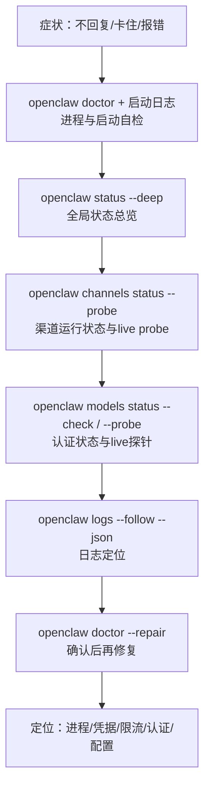

## 3.2 常用诊断命令与日志排障

排障核心思路：先确认进程与网关是否存活，再逐层验证渠道、模型依赖，最后通过日志定位具体错误。

> 完整命令参数与进阶排障流程见[附录 E 命令速查表](../appendix/command_cheatsheet.md)和[附录 C 排障检查清单](../appendix/troubleshooting_checklist.md)。

### 3.2.1 四层诊断顺序与辅助动作

本章建议把排障主链路固定为“四层诊断”：**进程/网关 → 渠道 → 模型 → 日志**。其中 `status --deep` 与 `doctor --repair` 为两个关键辅助动作：前者用于补充全局视图，后者用于在证据明确后做修复，而不是一上来就盲修。

| 诊断层级 | 命令 | 检查目标 |
|---------|------|----------|
| **第一层：进程与网关** | `openclaw doctor` + 启动日志 | 进程能否拉起、配置是否损坏、依赖是否缺失 |
| **第二层：渠道** | `openclaw channels status --probe` | 渠道运行状态与 live probe |
| **第三层：模型** | `openclaw models status --check` / `--probe` | 认证状态与 live provider 探针 |
| **第四层：日志** | `openclaw logs --follow --json` | 定位具体错误、trace 与上下文 |
| **辅助动作 1：全局视图** | `openclaw status --deep` | 当前状态加渠道 live probe |
| **辅助动作 2：修复工具** | `openclaw doctor --repair` | 在确认问题后执行引导式修复 |



图 3-4：四层诊断顺序与辅助命令

### 3.2.2 命令示例

**命令 1：健康检查**

```bash
openclaw health --json
```

`openclaw health --json` 通常会返回顶层 `ok` 与若干嵌套健康信息；不同版本字段结构会变化，不要把 `status: "ok"`、`errors` 等字段当成固定契约。验收时重点看整体是否健康、是否还有关键错误即可。

**命令 2：状态总览**

```bash
openclaw status --deep
```

一次性查看状态并对渠道做 live probe。它适合作为第二步的总览入口：如果这里已经显示渠道掉线，就不应先去改提示词或工作流；供应商用量与配额快照应使用 `openclaw status --usage`。

**命令 3：渠道探针**

```bash
openclaw channels status --probe
```

`channels status --probe` 是当前更稳妥的渠道 live 检查入口，用来确认 Gateway 可达时各渠道账号的运行状态、传输状态和探针结果。`channels capabilities` 更适合后续查看渠道能力、权限范围和联调提示；若需要更深的端到端验证，应结合结构化日志和实际渠道消息一起判断，而不要把单一探针命令写成固定契约。

**命令 4：模型探针**

```bash
openclaw models status --check
openclaw models status --probe
```

`--check` 用于发现缺失、过期或即将过期的认证档案；`--probe` 会实际探测已配置 provider 的 live auth。若探针返回认证或限流错误，再结合供应商后台配额与结构化日志判断是密钥失效、额度耗尽还是上游故障。

**命令 5：跟踪日志**

```bash
openclaw logs --json --limit 500
```

结构化输出便于用 `jq` 过滤。优先用有界快照按 `level` 与 `message` 判断是认证、限流、超时还是 allowlist 类故障：

```bash
openclaw logs --json --limit 500 \
  | jq -r 'select(.type=="log") | select((.level=="error") or (.message|test("auth|rate|timeout|blocked|allowlist";"i"))) | .message'
```

**命令 6：自动修复与诊断配置**

```bash
openclaw doctor --repair
```

自动检测并修复常见配置问题。建议配合脱敏配置使用：

```javascript
{
  logging: {
    level: "info",
    redactSensitive: "tools",
    redactPatterns: ["sk-[A-Za-z0-9]{16,}"],
  }
}
```

### 3.2.3 快速判断路径

- `health` 失败 → 检查进程与端口，查配置语法与权限。
- `status --deep` / `channels status --probe` 发现渠道异常 → 检查渠道凭据、网络连接与网关可达性；再用 `channels capabilities` 查看能力与权限提示。
- `models status --check` 失败 → 检查 API Key、OAuth 过期或缺失；需要 live provider 证据时再运行 `models status --probe`。

排障时不建议先改提示词或工作流；先把依赖与证据链确认下来。

> **踩坑实录：健康检查 “ok” 但消息不通**
>
> `openclaw health --json` 返回 `ok: true`，但 Telegram 消息始终无回复。原因是渠道链路与进程健康不是同一层：进程仍在跑，不代表消息已经真正送达。对渠道问题，先用 `channels status --probe` 查看 live 状态，再用 `channels capabilities` 确认能力与权限提示，最后结合实际消息回放和结构化日志做端到端排查，才是更稳妥的诊断路径。
