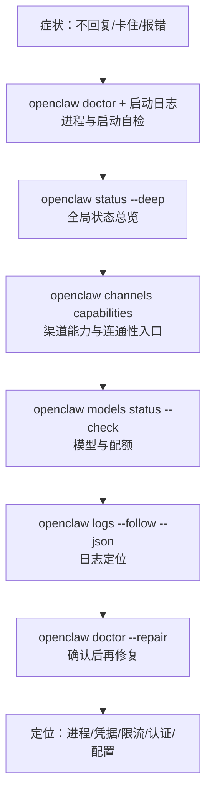

## 3.2 常用诊断命令与日志排障

排障核心思路：先确认进程与网关是否存活，再逐层验证渠道、模型依赖，最后通过日志定位具体错误。

> 完整命令参数与进阶排障流程见[附录 E 命令速查表](../appendix/command_cheatsheet.md)和[附录 C 排障检查清单](../appendix/troubleshooting_checklist.md)。

### 3.2.1 四层诊断顺序与两个辅助动作

本章建议把排障主链路固定为“四层诊断”：**进程/网关 → 渠道 → 模型 → 日志**。其中 `status --deep` 用于补充全局视图，`doctor --repair`（`--fix` 为别名）用于在证据明确后做修复，而不是一上来就盲修。

| 层级 / 动作 | 命令 | 检查目标 |
|------------|------|----------|
| 第一层：进程与网关 | `openclaw doctor` + 启动日志 | 进程能否拉起、配置是否损坏、依赖是否缺失 |
| 辅助总览 | `openclaw status --deep` | 当前渠道、模型、会话与网关的综合状态 |
| 第二层：渠道 | `openclaw channels capabilities` | 渠道能力、配置与连通性检查入口 |
| 第三层：模型 | `openclaw models status --check` | 模型认证、配额与供应商可用性 |
| 第四层：日志 | `openclaw logs --follow --json` | 定位具体错误、trace 与上下文 |
| 修复动作 | `openclaw doctor --repair` | 在确认问题后执行引导式修复 |



图 3-4：四层诊断顺序与辅助命令

### 3.2.2 命令示例

**命令 1：健康检查**

```bash
openclaw health --json
```

`openclaw health --json` 通常会返回顶层 `ok` 与若干嵌套健康信息；不同版本字段结构会变化，不要把 `status: "ok"`、`errors` 等字段当成固定契约。验收时重点看整体是否健康、是否还有关键错误即可。

**命令 2：状态总览**

```bash
openclaw status --deep
```

一次性查看网关、渠道、会话与模型的综合状态。它适合作为第二步的总览入口：如果这里已经显示资源异常或渠道掉线，就不应先去改提示词或工作流。

**命令 3：渠道探针**

```bash
openclaw channels capabilities
```

`channels capabilities` 是当前更稳妥的渠道检查入口，用来确认当前渠道支持什么能力、配置是否完整、以及下一步应如何继续做针对性的联调。若需要更深的端到端验证，应结合结构化日志和实际渠道消息一起判断，而不要把单一探针命令写成固定契约。

**命令 4：模型探针**

```bash
openclaw models status --check
```

`authentication_failed` 表示 API Key 失效，需要刷新凭据；`rate_limited` 且 quota 100% 表示配额耗尽，等待重置或增加额度。

**命令 5：跟踪日志**

```bash
openclaw logs --follow --json
```

结构化输出便于用 `jq` 过滤。统计高频错误类型，快速判断是认证还是限流类故障：

```bash
cat runtime.log | jq -r 'select(.type=="log") | .log | select(.err_type!="") | .err_type' | sort | uniq -c | sort -nr | head
```

**命令 6：自动修复与诊断配置**

```bash
openclaw doctor --repair
```

自动检测并修复常见配置问题。建议配合脱敏配置使用：

```javascript
{
  logging: {
    level: "info",
    redactSensitive: "tools",
    redactPatterns: ["sk-[A-Za-z0-9]{16,}"],
  }
}
```

### 3.2.3 快速判断路径

- `health` 失败 → 检查进程与端口，查配置语法与权限。
- `status --deep` / `channels capabilities` 发现渠道异常 → 检查渠道凭据、网络连接与网关可达性。
- `models status --check` 失败 → 检查 API Key、配额与供应商状态。

排障时不建议先改提示词或工作流；先把依赖与证据链确认下来。

> **踩坑实录：健康检查 “ok” 但消息不通**
>
> `openclaw health --json` 返回 `ok: true`，但 Telegram 消息始终无回复。原因是渠道链路与进程健康不是同一层：进程仍在跑，不代表消息已经真正送达。对渠道问题，先用 `channels capabilities` 确认能力与配置，再结合实际消息回放和结构化日志做端到端排查，才是更稳妥的诊断路径。
