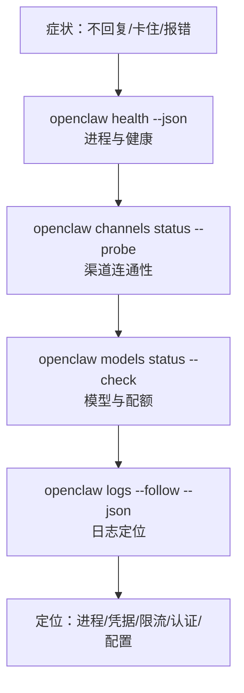

## 3.2 常用诊断命令与日志排障

排障核心思路：先确认进程与网关是否存活，再逐层验证渠道、模型依赖，最后通过日志定位具体错误。

> 完整命令参数与进阶排障流程见[附录 E 命令速查表](../appendix/command_cheatsheet.md)和[附录 C 排障检查清单](../appendix/troubleshooting_checklist.md)。

### 3.2.1 六步排障流程

| 步骤 | 命令 | 检查目标 |
|------|------|----------|
| 1 | `openclaw health --json` | 进程与网关是否存活，顺便确认健康快照结构 |
| 2 | `openclaw status --deep` | 渠道与模型资源总览 |
| 3 | `openclaw channels status --probe` | 渠道连通性与凭据有效性 |
| 4 | `openclaw models status --check` | 模型认证与配额 |
| 5 | `openclaw logs --follow --json` | 定位具体错误 |
| 6 | `openclaw doctor --fix` | 自动修复常见配置问题 |



图 3-2：命令梯子流程图

### 3.2.2 命令示例

**命令 1：健康检查**

```bash
openclaw health --json
```

本次审计实例里，`openclaw health --json` 返回的是顶层 `ok: true`，并附带 `channels`、`sessions`、`heartbeat` 等嵌套信息；不同版本字段结构会变化，不要把 `status: "ok"` / `errors` 当成固定契约。验收时只看整体是否健康、是否还有关键错误即可。

**命令 2：状态总览**

```bash
openclaw status --deep
```

一次性查看内存、渠道连接数、模型配额使用率。内存 >90% 考虑重启；渠道 `disconnected` 立即检查凭据。

**命令 3：渠道探针**

```bash
openclaw channels status --probe
```

`--probe` 触发真实的端到端连通性测试，不只检查进程存活。出现 `bot_token_invalid` 时需要更新渠道凭据；`webhook_latency > 2000ms` 时检查网络或对方 API 状态。

**命令 4：模型探针**

```bash
openclaw models status --check
```

`authentication_failed` 表示 API Key 失效，需要刷新凭据；`rate_limited` 且 quota 100% 表示配额耗尽，等待重置或增加额度。

**命令 5：跟踪日志**

```bash
openclaw logs --follow --json
```

结构化输出便于用 `jq` 过滤。统计高频错误类型，快速判断是认证还是限流类故障：

```bash
cat runtime.log | jq -r 'select(.type=="log") | .log | select(.err_type!="") | .err_type' | sort | uniq -c | sort -nr | head
```

**命令 6：自动修复与诊断配置**

```bash
openclaw doctor --fix
```

自动检测并修复常见配置问题。建议配合脱敏配置使用：

```javascript
{
  logging: {
    level: "info",
    redactSensitive: "tools",
    redactPatterns: ["sk-[A-Za-z0-9]{16,}"],
  }
}
```

### 3.2.3 快速判断路径

- `health` 失败 → 检查进程与端口，查配置语法与权限。
- `channels status --probe` 失败 → 检查渠道凭据与网络连接。
- `models status --check` 失败 → 检查 API Key、配额与供应商状态。

排障时不建议先改提示词或工作流；先把依赖与证据链确认下来。

> **踩坑实录：健康检查 “ok” 但消息不通**
>
> `openclaw health --json` 返回 `ok: true`，但 Telegram 消息始终无回复。原因是渠道链路与进程健康不是同一层：进程仍在跑，不代表消息已经真正送达。`channels status --probe` 才是真正的端到端探测命令，`health` 只检查进程存活。生产环境建议两者都纳入监控。
