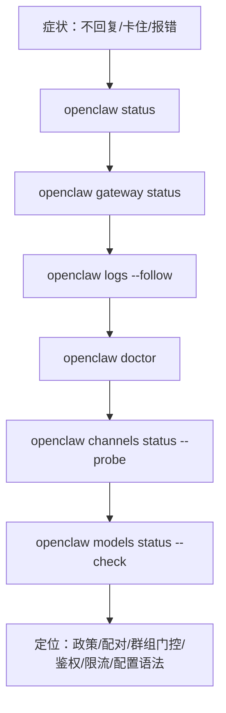

## 3.2 常用诊断命令与日志排障

本节把排障从”看报错猜原因”变成基于官方命令与日志证据的分层定位。核心思路是先用 `health` 与 `status` 判断系统是否可用，再用 `channels status --probe` 与 `models status --check` 分别验证渠道与模型依赖，最后通过 `doctor` 与诊断配置把敏感信息脱敏后采样留证。

> 本节涉及的所有 CLI 命令均可在[附录 F 命令速查表](../appendix/command_cheatsheet.md)中查阅完整语法与参数说明；更系统化的检查流程另见[附录 C 排障检查清单](../appendix/troubleshooting_checklist.md)。

### 3.2.1 分层定位顺序：先外后内

建议固定排障顺序。

1. 进程与健康：服务是否可用。
2. 网关与渠道：渠道是否连通、是否被策略拒绝。
3. 模型与配额：模型是否可用、是否限流或认证失败。
4. 会话与工具：是否串话、是否被工具策略拦截。

**命令梯子流程图：**



图 3-1：命令梯子流程图

### 3.2.2 四个命令覆盖 80% 排障

操作示例：先跑一遍健康与状态探测，再分别验证渠道与模型依赖，把问题定界到可执行动作。

**命令 1：健康检查**

```bash
openclaw health --json
```

✅ **正常输出**

完整的健康检查响应比 [3.1 节](3.1_control_ui_webchat.md)的最小示例包含更多字段（如 `fallback` 模型和 `last_check` 时间戳）。以下为完整格式：

```json
{
  "status": "ok",
  "gateway": "running",
  "uptime": 45678,
  "channels": {
    "telegram": "connected",
    "whatsapp": "connected",
    "discord": "connected"
  },
  "models": {
    "default": "gpt-5",
    "fallback": "claude-opus-4-6"
  },
  "last_check": "2026-03-06T10:30:45.123Z"
}
```

❌ **常见异常**
```json
{
  "status": "degraded",
  "gateway": "running",
  "channels": {
    "telegram": "disconnected",
    "whatsapp": "connected"
  },
  "errors": [
    "telegram: bot token expired (last checked 2026-03-05 10:00:00)",
    "models: rate limit approaching (used 95% quota)"
  ]
}
```

排查建议：
- `status: "degraded"` 表示部分组件故障，优先检查 `errors` 数组。
- `token expired` 需要刷新渠道凭据；`rate limit` 需要检查配额与成本控制。

---

**命令 2：状态总览与深度探测**

```bash
openclaw status --deep
```

✅ **正常输出（示例）**
```
Gateway Status
  Process ID: 12345
  Uptime: 1d 2h 30m
  Memory: 256MB / 512MB (50%)
  CPU: 15%

Channels Summary
  telegram: connected (1 bot, 25 active chats)
  whatsapp: connected (1 business account, 42 active chats)
  discord: connected (3 servers, 150 members)

Models Summary
  default: gpt-5 (quota: 95% used)
  fallback: claude-opus-4-6 (quota: 30% used)

Recent Errors (last 5 minutes)
  [none]
```

❌ **常见异常**
```
Gateway Status
  [WARN] Memory: 480MB / 512MB (93%) - approaching limit

Channels Summary
  telegram: disconnected - [ERROR] Bot token invalid or revoked
  whatsapp: connected (1 business account, 0 active chats)
  discord: connected (1 server, 0 members) - [WARN] Reconnected 3 times in last hour

Models Summary
  default: gpt-5 (quota: 100% used - LIMIT REACHED)

Recent Errors (last 5 minutes)
  [ERROR] 10:25:00 - Model call failed: rate_limit_exceeded
  [ERROR] 10:26:15 - Telegram webhook timeout
  [WARN] 10:28:30 - Database connection pool 90% utilized
```

排查建议：
- 内存接近上限 >90%，考虑重启网关或扩容。
- 渠道出现 `disconnected`，立即检查凭据与网络连接。
- 模型配额 100%，需要增加额度或等待重置。

---

**命令 3：渠道状态与连通性探针**

```bash
openclaw channels status --probe
```

✅ **正常输出**
```json
{
  "channels": [
    {
      "name": "telegram",
      "status": "connected",
      "bot_id": "123456789",
      "last_message": "2026-03-06T10:28:30.123Z",
      "probe": {
        "http_status": 200,
        "webhook_latency_ms": 45,
        "message_delivery": "ok"
      }
    },
    {
      "name": "whatsapp",
      "status": "connected",
      "business_account": "1234567890123456",
      "probe": {
        "http_status": 200,
        "webhook_latency_ms": 120,
        "message_delivery": "ok"
      }
    }
  ]
}
```

❌ **常见异常**
```json
{
  "channels": [
    {
      "name": "telegram",
      "status": "disconnected",
      "error": "bot_token_invalid",
      "details": "Token last validated at 2026-02-28. Use 'openclaw channels update telegram --token <new_token>'",
      "probe": {
        "http_status": 401,
        "error_body": "Unauthorized: Bot token was revoked"
      }
    },
    {
      "name": "whatsapp",
      "status": "connected_but_degraded",
      "webhook_latency_ms": 8500,
      "probe": {
        "http_status": 200,
        "warning": "webhook latency >5000ms, possible network issue"
      }
    }
  ]
}
```

排查建议：
- `bot_token_invalid`：需要更新凭据，参考输出中的命令提示。
- `webhook_latency` 过高 (>2000ms)：检查网络连接、防火墙、对方 API 服务状态。
- 若 `http_status` 为 5xx，对方服务可能故障，稍后重试。

---

**命令 4：模型状态与认证探针**

```bash
openclaw models status --check
```

✅ **正常输出**
```json
{
  "models": [
    {
      "name": "gpt-5",
      "provider": "openai",
      "status": "available",
      "quota": {
        "used": 95000,
        "limit": 100000,
        "percent": 95,
        "reset_at": "2026-03-07T00:00:00Z"
      },
      "probe": {
        "auth_status": "ok",
        "latency_ms": 450,
        "last_call": "2026-03-06T10:28:00Z"
      }
    },
    {
      "name": "claude-opus-4-6",
      "provider": "anthropic",
      "status": "available",
      "quota": {
        "used": 30000,
        "limit": 200000,
        "percent": 15,
        "reset_at": "2026-03-07T00:00:00Z"
      },
      "probe": {
        "auth_status": "ok",
        "latency_ms": 680,
        "last_call": "2026-03-06T10:27:30Z"
      }
    }
  ]
}
```

❌ **常见异常**
```json
{
  "models": [
    {
      "name": "gpt-5",
      "provider": "openai",
      "status": "unavailable",
      "error": "authentication_failed",
      "details": "API key expired or invalid. Check at https://platform.openai.com/account/api-keys",
      "probe": {
        "auth_status": "failed",
        "error_code": 401,
        "error_message": "Invalid authentication"
      }
    },
    {
      "name": "claude-opus-4-6",
      "provider": "anthropic",
      "status": "rate_limited",
      "quota": {
        "used": 200000,
        "limit": 200000,
        "percent": 100,
        "reset_at": "2026-03-07T08:00:00Z"
      },
      "probe": {
        "auth_status": "ok",
        "latency_ms": 800,
        "last_error": "rate_limit_exceeded (retry after 30s)"
      }
    }
  ]
}
```

排查建议：
- `authentication_failed`：API 密钥过期或无效，需要刷新凭据，参考输出中给出的管理链接。
- `rate_limited` 且 quota percent = 100%：配额已用尽，需要增加额度或等待重置时间。
- 若 latency >2000ms，检查网络连接或对方 API 服务是否出现性能问题。


### 3.2.3 日志与落盘位置：先找到证据

官方说明中，日志默认写入 `/tmp/openclaw/openclaw-YYYY-MM-DD.log`（以下示例中的 `runtime.log` 均指代该默认日志路径，实际路径以配置为准）。建议在排障时同时开启 follow 与结构化输出，便于 `jq` 过滤。也可以直接通过 Dashboard 的 Logs 选项卡实时查看系统运行状态：


图 3-2：Logs 实时监控界面

```bash
openclaw logs --follow --json
```

操作示例：统计某类错误类型的出现频率，快速判断是否为认证或限流类故障。字段名以实际日志为准。

```bash
cat runtime.log | jq -r 'select(.type=="log") | .log | select(.err_type!="") | .err_type' | sort | uniq -c | sort -nr | head
```

### 3.2.4 doctor 与诊断配置：可修复、可脱敏、可留证

官方提供 `doctor` 用于诊断与修复常见问题，并提供诊断配置用于脱敏与控制日志落盘。

```bash
openclaw doctor --fix
```

配置示例（从官方示例改写，突出脱敏与落盘）：

```json5
{
  logging: {
    file: "/tmp/openclaw/openclaw-%DATE%.log",
    level: "info",
    consoleLevel: "info",
    consoleStyle: "pretty",
    // 注意：redaction 主要作用于控制台/TTY 输出（不要承诺“文件日志完全脱敏”）
    redactSensitive: "tools",
    // 可选：自定义敏感模式
    redactPatterns: ["sk-[A-Za-z0-9]{16,}"],
  },
  diagnostics: {
    enabled: true,
    flags: ["telegram.*"], // 仅在需要时打开
  }
}
```
> [!WARNING]
> OpenClaw 对配置有严格的 Schema 校验。如果配置了未知的键，Gateway 将拒绝启动，并仅允许使用 `openclaw doctor` 等诊断命令恢复配置。

### 3.2.5 典型场景：渠道不响应时如何快速判断

- 若 `health` 失败：先看进程与端口，再看配置语法与权限。
- 若 `channels status --probe` 失败：优先检查渠道凭据与登录状态。
- 若 `models status --check` 失败：优先检查认证、配额与供应商状态。

排障时不建议先改提示词或工作流；先把依赖与证据链确认下来。

### 3.2.6 斜杠命令速查：日常高频操作

除了上述系统级诊断命令，OpenClaw 还提供了一套可在聊天界面中直接使用的斜杠命令，用于快速控制智能体行为。以下是最常用的命令速查表：

| 命令 | 用途 | 典型场景 |
| --- | --- | --- |
| `/status` | 查看当前运行状态 | 小龙虾卡住不回复时，先发这个定位问题 |
| `/stop` | 停止当前正在执行的任务 | 配合 `/status` 使用；发现任务卡住后强制终止 |
| `/compact` | 压缩当前会话上下文 | token 快满时使用，压缩后仍保留核心记忆 |
| `/new` | 开启全新会话 | 切换话题时避免上下文污染 |
| `/model <名字>` | 切换当前使用的模型 | 简单任务用便宜模型，复杂任务切强模型，控制成本 |
| `/think <级别>` | 调整思考深度（off / low / high） | 日常闲聊用 off 省 token，复杂推理开 high |

> [!TIP]
> `/status` + `/stop` 是排障第一步。当智能体长时间无响应时，先 `/status` 看状态，如果显示正在运行但无输出，多半是某个工具调用卡住了，发 `/stop` 让它恢复。

> [!WARNING]
> 飞书不支持原生命令菜单（command menus），但支持以文本发送 `/status`、`/reset`、`/model` 等常用命令。若需要更强的原生交互式命令体验，可使用其他支持指令菜单机制的渠道或 Control UI。

> **💡 踩坑实录：健康检查 "ok" 但消息不通**
>
> `openclaw health --json` 返回 `status: "ok"`，但 WhatsApp 消息始终无回复。最终发现是 Baileys 的 QR 配对过期了——Gateway 进程还在跑，但 WebSocket 连接已断开。`channels status --probe` 才是真正的端到端探测命令，`health` 只检查进程存活。生产环境建议两者都纳入监控。
