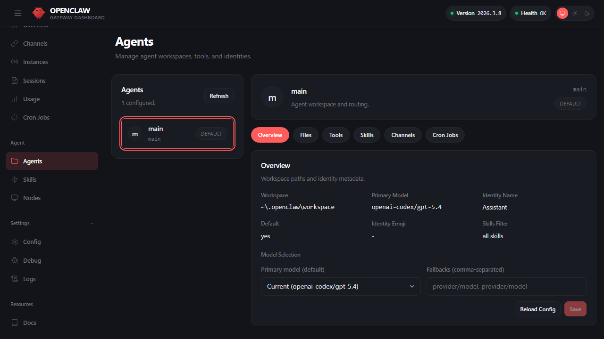

## 3.3 初始指令与智能体角色配置

初始指令是面向运行时的契约，核心包含三类信息：**目标收敛**（处理什么问题）、**边界声明**（禁止什么行为）、**格式约束**（输出什么结构）。指令越像可执行规范，系统越稳定；写成文学化口吻往往引入歧义，使模型在关键时刻无法可靠遵循。

> 多智能体路由下的进阶指令设计见[第七章](../07_multi_agent/README.md)；工具权限的配合配置见[第五章 5.2](../05_tools_skills/5.2_tool_policy.md)。

### 3.3.1 最小指令模板

第一次部署从这个三要素模板开始，足以让智能体稳定运行：

```text
你是 [角色名称]。遵守以下规则：
1. 只处理与 [领域] 相关的问题，其他问题回复"超出职责范围"
2. 输出必须包含：结论（一句话）→ 具体内容 → 验证方式
3. 不确定时明确说明，不编造信息
```

### 3.3.2 在配置中设置指令

OpenClaw 支持默认指令与按智能体覆盖，配置字段为 `agents.defaults.instructions`。

在 Dashboard 的 Agents 页面也可以可视化管理这些设定：



图 3-4：Agents 可视化配置

```javascript
{
  agents: {
    defaults: {
      instructions: "产出可执行步骤与验证方式；不确定时明确说明并给出排查路径；避免编造命令与配置键。"
    },
    work: {
      displayName: "工作助手",
      instructions: "只处理与工作相关的问题；高风险操作先给出确认点与回滚方案。"
    }
  }
}
```

多智能体路由场景建议：把"入口治理"写到入口智能体的指令里，把"领域知识与工具使用"写到领域智能体的指令里，减少单条指令承担过多职责。

### 3.3.3 好指令 vs 坏指令

| 维度 | ❌ 坏（模糊） | ✅ 好（可检查） |
|------|-------------|----------------|
| 目标 | "你是一个友善的助手，尽力帮助用户" | "只处理 K8s 运维问题；其他问题回复'超出职责范围'" |
| 边界 | "请小心使用危险命令" | "禁止输出 kubectl delete；如需执行必须先给出回滚方案并等待确认" |
| 输出 | "请尽量详细地回答" | "必须包含四段：结论→命令（带注释）→验证方式→失败处理" |

避免把安全边界只写在指令里——真正的边界由工具策略与沙箱约束提供确定性兜底，详见 [5.2 工具策略](../05_tools_skills/5.2_tool_policy.md)。

### 3.3.4 验证指令是否生效

用固定测试集覆盖边界问题与失败场景，再用日志确认智能体行为：

```bash
openclaw status --deep
openclaw logs --follow --json
```

观察到模型偏离指令时，优先检查路由绑定、工具策略或渠道门控是否导致上下文变化，再回到指令本身做最小修改。指令迭代建议与配置一同纳入版本控制。

> [!NOTE]
> 个人助理场景下，OpenClaw 还支持用 SOUL.md 文件定义智能体的沟通风格与个性化表现，详见[第六章 记忆机制](../06_context_memory/6.3_memory_mechanism.md)。
