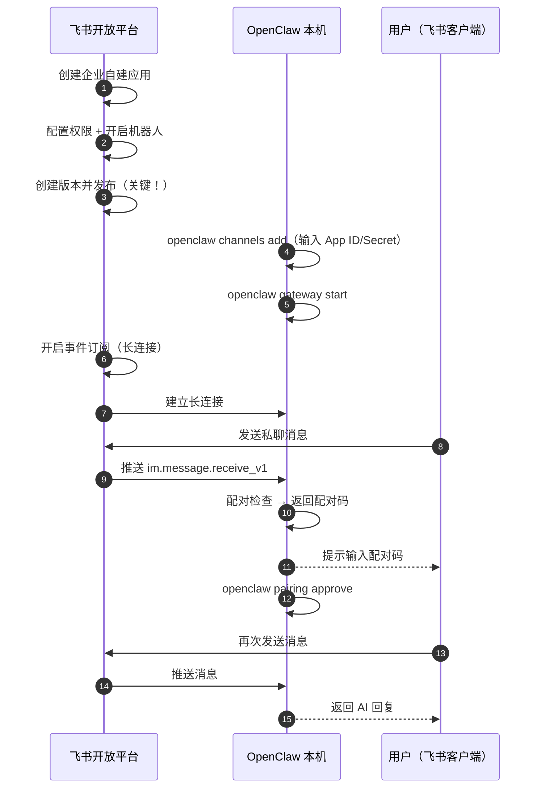

## 3.5 飞书专项接入指南：让它能在群里陪你聊天

接通飞书不仅需要配置 OpenClaw 侧，还需要在飞书开放平台完成一系列授权。很多新手在第一步“长连接订阅”就会失败。本节将详细梳理一条不会出错的“端到端”飞书接入流。

### 3.5.1 整体时序与防坑预警

提示：飞书接入会引入外部平台变量。若你仍在搭建第三章的本地最小闭环基准线，建议先完成 3.1–3.4 并稳定复验后，再开始本节操作。

常见失败点速查（建议先过一遍再动手）：

- 长连接订阅失败：优先确认“版本管理与发布”已创建版本并发布，然后再开启事件订阅（长连接）。
- 消息不触发：先检查群聊是否启用、是否要求 @、群是否在允许列表；再回看日志是否命中门控规则。
- 私聊要先配对：若启用了配对策略，首次私聊通常会先得到配对码，批准后才会进入正常对话。

不管你接的是哪家平台，基本都遵循同一条流水线，但 **飞书有个极为容易出错的步骤顺序** ：

1. ✅ **飞书侧** ：创建应用 -> 配置权限 -> **发布应用（关键！）** 2. ✅ **OpenClaw 侧**：配置飞书渠道 (`openclaw channels add`)
3. ✅ **OpenClaw 侧**：启动 Gateway (`openclaw gateway start`)
4. ✅ **飞书侧**：回到平台开启“事件订阅（长连接）”并添加事件

如下的时序图展示了飞书接入的端到端交互流程：



图 3-1：飞书接入的端到端交互流程

**血的教训**：如果你在飞书侧还没有点击“创建版本并发布”（第 3 步），就直接跑到“事件与回调”里开启长连接（第 6 步），那么系统会无限报错“长连接订阅失败”。

### 3.5.2 在飞书开放平台配置应用

1. 打开 [飞书开放平台](https://open.feishu.cn/app)，点击“创建企业自建应用”，获取 `App ID` 和 `App Secret`。
2. **权限配置（批量导入推荐）**：点击左侧“权限管理属性”，选择“批量导入权限”，粘贴以下内容避免遗漏：

```json
{
  "scopes": {
    "tenant": [
      "aily:file:read",
      "aily:file:write",
      "application:application.app_message_stats.overview:readonly",
      "application:application:self_manage",
      "application:bot.menu:write",
      "contact:user.employee_id:readonly",
      "corehr:file:download",
      "event:ip_list",
      "im:chat.access_event.bot_p2p_chat:read",
      "im:chat.members:bot_access",
      "im:message",
      "im:message.group_at_msg:readonly",
      "im:message.p2p_msg:readonly",
      "im:message:readonly",
      "im:message:send_as_bot",
      "im:resource"
    ],
    "user": [
      "aily:file:read",
      "aily:file:write",
      "im:chat.access_event.bot_p2p_chat:read"
    ]
  }
}
```

3. 在“应用能力”中找到 **机器人** 卡片并开启。
4. **发布应用**：在左侧进入“版本管理与发布”，创建一个 1.0 版本并申请发布。（企业管理员秒速通过）。

### 3.5.3 在 OpenClaw 侧完成绑定

在环境内使用渠道管理命令：

```bash
openclaw plugins enable feishu
openclaw channels add
```

- 选择 `Feishu/Lark (飞书)`
- 输入收集好的 `App ID` 与 `App Secret`。
- 对国内版务必正确选择域名 `feishu.cn`。
- 建议初次接入时： **群聊先选 disabled，后续配置通了再更改**。

配置完毕后查看连通性：

```bash
openclaw channels list
```

### 3.5.4 开启事件订阅并在飞书进行第一次对话

1. 先在终端将网关起飞：`openclaw gateway start`。
2. 此时，回到飞书开发者后台的“事件与回调”页面， **开启长连接** ，并添加事件 `im.message.receive_v1`（接收消息）。
3. 保存后如果未报错，说明订阅连通。
4. 去飞书电脑端搜索你的机器人，发送随便一句私聊“你好”。
5. 因为你在 3.4 节配置了配对策略，此时会收到一个配对码（Pairing code）。复制这段码并在终端通过 `openclaw pairing approve feishu <CODE>` 批准。
6. 最后，享受你的企业专属私人助理！
