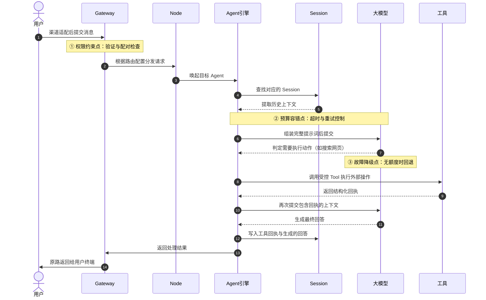
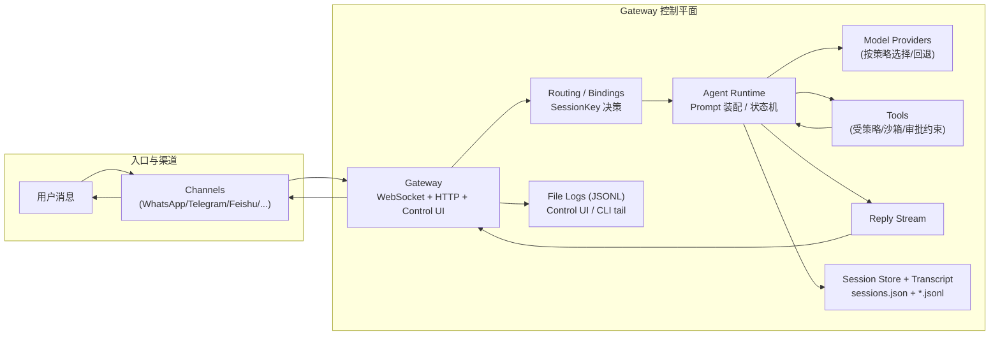

## 请求流转与分层排障

本节通过追踪一条真实消息的完整生命周期，帮助你建立对 OpenClaw 运行机制的直觉。当系统出了问题时，这里的分层排障策略能帮你快速定位到正确的层级。

---

### 追踪一条消息的完整生命周期

理解架构最好的方式是追踪一次真实请求。下面以"用户在 Telegram 发消息，智能体查了一个网页后回复"为例，还原完整流转过程：

**图：一次请求的核心流转路径（含三个关键约束点）**

分步解读：

1. **步骤 ①②③**：消息到达，Gateway 验证身份与配对，按路由把请求交给对应 Node 下的 Agent。
2. **步骤 ④⑤⑥⑦**：Agent 从 Session 提取历史记忆，拼装提示词，发送给模型。这里有超时与重试控制。
3. **步骤 ⑧⑨⑩⑪**：模型推理后决定调用工具（如搜索），执行完后把结果回传给模型。此阶段受故障降级策略保护。
4. **步骤 ⑫⑬⑭**：模型根据工具回执生成最终回答，写入 Session，通过 Gateway 返回给用户。

---

### 分层排障：出了问题先查哪里

由于四层职责严格分离，排障可以采用"**由外到内**"策略——先检查入口层，再控制层，再执行层，最后能力层。

| 层级与对象 | 核心职责 | 典型故障表现 | 排查方向 |
|---|---|---|---|
| **入口层 (Channels)** | 协议适配、事件统一 | 日志无任何流入记录；客户端反复"连接断开" | Webhook 配置、网络连通性 |
| **控制层 (Gateway/Node)** | 鉴权、路由 | 请求被秒拒（Unauthorized），但模型没收到任何消息 | 终端配对文件、路由配置、访问限制 |
| **执行层 (Agent/Session)** | 记忆拼接、推理、重试 | 推理时间超长、死循环、回答完全脱离上下文或偏离角色 | Context 长度、Agent 配置、Compaction 压缩参数 |
| **能力层 (Tool/Model)** | 外部执行、模型补全 | 无动作响应、收到 429 限流、工具调用未释放 | 模型额度、工具元数据、探活探针 |

**两个常见症状的快速定位**：
- **"间歇性回答缓慢且越来越离谱"** → 先查**执行/能力层**（上下文过长、模型降级）
- **"发消息完全没反应，或瞬间被拒"** → 先查**入口/控制层**（鉴权失败、路由配置错误）

完整的排障检查清单见[附录 C](../appendix/troubleshooting_checklist.md)。

---

### 端到端消息链路图（全局视图）

**图：端到端消息链路图（含存储与日志路径）**
