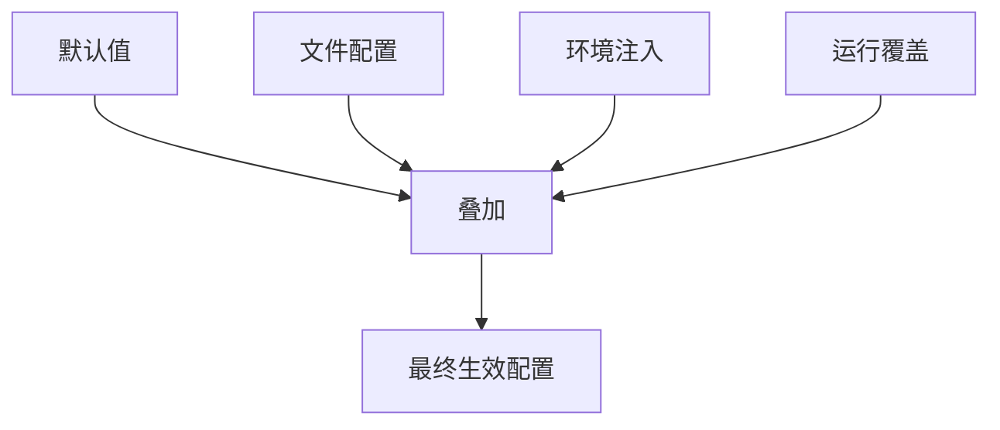

## 4.1 openclaw.json 结构与配置优先级

本节梳理配置体系的生效链：配置来源、优先级、覆盖与审计。重点是让任何运行时行为都能追溯到某个确定输入，并给出验证最终生效值的方法。

### 4.1.1 配置是什么：把系统行为写成可追溯输入

OpenClaw 的配置不是“参数集合”，而是系统行为的输入。把行为写进配置的意义在于：同一套系统在不同机器、不同渠道、不同账号下运行时，行为仍可被复现与解释。

从系统链路看，配置至少决定三类结果：

- 入口结果：哪些消息能进入系统，哪些消息会被拒绝或忽略。
- 执行结果：任务被哪个 Agent/Node 执行，使用哪些工具，输出如何回注到会话。
- 治理结果：权限边界、审计与故障处理策略是否能在异常时稳态运行。

实践中最常用的主配置文件位于 `~/.openclaw/openclaw.json`（JSON5）。配置一旦用于生产，必须满足两条底线：可解释（能定位到字段与来源），可追溯（变更有记录且可回滚）。

高级安全配置示例如下，比起单纯的“开关”，更推荐用完整的 JSON 结构来定义行为：

```json5
{
  "gateway": {
    "port": 18789,
    "auth": {
      "requirePairing": true,
      "allowedOrigins": ["https://admin.openclaw.ai"]
    }
  },
  "channels": {
    "whatsapp": {
      "enabled": true,
      "allowFrom": ["+15555550123"],
      "groups": {
        "*": { "requireMention": true }
      }
    }
  },
  "messages": {
    "groupChat": {
      "mentionPatterns": ["@openclaw"]
    }
  }
}
```

### 4.1.2 作用域拆分：Gateway、Agent、渠道、工具各自控制什么

很多“配置不生效”并非优先级问题，而是写错了作用域。最稳的做法是先把配置按职责拆成四层，再讨论覆盖：

- Gateway 级：连接、鉴权、配对、路由与状态治理等控制平面行为。
- Agent 级：默认工作区、任务策略、能力组合方式（模型/工具/记忆如何协作）。
- 渠道级：渠道凭据与访问边界，例如 Telegram 令牌、WhatsApp 允许来源等。
- 工具级：工具启用、最小权限、超时与回执规范（工具输出如何进入上下文）。

一个实用判断法：

- 入口相关的“谁能触发”属于渠道级或 Gateway 级。
- “怎么做事、用什么能力”属于 Agent 级与工具级。
- “失败时怎么办、如何审计”通常横跨 Gateway/工具两层，但落点不同。

### 4.1.3 优先级模型：默认值、文件、环境注入、运行覆盖如何叠加

无需依赖实现细节，也能用一个稳定模型理解优先级：越接近运行时，优先级越高。常见来源包括：

1. 默认值：程序内置，保证系统至少能启动（例如 Gateway 默认端口 18789）。
2. 文件配置：`~/.openclaw/openclaw.json` 的 JSON5 内容。
3. 环境注入：配置里写成 `ENV:VAR_NAME` 的字段，会在运行时从环境变量读取真实值（典型用于密钥、令牌等敏感信息）。注意：环境变量不是“无差别覆盖任意字段”，它只会填充你在配置里主动声明为 `ENV:` 的字段。
4. 运行覆盖：启动时的命令行参数等临时覆盖（例如启动时使用 `--port 19091`），用于一次性实验与快速回滚。

下面的示意图表达“叠加而非替换”的关系：



图 4-1：配置优先级叠加模型

同一字段可能在多处出现，最终值取决于覆盖来源，而不是“文件里谁写在后面”。因此治理配置时要避免重复定义同一语义的字段，尤其是跨环境复制时最容易留下残留覆盖。

### 4.1.4 生效证据：如何证明“最终生效值”

把“配置生效”落到证据链，才能形成稳定排障方法。推荐按顺序收集四类证据：

- 路径证据：确认输出 `Loading config from ~/.openclaw/openclaw.json`。
- 内容证据：关键字段的脱敏快照。用 `openclaw status --deep` 核对关键配置是否被加载（例如默认智能体、模型选择、渠道策略与工具策略的概要），并结合配置文件内容形成“字段 → 行为”的对应表。
- 运行证据：日志必须解释“为什么拒绝”。例如：`[Channel/WhatsApp] Message rejected: sender +19999999999 not in allowFrom list`。
- 行为证据：用一个可复现实验验证字段是否生效。

可复现实验应尽量选择“二值结果”。例如：

- 渠道白名单：从未授权号码发送消息，期望被拒绝；从授权号码发送消息，期望被接收。
- 工具策略：触发被断言禁用的工具，期望日志打印 `Tool 'execute_shell' denied by policy: minimum clearance level required`。

如果你希望把证据链做得更“二值化”，可以把验收命令固定为一组最小集合：先 `doctor` 确认配置可读、再 `status --deep` 确认加载、最后用 `logs --follow --json` 回放一次具体链路（见第 3 章诊断与附录 D 的命令速查）。
