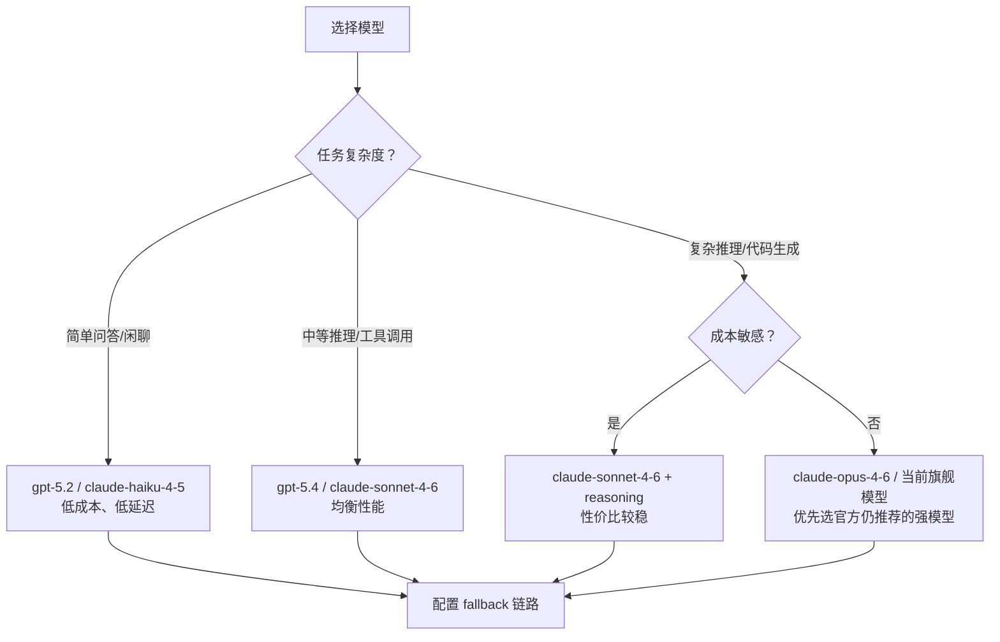

## 4.3 模型选择与默认策略

本节围绕 `agents.defaults.model` 讲清模型选择的落点：默认主模型如何设定；不同智能体如何覆盖默认值；在工具调用与长上下文场景下选型要额外关注哪些能力约束。最后给出一组基于 `models status` 与用例回归的验证方法，把选型从“感觉”变成“可对比”。

### 4.3.1 决策维度：质量、成本、延迟、可靠性

模型选择不要只看效果。对可运行系统，至少需要同时考量以下四个维度：

- 质量：完成度、事实性、工具调用对齐。
- 成本：单位请求成本与失败成本。
- 延迟：平均与尾延迟。
- 可靠性：失败率、限流频率、抖动恢复时间。

**具体例子：三个典型业务场景的选型对比**

| 业务场景 | 质量需求 | 延迟容忍 | 成本敏感度 | 推荐策略 |
| --- | --- | --- | --- | --- |
| 客服系统 | 中（标准问答） | 低（用户在线等待） | 高（每条消息计费） | 轻量模型为主（如 `openai-codex/gpt-5.2` 或 `anthropic/claude-haiku-4-5`），大模型兜底 |
| 数据分析助手 | 高（复杂推理） | 中（可等 30 秒） | 中 | 大模型为主（如 gpt-5.4），关注上下文窗口 |
| 定时巡检报告 | 高（结构化输出） | 高（离线异步） | 低 | 大模型为主，失败后自动重试而非降级 |

以此表为参考，客服场景中，把轻量模型设为 `primary`，并把 `gpt-5.4` 或 `claude-sonnet-4-6` 放进 `fallbacks`，能在控制成本的同时保证复杂问题不崩；而内部分析场景则相反，应把大模型作为主力。

四维必然冲突。工程上更稳的做法是先固定默认主模型，再通过回退链路兜底，而不是频繁手动换模型。

**模型选择决策树**

下图展示了从任务复杂度出发，进行模型选择与 fallback 配置的完整决策流程：



使用此决策树的步骤：

1. **评估任务复杂度**：确定你的使用场景属于简单问答、中等推理还是复杂推理与代码生成。
2. **选择主模型**：沿着对应分支找到推荐模型。
3. **配置 fallback 链路**：为主模型配置至少一个降级模型，见 4.4。

示例配置（中等推理场景）：

```javascript
{
  agents: {
    defaults: {
      model: {
        primary: "openai-codex/gpt-5.4",
        fallbacks: [
          "anthropic/claude-sonnet-4-6",
        ],
      },
    },
  },
}
```

示例配置（复杂推理、成本敏感场景）：

```javascript
{
  agents: {
    defaults: {
      model: {
        primary: "anthropic/claude-sonnet-4-6",
        fallbacks: [
          "openrouter/anthropic/claude-sonnet-4-6",
          "openai-codex/gpt-5.4",
        ],
      },
    },
  },
}
```

### 4.3.2 默认主模型：agents.defaults.model.primary

默认主模型建议写在 `agents.defaults.model.primary`，并把它当作“系统基线”而不是“随手开关”：先固定默认值，再通过回退链路兜底（见 4.4），避免频繁手动切换导致证据链断裂。

```javascript
{
  agents: {
    defaults: {
      model: {
        primary: "openai-codex/gpt-5.4",
      },
    },
  },
}
```

### 4.3.3 针对单个智能体覆盖：agents.list

当不同智能体承担不同任务时，可以在 `agents.list` 中覆盖模型选择，使其与工具策略、工作区隔离一起演进。

```javascript
{
  agents: {
    list: [
      {
        id: "assistant",
        model: {
        primary: "openai-codex/gpt-5.4",
        },
      },
      {
        id: "fast",
        model: {
          primary: "openai-codex/gpt-5.2",  // 轻量模型示例，具体以本地目录为准
        },
      },
    ],
  },
}
```

### 4.3.4 与上下文与工具的耦合点

选型时建议额外检查三类约束。

- 上下文窗口：是否能承载目标任务的上下文体积。
- 工具调用能力：是否能稳定遵循工具签名与输出契约。
- 输出格式：是否能稳定输出结构化结果，便于后续审计与回放。

如果系统大量依赖工具回执与结构化回注，模型的“格式合规率”通常比纯问答更重要。

### 4.3.5 验证方法：探针加回归用例

操作示例：先确认模型可用，再跑最小用例回归。

```bash
openclaw models status --check
```

当更换 `primary` 或调整回退链路时，建议固定一组用例回归，至少包含。

- 事实性用例。
- 工具型用例。
- 多轮上下文用例。

把回归结果与成本、延迟一起记录，才能避免“看似更聪明但更不稳定”的回归。
