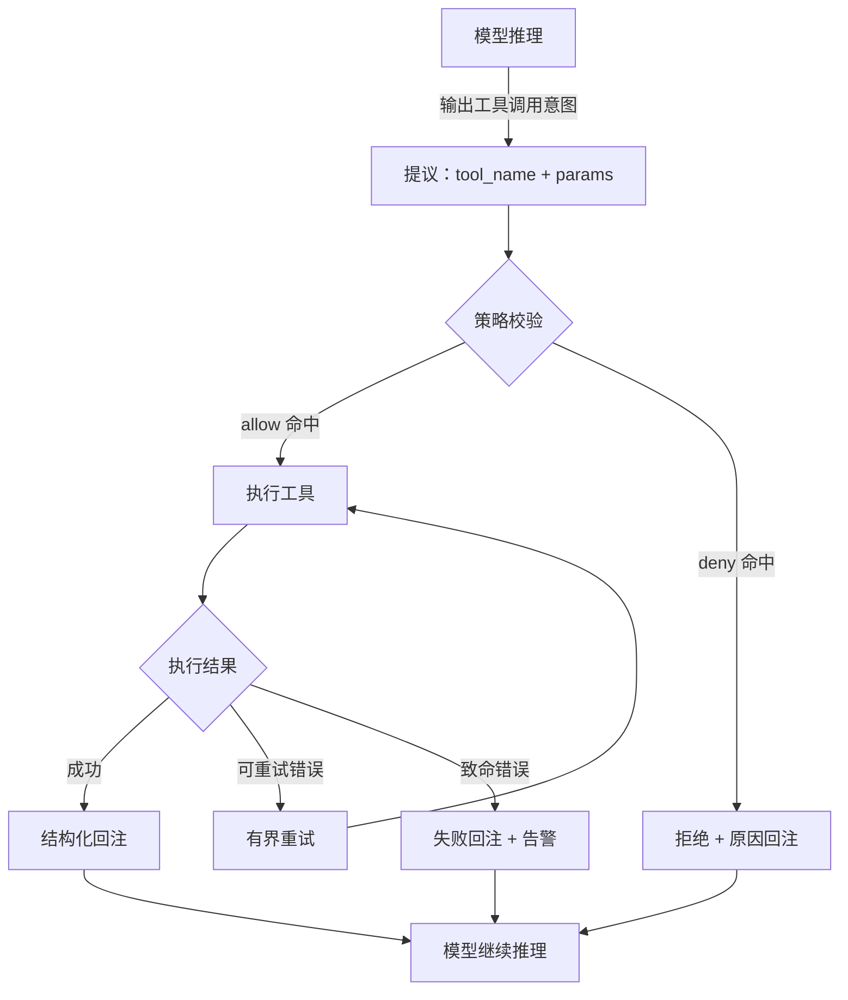

## 5.1 内置工具全景与调用范式

本节建立工具清单的工程化视角：工具契约、失败语义、只读与写入边界，以及如何让一次调用可复现、可回放（并能落到你自己的本地实例上验证）。

### 5.1.1 内置工具全景：来源、分组与“你的本地清单”

“内置工具全景”不是列出一份固定清单（它会随版本、profile、插件与部署形态变化），而是让你能在自己的实例上回答三件事：

1. **候选工具集从哪里来** ：`tools.profile` 的基础集合 + 已启用插件带来的新增工具。
2. **哪些工具被策略裁剪** ：`tools.allow`/`tools.deny` 与 `channels.*.groups.*.tools` 的分层限制把候选集合收敛到可执行集合。
3. **一次调用如何被审计** ：当工具被允许/拒绝/失败时，能在 `status --deep` 与结构化日志里复盘“命中哪条规则、失败在哪里”。

建议把“你的本地工具清单”做成一张可复用的表（后续写工具策略、做验收、做排障都用它）：

| 工具类别 | 典型工具模式（示例） | 风险等级 | 默认策略建议 | 验收关注点 |
| --- | --- | --- | --- | --- |
| 只读查询 | `group:web`、`read`、`memory_search` | 低 | 默认允许（按需限流） | 准确率、延迟、可用性 |
| 有副作用写入 | `write`、`edit`、`group:messaging` | 中 | 默认拒绝（按入口/角色放开） | 幂等、回滚、权限边界 |
| 执行/命令类 | `group:runtime` (`exec`, `bash`) | 高 | 默认拒绝（最小范围放开） | 白名单、审计、爆炸半径 |
| 交互自动化 | `group:ui` (`browser`, `canvas`) | 高 | 默认拒绝（必要时放开） | 步骤可验证、失败可定位 |
| 扩展工具 | `plugins.*`（由插件提供） | 取决于能力 | 先插件白名单，再工具策略收敛 | 启停、灰度、可回放证据 |

> 说明：上表中的“工具模式”用于表达治理方法与风险分层；具体 tool id 与可用命令请以你本地实例的 `status --deep`、结构化日志与各子命令 `--help` 的实际输出为准。

一个最小、可复制的“工具清单生成/校验”流程（不依赖记忆，依赖证据）：

1. **静态证据** ：检查配置里 `tools.profile`、`tools.allow`、`tools.deny` 与 `channels.*.groups.*.tools` 的收敛意图是否清晰。
2. **运行时证据** ：用 `status --deep` 确认配置已加载；用结构化日志回放一次工具允许/拒绝事件，确认命中的规则可追溯。
3. **扩展证据** ：如果引入插件，先用 `plugins list`/`plugins doctor` 确认“插件是否加载、是否启用、是否健康”，再谈工具策略是否放行。

这一节的目标是把“工具是黑盒能力”变成“工具是可盘点、可分层、可验收的工程对象”。接下来四个小节分别解决：工具契约、调用范式、回注与可观测性。

### 5.1.2 工具是什么：契约、边界与失败语义

在 OpenClaw 中，“工具”应被视为一段受控执行：它有明确输入、明确输出、明确失败语义，并且其副作用必须可审计。

把工具当作一等对象的核心意义是把系统从“凭感觉做事”推进到“按契约做事”。契约至少回答四个问题：

- 输入是什么：参数结构、必填项、合法值范围。
- 输出是什么：结构化字段、关键结论与证据来源。
- 失败是什么：哪些错误可重试，哪些必须立刻失败并上报。
- 副作用是什么：是否会写入外部系统，是否可回滚，回滚路径是什么。

以下是一个概念性的工具契约示例（用于说明设计原则；字段名与可用项以你本地实例的实际输出为准）：

```json
{
  "name": "create_ticket",
  "description": "Create a support ticket",
  "parameters": {
    "type": "object",
    "properties": {
      "title": { "type": "string" },
      "priority": { "enum": ["P1", "P2", "P3"] }
    },
    "required": ["title"]
  },
  "failure_semantics": {
    "retryable_errors": ["NetworkTimeout", "RateLimitExceeded"],
    "fatal_errors": ["Unauthorized", "InvalidFormat"]
  }
}
```

只要副作用存在，就必须把“失败语义”设计在工具侧，而不是事后靠提示词补救。

### 5.1.3 调用范式：只读查询、有副作用写入、链式编排

基于权限边界与验收流，工具调用可分为以下三种范式：

- 只读查询：检索、读取、统计。验收看“准确率、延迟、稳定性”。
- 有副作用写入：发消息、创建工单、改配置、删除对象。验收看“权限、幂等、回滚”。
- 链式编排：多个工具串联完成任务。验收看“中间态可解释、失败可定位、回放可复现”。

**实践补充：网页抓取工具的选型**

在只读查询范式中，网页内容抓取是最常见的场景之一。OpenClaw 内置的 Readability 工具适合大多数场景，但存在已知局限：不加载 JavaScript（部分 SPA 页面抓取为空白）、多页内容抓取不完整、缺少结构化元数据。

[jina.ai Reader](https://r.jina.ai/) 是一个值得关注的第三方替代方案，用法极其简单：在任何网址前加上 `https://r.jina.ai/` 前缀即可获取该页面的 Markdown 格式内容。

| 维度 | 内置 Readability | jina.ai Reader |
| --- | --- | --- |
| JavaScript 渲染 | 不支持 | 支持 |
| 付费墙内容 | 受限 | 部分可绕过 |
| 社交媒体（如 X/推特） | 不支持 | 支持 |
| 输出格式 | HTML 片段 | 干净的 Markdown |
| 部署依赖 | 无（内置） | 无（免费 API，无需 key） |

> [!TIP]
> 可以将 jina.ai Reader 配置为自定义技能（Skill），让智能体在 Readability 抓取失败时自动降级使用。具体的技能配置方式参见 [5.3 技能与插件](5.3_skills_plugins.md)。

下面的流程图展示了一次工具调用的完整生命周期，从模型提议到结果回注：



图 5-1：工具调用的完整生命周期

工程上建议把链式编排拆成可检查的阶段：每一步都产出结构化中间结果，并写入会话或日志。这样在失败时能定位到具体一步，而不是只看到“任务失败”。

### 5.1.4 回注原则：把结果变成可复用证据

工具输出如果原样回注，常见后果是上下文爆炸与证据丢失。更稳的回注方式是“三段式”：

1. 结论摘要：本次工具执行得到的关键结论（可直接用于回复）。
2. 证据引用：关键字段、时间戳、来源标识（便于追溯）。
3. 原始输出：仅在需要时保留，避免大量无用文本进入上下文。

以下是一个标准的回注日志示例：

```json
{
  "summary": "User account is active but password expired.",
  "evidence": {
    "account_id": "u_12345",
    "status": "active",
    "last_login": "YYYY-MM-DDTHH:MM:SSZ"
  },
  "raw_output": "{\"db_record\": {...}}"
}
```

这套结构的目标是让后续推理可以引用“证据”，而不是引用一大段噪声文本。

### 5.1.5 可观测性：如何让一次工具调用可复现、可回放

工具系统的可靠性来自可观测性。建议把一次工具调用的最小可复现信息固化为记录：

- 输入摘要：参数关键字段（脱敏）。
- 权限判定：为什么允许或拒绝（命中哪条策略）。
- 执行结果：成功/失败、耗时、错误类别。
- 回注内容：写入上下文的摘要与证据标识。

当出现“同一任务偶发失败”，第一反应不应是改提示词，而应把失败样例回放到同一工具调用记录上，复现后再定位根因。

参考：[https://docs.openclaw.ai/tools](https://docs.openclaw.ai/tools)
