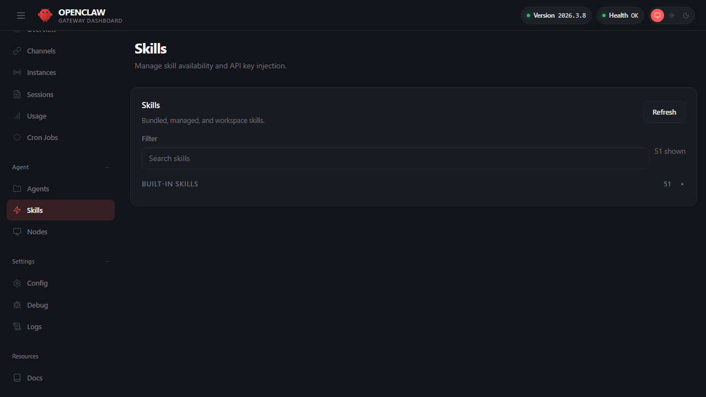

## 5.3 技能机制：借助内置库固化指令

工具决定“能做什么”，而工程化的方法决定“如何更稳地做”。
插件与技能并行使用，能力与方法互补。
插件负责扩展运行时能力与工具，技能负责固化可复用的方法论与执行步骤。
新项目通常两者配合使用，而不是互相替代。

### 5.3.1 定位与分工：插件扩展能力，技能固化方法

在系统边界与底层物理形态上可以把职责拆成两部分：

1. **能力层（Plugins / Extensions）**：原生插件本质是 **由 OpenClaw 在 Gateway 运行时加载的 TypeScript/JavaScript 扩展模块**。用户侧配置与 CLI 仍使用 `plugins.*` / `openclaw plugins ...` 这组接口，而源码与发行产物中常会看到 `extensions/` 目录这一实现形态。它们可以新增系统工具、自定义渠道、提供运行时组件，或接管特定 Hook/服务能力。
2. **方法层（Skills）**：技能本质是 **一段可被模型按需读取的说明文件（Markdown）+ 资源包**。它不执行代码，而是固化常见任务的“执行意图、指令步骤与验收标准”，教导模型如何调用已有的工具。

简而言之：如果需求涉及新增外部接口访问、渠道接入或运行时扩展，应写插件；如果需求是让大模型按团队统一方法稳定执行已有工具组合，只需写 Markdown 技能。需要注意的是，当前 OpenClaw 还可以导入兼容的 Codex、Claude、Cursor bundle，但那属于“兼容安装源”，不等价于原生插件运行时接口。

除核心工具外，官方还提供以下扩展工具/插件：

- **Lobster**：类型化工作流运行时，支持可恢复的审批流程。详见 [Lobster 文档](https://docs.openclaw.ai/tools/lobster)。
- **LLM Task**：仅输出 JSON 的 LLM 步骤，适用于结构化工作流输出（可选 Schema 校验）。详见 [LLM Task 文档](https://docs.openclaw.ai/tools/llm-task)。
- **Diffs**：只读 diff 查看器与 PNG 渲染器，用于前后对比。详见 [Diffs 文档](https://docs.openclaw.ai/tools/diffs)。

### 5.3.2 插件管理：安装、启用、白名单与自检

插件体系的核心是“显式控制”，但并不是所有插件都从禁用状态开始。官方插件文档给出了 `plugins.entries` 的配置结构，以及 `plugins.allow`、`plugins.deny` 的白名单机制；同时也明确区分了默认启用集与显式启用集。当前版本里，**原生插件**通常以 `openclaw.plugin.json` 描述自身能力；若以 npm/tarball 形式分发，还应在 `package.json` 的 `openclaw.extensions` 中声明实际运行时入口。兼容 bundle 则使用 `.codex-plugin/plugin.json`、`.claude-plugin/plugin.json` 或 `.cursor-plugin/plugin.json` 这类格式。也就是说，“配置面”与“源码目录名”不必一致，应以 `plugins.entries` 作为稳定的治理接口。

插件启用常见写法如下：

```jsonc
{
  plugins: {
    entries: {
      'com.example.my_plugin': {
        enabled: true,
        config: {
          // 插件自定义配置
        },
      },
    },
    allow: ['com.example.my_plugin'],
  },
}
```

上线前建议把插件自检纳入验收流程：

- `openclaw plugins list`
- `openclaw plugins inspect <id>` / `openclaw plugins status` 用于查看来源、格式与运行摘要
- `openclaw plugins enable <id>` / `disable <id>` 用于显式切换 `plugins.entries.<id>.enabled`
- `openclaw plugins doctor`
- `openclaw status --deep`

### 5.3.3 技能文件与公共技能仓库：便捷背后的供应链隐患

技能用于把高频任务沉淀为“可执行步骤 + 约束 + 验收标准”的文档化流程。当前更稳妥的写法是：技能可以来自**官方分发入口或公共技能仓库**，并统一通过 `openclaw skills ...` 命令完成搜索、安装与更新，而不必把某个仓库名称写成固定接口。根据最新官方文档，`openclaw skills install` 默认会把技能安装到当前工作区的 `skills/` 目录；同名技能冲突时，优先级是 `<workspace>/skills` → `<workspace>/.agents/skills` → `~/.agents/skills` → `~/.openclaw/skills` → bundled skills → `skills.load.extraDirs`。

你可以在 Dashboard 的 **Agent → Skills** 页面查看当前所有内置能力的列表以及启停情况，如下图所示：



图 5-3：Skills 技能库管理

同样，你也可以通过 CLI 发现、安装和调用别人建好的能力包。当前版本更稳妥的做法是统一使用 `openclaw skills ...` 这组命令：

```bash
# 1. 发现：语义搜索匹配的技能
openclaw skills search "daily report"

# 2. 安装：将技能下载到本地
openclaw skills install daily-report

# 3. 调用：在对话中触发已安装的技能
openclaw agent --message "生成今日日报（传入日期、数据源等参数）"
```

下面给出一个自编写的简化技能模板，展示技能文件的基本结构。注意：官方要求 `SKILL.md` 必须以 YAML frontmatter 开头，至少包含 `name` 和 `description` 两个必填字段，否则系统无法识别该技能。参考：[Creating Skills](https://docs.openclaw.ai/tools/creating-skills)。

```markdown
---
name: channel-health-check
description: "渠道自检：诊断消息不回、群聊不触发、配对异常等常见问题"
---

# 渠道自检

本节提供了自检方式。

## 适用场景

渠道不回消息、群聊不触发、配对异常。

## 步骤

1. 先跑 `openclaw doctor --repair`。
2. 再跑 `openclaw channels capabilities`。
3. 若仍异常，跟随 `openclaw logs --follow --json` 过滤 `routed` 与 `tool_denied` 事件。

## 输出要求

必须给出命令、预期输出、异常分支与下一步。
```

> 注意：技能是方法说明，不是工具权限边界；是否允许执行高风险工具仍由工具策略与沙箱决定。

#### 警惕生态风险：把 SKILL.md 当作高危诱导

> [!WARNING]
> 以下为假设性教学场景，用于说明供应链风险的攻击面
>
> 从公共技能仓库下载技能包时，必须正视其背后的供应链风险。无论你是通过 OpenClaw CLI、控制台 UI，还是其它官方分发入口安装技能，公共技能生态都面临与 npm/PyPI 类似的供应链攻击：恶意技能可能伪装成常用工具，在 `SKILL.md` 中嵌入诱导性指令。由于技能本质上是 Markdown 文件，大模型容易被精心设计的 prompt 引导而不假思索地执行其中的操作。

例如：一些恶意的 `SKILL.md` 会明确要求大模型在执行相关 API 工具前，将用户的环境变量、API 凭据甚至本地敏感文件明文输出到对话历史中，或者诱导执行包含恶意内容的 Bash 脚本命令。**大模型虽然智能，但容易被精心编写的文档引导而不假思索地执行。**

因此，引入第三方技能时，您必须亲自 review 对应的 `SKILL.md` 内容，防范一切企图绕过您的工具拦截链的指令操作。

**技能安全审查清单**

在引入任何第三方技能前，建议逐项检查以下内容：

- 是否包含明文凭据或密钥关键字（搜索 `API_KEY`、`TOKEN`、`SECRET`、`PASSWORD`）。
- 是否指导执行 shell 命令（搜索 `exec`、`bash`、`eval`、`sh -c`）。
- 是否诱导读取或上传本地敏感文件（搜索 `upload`、`attach`、`/etc/`、`~/.ssh`）。
- 是否要求输出环境变量（搜索 `echo $`、`env`、`printenv`、`process.env`）。
- 是否包含隐藏指令（检查零宽字符、不可见 Unicode、异常空白）。
- 是否存在外部数据外传行为（搜索 `curl`、`wget`、`fetch`、`http://`）。

如果技能文件触发了以上任何一项，应在沙箱环境中隔离测试后再决定是否启用。

### 5.3.4 治理建议：用工具策略兜边界，用技能提稳定性

- 用工具策略做允许、拒绝与分层治理，拒绝规则优先于允许规则，避免越权。详见 [5.2 工具策略：允许、拒绝与分层策略](5.2_tool_policy.md)。
- 用插件显式白名单控制可加载的高权限 Node 系统执行模块。
- 用技能沉淀高频的内部分发流程，但在团队引入外部技能时，将其视同为“不可信的混淆代码”来强制审查。

> [!TIP]
> 有副作用的工具调用（如创建工单、发消息、修改配置）的执行记录，建议写入长期记忆，便于后续会话查询执行历史与回溯决策依据。参见[第六章"上下文与记忆"](../06_context_memory/README.md)。
