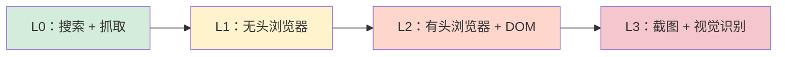

## 5.4 浏览器工具与网页自动化

浏览器工具用于将“访问网页、登录、点击、抓取”等交互转换为可控的工具调用，使智能体能按需获取网页信息或执行操作。本节说明浏览器工具的安全边界、使用方式，以及如何把网页自动化纳入工具策略与排障闭环。

### 5.4.1 安全边界：隔离优先，登录态视为敏感状态

浏览器工具是智能体中攻击面最大的能力之一：可跨站访问、读取页面内容、触发外部副作用，还可能执行任意 JavaScript。**在讨论任何命令和分层之前，必须先建立安全边界。**

官方 [Browser 文档](https://docs.openclaw.ai/tools/browser) 强调以下原则：

- **始终使用隔离的 `openclaw` profile**：系统默认创建独立的浏览器 profile，与你的个人浏览器完全隔离。绝对不要将智能体绑定到你日常使用的浏览器 profile 上。
- **登录态视为敏感状态**：`openclaw` profile 中可能保存登录会话（Cookie、Token）。带登录态的 profile 等同于持有凭据，应按敏感资源管理，避免在不受信入口暴露。
- **`user` profile 仅限人在旁边时使用**：`user` profile 会挂载你的真实 Chrome 会话，拥有你的所有登录态。只有当你坐在电脑前、能实时审批操作时才应启用。
- **浏览器控制端口仅绑定 loopback**：浏览器的 CDP 端口默认只监听 `127.0.0.1`，不对外暴露。远程 CDP 端点必须通过隧道保护，绝不直接暴露到公网。
- **SSRF 防护**：默认启用严格的 SSRF 策略，阻止浏览器访问私有/内网地址。
- **慎用 JavaScript 执行**：`browser act` 和 `wait --fn` 可执行任意 JS，存在提示注入引导执行恶意脚本的风险。如无必要，建议通过 `browser.evaluateEnabled=false` 禁用。

> [!WARNING]
> 浏览器工具的安全基线是**隔离 profile + loopback 绑定 + SSRF 策略**三道防线。缺少任何一道，都可能让智能体成为攻击者的跳板。

### 5.4.2 能力与策略：把网页操作做成有界工具

在安全边界之上，通过工具策略控制哪些智能体可以使用浏览器相关工具，拒绝规则优先于允许规则。详见 [5.2 工具策略：允许、拒绝与分层策略](5.2_tool_policy.md) 与官方工具文档 [https://docs.openclaw.ai/tools](https://docs.openclaw.ai/tools)。

交互流程上，把网页操作拆成可验证步骤，每一步都要有可检查的成功条件，并在失败时输出下一步排障命令。

### 5.4.3 浏览器能力分层：从搜索到视觉的四个层级

并非所有网页交互都需要启动完整浏览器。实践中，网页相关能力可按成本、复杂度和适用场景分为四个渐进层级，**优先使用低层级，仅在不够用时才升级到高层级**。



**四层能力详解**

| 层级 | 能力 | 适用场景 | 依赖 | 性能与成本 |
| --- | --- | --- | --- | --- |
| **L0** | 搜索引擎 + 网页抓取 | 日常信息检索（覆盖 80% 场景） | Tavily / Firecrawl / Brave Search + Readability | 最低 |
| **L1** | 无头浏览器（Headless Chrome） | 需要 JavaScript 渲染的 SPA 页面 | Headless Chrome | 低 |
| **L2** | 有头浏览器 + DOM 操作 | 需要登录、填表单、点按钮 | Chrome + 虚拟桌面（Xvfb） | 中，需 ≥4G 内存 |
| **L3** | 截图 + 视觉识别 | 信息只存在于图片中（商品图、图表、参数表） | 有头浏览器 + 多模态模型 | 最高，速度最慢 |

**决策逻辑**

1. 先尝试 L0：能用搜索 + 抓取拿到信息，就不要启动浏览器。
2. L0 抓取为空白（典型症状：SPA 页面只有骨架 HTML）→ 升级到 L1。
3. L1 仍无法完成（需要登录、点击、填写表单）→ 升级到 L2。
4. L2 无法获取的信息（嵌入在图片中的文字、图表数据）→ 最后使用 L3。

> [!NOTE]
> 在云服务器上使用 L2 和 L3，需要先安装虚拟桌面服务（如 Xvfb），它会在内存中模拟一个显示器，让有头浏览器能在无物理显示器的环境下运行。完整安装命令：`sudo apt-get install -y xvfb chromium-browser fonts-noto-cjk`（其中 `fonts-noto-cjk` 确保中文正常渲染）。启动命令：`Xvfb :99 -screen 0 1280x1024x24 &`，并设置环境变量 `export DISPLAY=:99`。

### 5.4.4 常用命令：启动、检查与打开页面

以下命令展示的是**常见的浏览器控制入口形态**；不同版本的 CLI 子命令名可能会变化。本次 live 审计只确认当前工具目录里存在 `browser` 能力组，并未把 `openclaw browser status/start/open/stop` 逐条作为稳定接口复验。因此在实际操作前，请先以本地 `openclaw --help`、相关子命令 `--help` 和 Tool Catalog 为准。[浏览器工具参考](https://docs.openclaw.ai/tools/browser)。

在需要浏览器能力前，建议先检查状态，再按需启动；如果当前版本把浏览器能力折叠到了其他命令名或 UI 工具入口，也应遵循同样的“先体检、后打开目标页”的思路。

```bash
openclaw browser status
openclaw browser start
```

当浏览器服务可用后，可以用 `browser open` 快速打开目标页面，便于验证环境与网络是否正常。

```bash
openclaw browser open "https://example.com"
```

如果需要停止浏览器服务，可使用 `browser stop`。

```bash
openclaw browser stop
```

### 5.4.5 与网页工具协作：优先读工具，必要时才用浏览器

网页相关能力通常分两类：

1. 读为主的网页获取与解析，适合用网页工具完成，结果更易结构化与回注。
2. 必须交互的场景，例如登录后页面、复杂表单、或需要执行脚本的页面，才引入浏览器工具。

工程上建议优先使用读工具获取信息，仅在读工具无法覆盖时再使用浏览器，以减少不确定交互带来的故障面。详情参考 [网页工具说明](https://docs.openclaw.ai/tools/web)。

内置的 Readability 工具适合大多数场景，但不加载 JavaScript（SPA 页面可能抓取为空白）。如遇此类局限，可考虑引入支持 JS 渲染的第三方抓取服务（如 [jina.ai Reader](https://r.jina.ai/)、Firecrawl 等），并将其配置为自定义技能，在 Readability 失败时自动降级。使用任何第三方抓取工具时，务必遵守目标网站的服务条款。

### 5.4.6 验收与排障：用状态命令与日志定位问题层级

浏览器相关问题的排障建议按层级收敛：

1. 先用 `browser status` 判断服务是否在线。
2. 再用 `browser open` 验证网络与页面可达性。
3. 最后用系统日志定位是否为工具策略、路由或会话问题。

```bash
openclaw browser status
openclaw status --deep
openclaw logs --follow --json
```

当出现“能打开页面但智能体无法完成任务”时，优先检查工具策略是否拒绝了浏览器相关工具；当出现“浏览器无法启动”时，优先检查依赖与运行环境，并先跑 `doctor` 获取结构化的自检结果。

```bash
openclaw doctor
```
