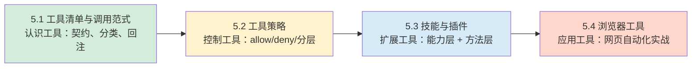

# 第五章 工具系统、技能与插件

本章讨论智能体系统的行动层：模型负责提出意图，真正产生外部影响的是工具与扩展能力。内容主线是把“能调用工具”升级为“能在明确边界内稳定执行，并且可审计、可排障、可回滚”。

先修知识：本章假设读者已理解[第四章"配置与模型接入"](../04_config_models/README.md)的配置体系基本概念（配置优先级、profile 选择等）。

学习目标：

- 理解工具调用链路的关键拦截点，明确哪些边界应由运行时策略兜底。
- 掌握工具策略的允许、拒绝与分层策略方法，建立最小权限默认。
- 了解插件体系的启停与白名单治理，并掌握技能与插件的协同定位与治理边界。
- 掌握浏览器工具的常用命令与排障闭环。

## 全景导览

本章四个小节围绕"行动能力的工程治理"展开，各有侧重又互为补充：

简而言之：5.1 回答"工具是什么"，5.2 回答"谁能用什么工具"，5.3 回答"如何扩展与复用"，5.4 展示一个高风险工具的完整治理实例。

## 本章内容导读

本章包括以下几个小节：

- **[5.1 工具清单与调用范式](5.1_tool_inventory.md)**：从工程化视角盘点工具分类，建立工具契约、失败语义与调用范式的系统认知。
- **[5.2 工具策略：允许、拒绝与分层策略](5.2_tool_policy.md)**：讲解 `tools.allow`、`tools.deny` 的匹配语义与按渠道/群组的分层治理。
- **[5.3 技能机制：借助内置库固化指令](5.3_skills_plugins.md)**：区分插件（扩展能力）与技能（固化方法）的定位，并警示 ClawHub 的供应链风险。
- **[5.4 浏览器工具与网页自动化](5.4_browser_nodes.md)**：介绍浏览器能力的四个渐进层级，以及常用命令与排障闭环。
- **[5.5 本章小结](summary.md)**：关键结论与读者自检。

> 说明：书中命令示例有时会省略“主命令前缀”（例如某些部署要求在子命令前加上统一的 CLI 前缀）。若你执行时报“找不到命令”，请优先以你本地 CLI 的 `--help` 输出与本书其他章节的写法为准。
