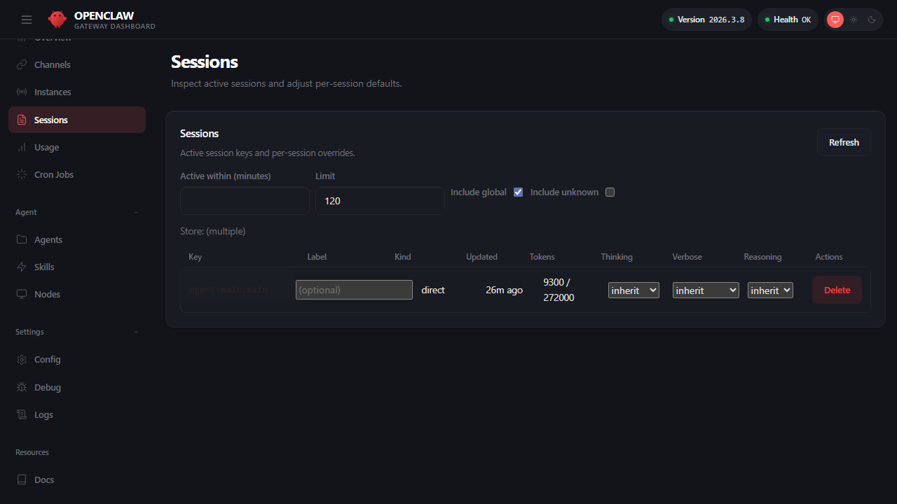

## 6.1 会话模型与状态持久化

本节介绍 OpenClaw 的会话（Session）管理机制，主要包含三个核心环节：会话作用域的划分、重置策略的设定，以及会话状态的持久化与排障。通过合理的配置，开发者能够将”串话”、”重复执行”和”状态恢复失败”等隐患，转化为可配置、可观测的工程实践。

### 6.1.1 会话作用域：先把会话键划清楚

OpenClaw 的会话行为由 `session` 相关配置共同决定，但实际排障时比字段名更重要的是：**一条消息最终会落到哪个 session key**。当前官方模型强调的是主会话、群聊/线程隔离、以及按渠道或账号拆分，而不是要求读者先死记某个单独的 `session.scope` 字段。

典型选择思路：

- 私聊与个人助理：优先确认 direct chat 是否折叠进主会话，还是按账号拆出独立会话。
- 群聊、线程、话题场景：优先确认是否按线程或话题隔离，避免不同讨论串共用上下文。
- 多渠道触达同一用户：只有在明确需要共享上下文时，才建立跨渠道的映射关系；默认应先保持隔离。

可以通过 Dashboard 的 Sessions 页面直观管理活跃的会话及其 Token 消耗情况，如下图所示：



图 6-1：Sessions 会话管理与用量

在深入排障前，先把以下三个概念分清：

| 概念 | 当前应如何理解 |
| --- | --- |
| 主会话（main） | 私聊最常见的归并目标。很多部署会把 direct chat 折叠进 `agent:<agentId>:main` 这条主会话。 |
| 渠道/线程隔离 | 群聊、线程、话题和多账号接入通常会拆出独立 session key，避免上下文串线。 |
| 每会话覆盖 | Dashboard 的 Sessions 页优先展示活跃 session key、模型、上下文预算、Token 用量等信息；是否额外显示 `thinking`、`verbose`、`reasoning` 等覆盖项，应以当前版本 UI 为准。 |

当前更实用的验收方式不是背配置片段，而是回答下面三个问题：

1. 这条消息是落入主会话，还是被拆成独立的群聊/线程会话？
2. 这个 session key 是按渠道、账号、线程还是话题隔离出来的？
3. 当前会话是否叠加了额外的 per-session 覆盖项？

验收点：能解释一条消息最终会落到哪个 `sessionKey`，并且能在日志与会话存储中找到对应记录。

### 6.1.2 重置策略：将重置规则化，避免手动干预

长时间运行后，会话会积累历史与上下文偏差。官方支持按时间窗或空闲时长重置，也支持通过 `/new` 主动切断历史。实际字段名与层级会继续演进，因此本书更关注**重置策略本身**，而不是把某组字段名写成不可变接口。参考：[会话配置](https://docs.openclaw.ai/gateway/configuration#session)。

常见做法是：

- 为主会话设置更长的空闲重置窗口。
- 为群聊、线程或临时任务会话设置更短的重置窗口。
- 把 `/new` 作为人工切断历史的兜底手段。

验收点：在重置窗口内，会话能按预期断开历史，且不会误删正在执行的高风险作业。

### 6.1.3 消息队列模式概览

消息在会话中的排队方式会影响实际体验。OpenClaw 官方当前常见的队列模式包含 `collect`、`steer`、`followup`、`steer-backlog` 和 `interrupt`。核心区分在于：`collect` 按顺序处理，适合独立长任务；`steer` 实时注入新消息使智能体调整方向，适合人机协作纠偏场景。

> [!WARNING]
> 早期版本中的 `queue` 模式仅为 `steer` 的别名（legacy alias），请避免继续使用。

配置示例：

```jsonc
{
  messages: {
    queue: {
      mode: "collect",
      debounceMs: 1000,
      cap: 20,
      drop: "summarize",
    },
  },
}
```

队列模式的完整参数、按渠道差异化配置与并发控制语义，详见[第十章 10.3 节](../10_agent_loop/10.3_entry_queue.md)。

### 6.1.4 DM 会话隔离：安全边界速览

当 OpenClaw 面向多个不受信用户开放 DM 私聊时，需要理解隔离的两层含义：会话层面（Token 窗口、历史记录、上下文）默认按用户隔离；但宿主机资源（文件系统、Shell）是共享的，若工具策略未做沙箱限制，用户仍可能间接访问全局信息。

> **安全模式推荐做法**：面向多 untrusted 用户时，必须禁止 `group:runtime` 等高危工具，并将文件读写限制在独立沙箱内。详情参见 [11.4 节防护栏](../11_reliability_security/11.4_guardrails.md)与[官方 Security 文档](https://docs.openclaw.ai/gateway/security#dm-session-isolation-multi-user-mode)。

### 6.1.5 会话状态的双层存储机制

OpenClaw 的会话状态数据默认按智能体存储在 `~/.openclaw/agents/<agentId>/sessions/` 目录下。官方允许用 `session.store` 覆盖目录位置。根据底层设计，会话状态分为两层分开存储：

- **Session Store (`sessions.json`)**：主要存储会话的元数据（如 `sessionId`、Token 计数、压缩次数等）。这部分数据是轻量级的，即便由于意外被手动修改，也能被 Gateway 安全重建。
- **Transcript (`<sessionId>.jsonl`)**：追加式的对话历史记录（JSONL 格式）。包含了原始消息、工具调用记录以及压缩后的摘要内容。

配置示例：

```jsonc
{
  session: {
    store: "~/.openclaw/agents/{agentId}/sessions/sessions.json",
  },
}
```

建议：会话存储目录进入备份与审计范围；但不要把敏感内容原样同步到不可信位置，必要时启用脱敏或最小化日志。

> [!TIP]
> **避坑：`/new` 命令会让你失去记忆吗？**
> 很多新手误以为执行 `/new` 命令会让当前的 AI 助手完全“失忆”。实际上，该命令仅仅是创建了一个全新的 `sessionId` 并清空了当前的 **临时对话上下文（Transcript）**。磁盘上持久化的记忆文件（如 `MEMORY.md`）依然存活，它们会在这个新会话中 **被自动重新加载**。

### 6.1.6 排障案例：跨渠道串话的排查过程

**具体例子：用户 A 在 Telegram 私聊提问，却收到了另一条会话里的上下文**

某天运维收到反馈：“我问的是部署问题，但机器人回复了一段关于财务报表的内容。”排查过程如下：

1. **定位会话键**：在日志中筛选用户 A 的请求，确认它本应落到某条独立的 DM session key。
2. **检查归并规则**：发现当前部署把多个 direct chat 错误地折叠进同一条主会话，或把账号/渠道边界配得过宽，导致不同来源共享了历史。
3. **根因确认**：并不是模型“记错了”，而是 session key 归并规则过于宽泛，导致不同对话被折叠进了同一上下文。
4. **修复**：收紧 direct chat 的归并粒度，必要时按渠道、账号或线程拆分，并通过 `status --deep` 和 Sessions 页复核新的 session key 分布。

**排障教训**：大多数“串话”都不是推理问题，而是 session key 设计问题。先看 key 怎么生成，再看历史怎么压缩，效率最高。

### 6.1.7 排障命令：用状态与日志定位串话与重置异常

当出现“串话”“突然忘记上下文”“一直不重置”等问题，优先用系统自检与结构化日志定位。

```bash
# 查看整体状态（--deep 会做更深的探测）
openclaw status --deep

# 追踪日志，按需加上 --json 便于 jq 过滤
openclaw logs --follow --json
```

操作示例：在日志中筛选同一会话键的事件流，确认是否出现“多个来源被错误折叠进同一会话”。字段名以实际日志为准。

```bash
cat runtime.log | jq -r 'select(.type=="log") | .log | select(.sessionKey=="agent:main:whatsapp:dm:+15555550123") | [.ts,.trace_id,.event,.from] | @tsv' | tail
```
