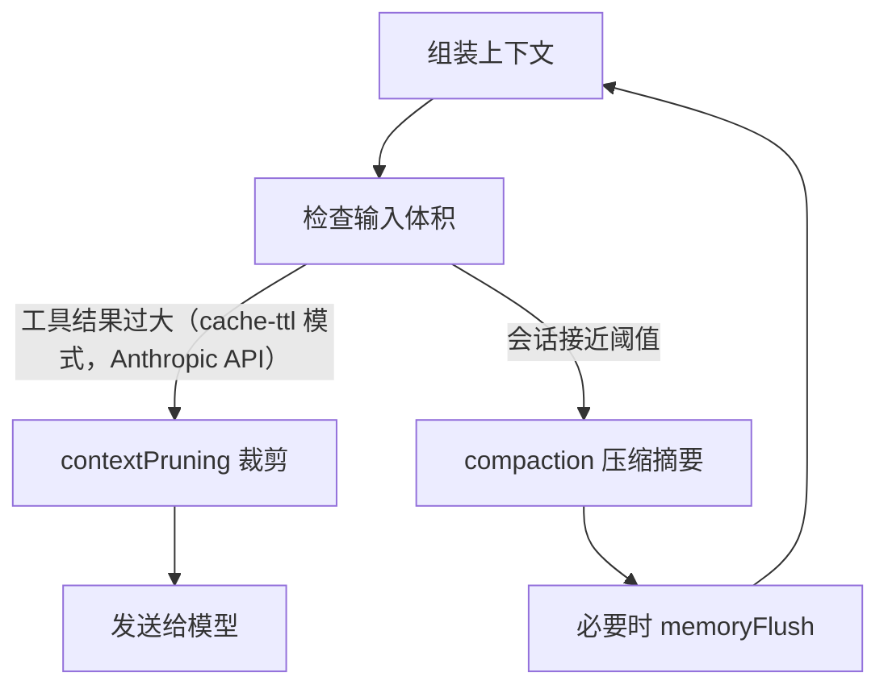

## 6.4 压缩与裁剪：折叠与丢弃策略

本节把“上下文爆炸”拆成两类可配置机制：工具结果裁剪与会话压缩。前者由 `agents.defaults.contextPruning` 控制，目标是裁掉旧工具结果以降低模型输入体积；后者由 `agents.defaults.compaction` 控制，目标是在会话接近压缩阈值时生成摘要，并在必要时先刷新长期记忆。两者配合，才能在长会话中同时保证可用性与可回放性。

### 6.4.1 核心概念辨析：压缩（Compaction） vs 裁剪（Pruning）

在处理上下文爆炸的问题上，新手很容易混淆 OpenClaw 设计上的这两套方案。它们的本质差异体现在“是否被持久化”与“生命周期触点”上：

- **上下文裁剪（Session Pruning，由 `contextPruning` 控制）**：
  发生在**大语言模型调用前**，系统为了降低单次请求负荷、减轻算力或缓存失效而“临时舍弃极度老旧的工具打印执行结果”。它**不会修改任何磁盘历史文件**，只作用于内存数据结构上。
- **会话压缩（Compaction，由 `compaction` 控制）**：
  发生在**整个会话接近承载容积瓶颈上限前**。把前面冗长繁杂的车轱辘话打散折叠成精华的概要点（摘要），并**回写保存并强制持久化到你的 `JSONL` 追踪日志中**，属于物理折叠以使得新数据继续顺滑滚动。

官方相关参考资料解释：
- 工具结果裁剪：https://docs.openclaw.ai/gateway/configuration#agentsdefaultscontextpruning
- 压缩概念：https://docs.openclaw.ai/concepts/compaction

> [!IMPORTANT]
> Session Pruning 目前**仅在 `mode: "cache-ttl"` 且使用 Anthropic API 等特殊协议驱动时生效**。而 Compaction 是每个模型都能通用受益的长效型独立安全控制阀门。两者虽然互助但互不依赖。

### 6.4.2 触发流程：先裁剪工具，再压缩会话

下面展示一个典型的触发顺序。



图 6-1：裁剪与压缩的典型触发顺序

### 6.4.3 工具结果裁剪：可调参项与验收点

`agents.defaults.contextPruning` 的关键调参项包括 `keepLastAssistants`、软硬阈值比率、以及 `tools.deny` 排除列表。参考：[工具结果裁剪](https://docs.openclaw.ai/gateway/configuration#agentsdefaultscontextpruning)。

验收点：

- 长会话输入体积稳定，成本与时延不随时间线性上升。
- 裁剪不会破坏关键证据段，回放一致性可接受。

### 6.4.4 魔法核心：预压缩记忆刷新（Pre-compaction Memory Flush）

相比于一般工具的粗暴截断，OpenClaw 的杀手锏是它的“预压缩处理逻辑”。
当系统探测到当前进程将达到**自动压缩软阈值 (Auto-compaction soft threshold)**时，它绝不会二话不说地丢弃记录。相反，系统框架中隐藏触发了一个**静默智能体回合 (Silent Agentic Turn)**，温馨且主动提醒机器模型赶紧把精华转移到安全地带。

它的六步隐蔽工作流如下：
1. **持续监控**：追踪测算用户的海量 Token。
2. **触发软警报**：一旦消耗越过多所设置的 `softThresholdTokens` 警戒水位。
3. **注入指令**：抛出类似于“即将触发空间清理”的内部警告。
4. **归档落盘**：AI 自主运行关键内容存储动作（将结果写进 `memory/YYYY-MM-DD.md` 等文件位置中）。
5. **静默确认**：发出一具纯碎空返回特征字符 `NO_REPLY` 收尾动作。由于不会回显至屏幕，因此前端提问的用户对刚刚发生的存盘毫无察觉。
6. **正式折叠**：待记忆安全脱壳落回磁盘之后，会话系统再进行后续毫无包袱的压缩与折叠清理释放流程。

启用该特性非常简单：
```json
{
  agents: {
    defaults: {
      compaction: {
        reserveTokensFloor: 20000,
        memoryFlush: {
          enabled: true,
          softThresholdTokens: 4000, // 提示提前静默执行的量级线
          prompt: "Write any lasting notes to memory/YYYY-MM-DD.md; reply with NO_REPLY if nothing to store."
        }
      }
    }
  }
}
```

注意：若全局安全设计把你的当前主目录权限掐断（设为只读如 `workspaceAccess: "ro"` ），这套智能的记忆刷新流程也会自动休眠跳过。

### 6.4.5 排障命令：先看状态，再看日志与裁剪事件

操作示例：先用状态命令确认系统是否处于可用状态，再用日志观察裁剪与压缩是否在高峰期被频繁触发。

```bash
openclaw status --deep
openclaw logs --follow --json
```

操作示例：统计工具结果裁剪触发是否过于频繁。日志字段以实际实现为准。

```bash
cat runtime.log | rg "Tool result trimmed" | wc -l
```

