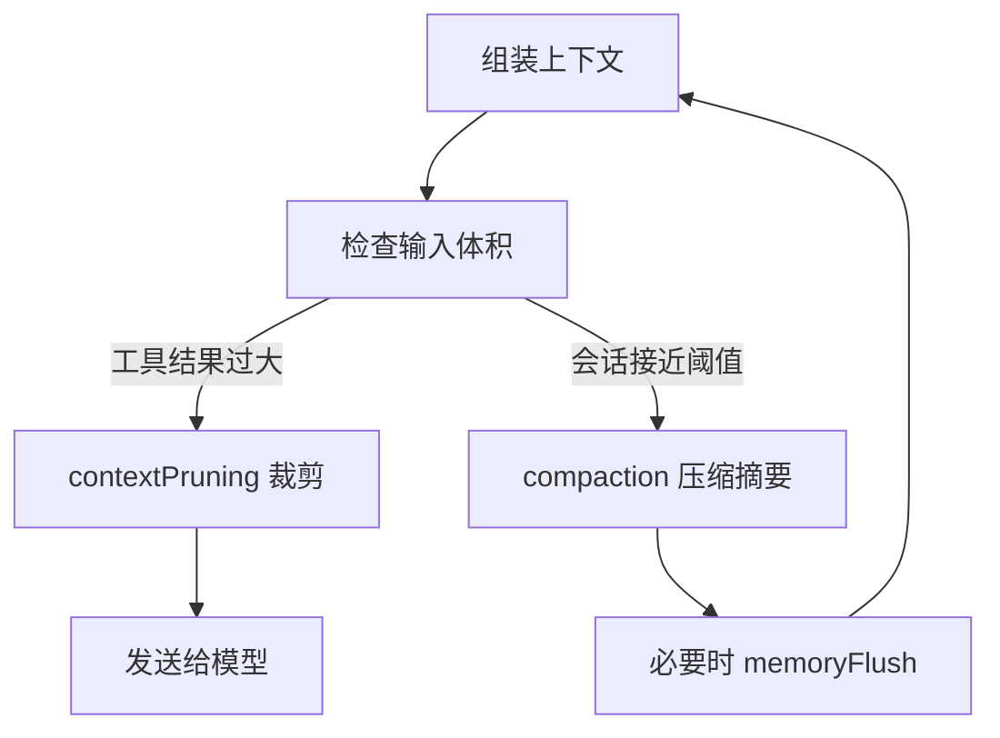

## 6.4 压缩与裁剪：折叠与丢弃策略

本节把“上下文爆炸”拆成两类可配置机制：工具结果裁剪与会话压缩。前者由 `agents.defaults.contextPruning` 控制，目标是裁掉旧工具结果以降低模型输入体积；后者由 `agents.defaults.compaction` 控制，目标是在会话接近压缩阈值时生成摘要，并在必要时先刷新长期记忆。两者配合，才能在长会话中同时保证可用性与可回放性。

### 6.4.1 两类机制：上下文裁剪与会话压缩

- 上下文裁剪：发生在“发送给模型之前”，只影响本轮输入，不改磁盘历史。
- 会话压缩：发生在“会话接近上限时”，通过摘要把历史折叠为可继续推理的状态块。

官方分别给出配置项与概念解释：

- 工具结果裁剪：https://docs.openclaw.ai/gateway/configuration#agentsdefaultscontextpruning
- 会话裁剪概念：https://docs.openclaw.ai/concepts/session-pruning
- 压缩概念：https://docs.openclaw.ai/concepts/compaction

### 6.4.2 触发流程：先裁剪工具，再压缩会话

下面展示一个典型的触发顺序。



图 6-1：裁剪与压缩的典型触发顺序

### 6.4.3 工具结果裁剪：可调参项与验收点

`agents.defaults.contextPruning` 的关键调参项包括 `keepLastAssistants`、软硬阈值比率、以及 `tools.deny` 排除列表。参考：[工具结果裁剪](https://docs.openclaw.ai/gateway/configuration#agentsdefaultscontextpruning)。

验收点：

- 长会话输入体积稳定，成本与时延不随时间线性上升。
- 裁剪不会破坏关键证据段，回放一致性可接受。

### 6.4.4 会话压缩与记忆刷新：agents.defaults.compaction

官方提供 `agents.defaults.compaction`，并支持在压缩前触发 `memoryFlush`，提示模型把长期记忆写入到工作区文件（例如每日记忆文件）。参考：[压缩配置](https://docs.openclaw.ai/gateway/configuration#agentsdefaultscompaction)。

配置示例（从官方示例改写，突出常用项）：

```json5
{
  agents: {
    defaults: {
      compaction: {
        mode: "safeguard",
        reserveTokensFloor: 24000,
        memoryFlush: {
          enabled: true,
          softThresholdTokens: 6000,
          systemPrompt: "Session nearing compaction. Store durable memories now.",
          prompt: "Write any lasting notes to memory/YYYY-MM-DD.md; reply with NO_REPLY if nothing to store.",
        },
      },
    },
  },
}
```

注意：当工作区为只读时会跳过记忆刷新。相关限制见官方说明：https://docs.openclaw.ai/gateway/configuration#agentsdefaultscompaction。

### 6.4.5 排障命令：先看状态，再看日志与裁剪事件

操作示例：先用状态命令确认系统是否处于可用状态，再用日志观察裁剪与压缩是否在高峰期被频繁触发。

```bash
openclaw status --deep
openclaw logs --follow --json
```

操作示例：统计工具结果裁剪触发是否过于频繁。日志字段以实际实现为准。

```bash
cat runtime.log | rg "Tool result trimmed" | wc -l
```

官方参考：

- 工具结果裁剪：https://docs.openclaw.ai/gateway/configuration#agentsdefaultscontextpruning
- 压缩与记忆刷新：https://docs.openclaw.ai/gateway/configuration#agentsdefaultscompaction
