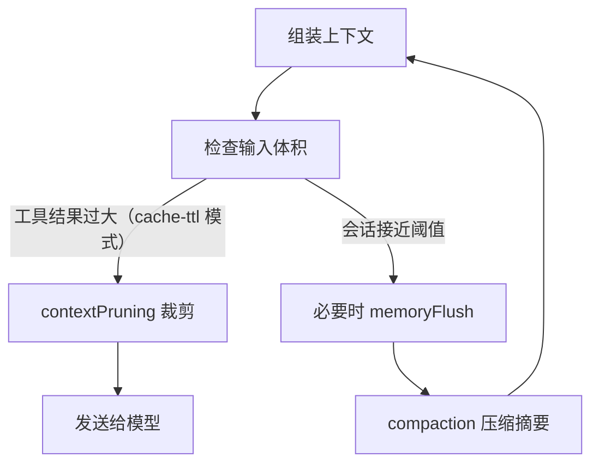

## 6.4 压缩与裁剪：折叠与丢弃策略

本节是长会话治理的参数与机制的唯一参考来源。[6.2 节](6.2_context_building.md)讲“怎样把信息组装进上下文”，本节讲“当上下文涨到放不下时怎么办”。两套可配置机制分别是：工具结果裁剪（Pruning，由 `agents.defaults.contextPruning` 控制，裁掉旧工具结果以降低模型输入体积）与会话压缩（Compaction，由 `agents.defaults.compaction` 控制，在会话接近阈值时生成摘要并在必要时先刷新长期记忆）。两者配合，才能在长会话中同时保证可用性与可回放性。

### 6.4.1 核心概念辨析：压缩 vs 裁剪

在处理上下文爆炸的问题上，新手很容易混淆 OpenClaw 设计上的这两套方案。它们的本质差异体现在“是否被持久化”与“生命周期触点”上：

- **上下文裁剪（Pruning，由 `contextPruning` 控制）**：
  发生在 **大语言模型调用前**，系统为了降低单次请求负荷、减轻算力或缓存失效而临时舍弃极度老旧的工具执行结果。它 **不会修改任何磁盘历史文件**，仅作用于内存数据结构。
- **会话压缩（Compaction，由 `compaction` 控制）**：
  发生在 **会话接近承载容积上限前**。把前面冗长繁杂的对话内容折叠成精华的概要（摘要），并 **持久化回写到 `JSONL` 追踪日志中**，属于物理折叠以使得新数据继续流畅滚动。

官方相关参考资料解释：
- 工具结果裁剪：[contextPruning 配置](https://docs.openclaw.ai/gateway/configuration#agentsdefaultscontextpruning)
- 压缩概念：[Compaction](https://docs.openclaw.ai/concepts/compaction)

> [!IMPORTANT]
> 上下文裁剪（Pruning）目前主要围绕 `mode: "cache-ttl"` 工作，并且在 Anthropic 路径上通常最先体现出价值；但它并不等于“只对 Anthropic 生效”。当前配置面允许在非 Anthropic 提供方上显式启用 `contextPruning`。会话压缩（Compaction）则是更通用的长会话控制机制。两者虽然互补，但互不依赖。

### 6.4.2 触发流程：先裁剪工具，再压缩会话

下面展示一个典型的触发顺序。


```mermaid
flowchart TD
  A["组装上下文"] --> B["检查输入体积"]
  B -->|"工具结果过大（cache-ttl 模式）"| C["contextPruning 裁剪"]
  C --> D["发送给模型"]
  B -->|"会话接近阈值"| E["必要时 memoryFlush"]
  E --> F["compaction 压缩摘要"]
  F --> A
```

图 6-2：裁剪与压缩的典型触发顺序

### 6.4.3 工具结果裁剪：参数与内部机制

了解裁剪的完整参数有助于在生产环境中精细调优——比如调整保护多少条最近的助手回复、在什么体积阈值触发裁剪等。`agents.defaults.contextPruning` 的完整默认参数：

| 参数 | 默认值 | 说明 |
|------|--------|------|
| `mode` | `"cache-ttl"` | 裁剪模式 |
| `ttl` | `"5m"` | 缓存 TTL |
| `keepLastAssistants` | 3 | 保护最近 N 条助手回复不被裁剪 |
| `softTrimRatio` | 0.3 | 上下文达到 30% 时触发软裁剪 |
| `hardClearRatio` | 0.5 | 上下文达到 50% 时触发硬清除 |
| `softTrim.maxChars` | 4,000 | 仅裁剪超过此长度的工具结果 |
| `softTrim.headChars` | 1,500 | 软裁剪保留头部字符数 |
| `softTrim.tailChars` | 1,500 | 软裁剪保留尾部字符数 |
| `minPrunableToolChars` | 50,000 | 硬清除的最小工具结果大小 |

裁剪分**两阶段**执行：第一阶段（softTrim）把超长工具结果截为“头 1500 字符 + `...` + 尾 1500 字符”；第二阶段（hardClear）用占位符 `[Old tool result content cleared]` 替换整个结果。

**三个关键的安全约束**（源码中的硬编码规则）：

- **图片块先替换再继续裁剪**：包含图片块的工具结果不会原样保留；当前实现会先把图片替换成占位文本，然后该消息仍可能继续进入 soft-trim 或 hard-clear。
- **引导消息保护**：第一条用户消息之前的所有内容（SOUL.md、USER.md 等身份读取）不参与裁剪。
- **工具名过滤**：通过 `tools.deny` 的 glob 模式排除不参与裁剪的工具结果；`tools.allow` 是“允许被裁剪”的 allowlist，不是排除列表。

**Token 估算**：源码使用 `CHARS_PER_TOKEN_ESTIMATE = 4` 作为基础估算（英文约 4 字符 ≈ 1 token），并通过 CJK-aware 估算器把中文等非拉丁文本按更接近 1 字符 ≈ 1 token 的方式放大后再计算；图片按 `IMAGE_CHAR_ESTIMATE = 8000` 字符计入预算。这意味着一张图片约占 2000 token 的预算。

`keepLastAssistants` 的工作方式是从消息列表末尾向前扫描，找到第 N 条助手回复的位置作为“保护线”——保护线之后的所有消息都不会被裁剪。

验收点：

- 长会话输入体积稳定，成本与时延不随时间线性上升。
- 裁剪不会破坏关键证据段，回放一致性可接受。

### 6.4.4 压缩中的标识符保护与安全过滤

压缩（Compaction）的本质是让 LLM 对历史对话生成摘要。但 LLM 在总结时存在一个危险倾向：**无意中篡改不透明标识符**——把 UUID 缩短、把 API Key 部分省略、把 URL 参数丢弃。这在后续工具调用中会导致难以排查的隐藏错误。

源码（`compaction.ts`）中内建了 **标识符保护指令**（`IDENTIFIER_PRESERVATION_INSTRUCTIONS`），在每次压缩摘要请求中注入：

> “Preserve opaque identifiers exactly as written, including UUIDs, hashes, IDs, hostnames, IPs, ports, URLs, and file names.”

该指令有三种策略模式：`“strict”`（默认，始终注入）、`“off”`（不注入）、`“custom”`（使用自定义指令）。

**分批摘要策略**：当对话过长无法一次性摘要时，系统通过 `splitMessagesByTokenShare()` 将消息按 token 占比均匀切分为 N 段（默认 2 段），对每段独立摘要后再合并。合并阶段有专门的指令要求保留活跃任务状态、批处理进度（如“5/17 已完成”）、用户最后的请求、决策理由和待办事项，并优先保留近期上下文。

**工具结果安全过滤**：在压缩前，`stripToolResultDetails()` 会剥离所有工具结果中的 `details` 字段。源码注释明确指出：“toolResult.details can contain untrusted/verbose payloads; never include in LLM-facing compaction.” 这防止了不可信的工具输出（如 stderr、HTTP 头）进入摘要提示词，既节省 token 又避免潜在的提示注入。

**超大消息降级**：如果单条消息超过上下文窗口的 50%（`isOversizedForSummary`），会被排除在摘要之外并插入说明（如 `[Large assistant (~45K tokens) omitted from summary]`）。如果摘要整体失败，系统会逐步降级：先排除超大消息重试，最后回退到纯文本记录。

### 6.4.5 预压缩记忆刷新机制

OpenClaw 在执行压缩之前，会先尝试让智能体主动保存关键信息。这里的 `softThresholdTokens` 更准确地说是“提前量”而不是单独那条阈值线：实际触发点取决于 `contextWindowTokens - effectiveReserveTokens - softThresholdTokens`，其中 `effectiveReserveTokens` 可能被 `reserveTokensFloor` 抬高。当系统判断上下文逼近这一触发线时，会在正式压缩前插入一个**后台智能体回合**，让模型有机会将重要内容归档到持久存储。

这个预压缩流程分六步执行：
1. **持续监控**：实时追踪当前会话的 token 消耗量。
2. **触发软警报**：当剩余预算逼近 `reserveTokensFloor + softThresholdTokens` 所定义的提前量时，启动预压缩流程。
3. **注入指令**：向模型发送“上下文即将被压缩，请保存关键信息”的内部指令。
4. **归档落盘**：智能体执行记忆存储动作，将关键上下文写入持久文件（如 `memory/YYYY-MM-DD.md`）。
5. **后台确认**：智能体回复 `NO_REPLY` 特征字符串收尾，该回复不会显示给用户，整个过程对前端透明。
6. **正式压缩**：记忆安全落盘后，系统再执行常规的压缩与折叠清理。

预压缩 memory flush 默认启用。只有需要关闭、调整 `softThresholdTokens` / `prompt`，或指定 `memoryFlush.model` 时才需要显式配置：
```jsonc
{
  agents: {
    defaults: {
      compaction: {
        reserveTokensFloor: 20000,
        memoryFlush: {
          // 默认启用；需要关闭时才设置 enabled: false
          softThresholdTokens: 4000, // 提示提前静默执行的量级线
          prompt: "Write any lasting notes to memory/YYYY-MM-DD.md; reply with NO_REPLY if nothing to store."
        }
      }
    }
  }
}
```

注意：若全局安全设计对工作目录权限施加限制（设为不可写，如 `workspaceAccess: "ro"` 或 `"none"`），这套智能的记忆刷新流程也会自动跳过。

### 6.4.6 排障命令：优先查看状态，其次查看日志与裁剪事件

操作示例：先用状态命令确认系统是否处于可用状态，再用日志观察裁剪与压缩是否在高峰期被频繁触发。

```bash
openclaw status --deep
openclaw logs --limit 500 --json
```

操作示例：统计工具结果裁剪触发是否过于频繁。日志字段以实际实现为准。

```bash
cat runtime.log | rg "Tool result trimmed" | wc -l
```
