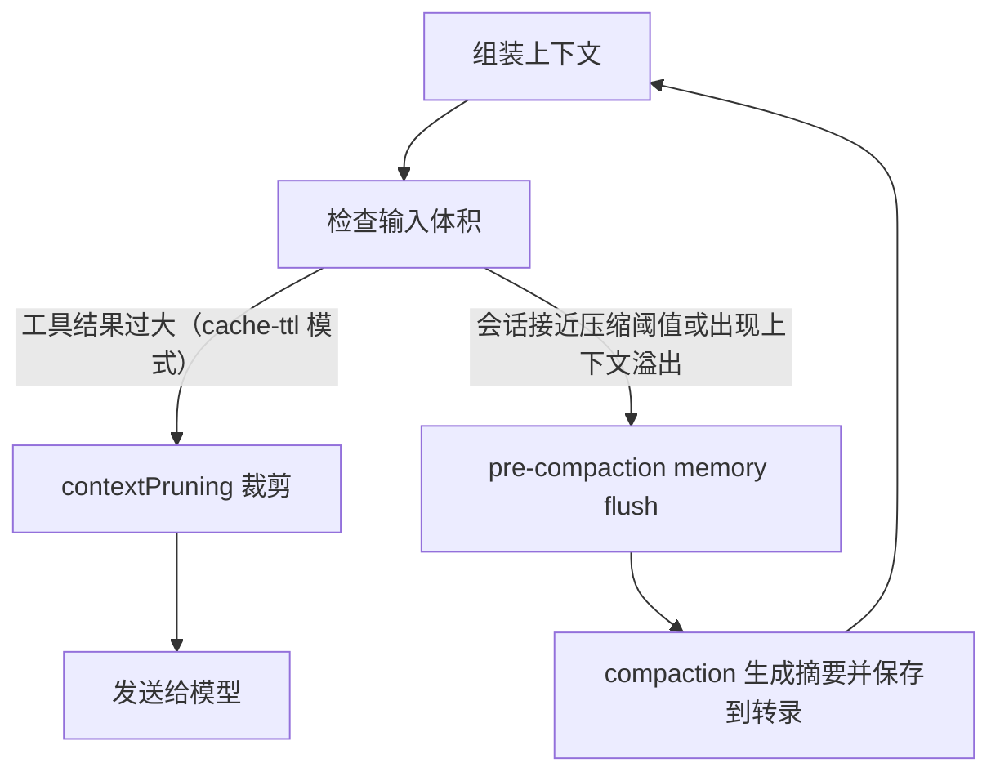

## 6.4 压缩与裁剪：折叠与丢弃策略

本节是长会话治理的参数与机制的唯一参考来源。[6.2 节](6.2_context_building.md)讲“怎样把信息组装进上下文”，本节讲“当上下文涨到放不下时怎么办”。两套可配置机制分别是：工具结果裁剪（Pruning，由 `agents.defaults.contextPruning` 控制，裁掉旧工具结果以降低模型输入体积）与会话压缩（Compaction，由 `agents.defaults.compaction` 控制，在会话接近阈值时生成摘要并在必要时先刷新长期记忆）。两者配合，才能在长会话中同时保证可用性与可回放性。

### 6.4.1 核心概念辨析：压缩 vs 裁剪

在处理上下文爆炸的问题上，新手很容易混淆 OpenClaw 设计上的这两套方案。它们的本质差异体现在“是否被持久化”与“生命周期触点”上：

- **上下文裁剪（Pruning，由 `contextPruning` 控制）**：
  发生在 **大语言模型调用前**，系统为了降低单次请求负荷、减轻算力或缓存失效而临时裁掉旧工具执行结果。它 **不会修改磁盘上的会话转录**，仅作用于本次请求的内存上下文。
- **会话压缩（Compaction，由 `compaction` 控制）**：
  发生在 **会话接近承载容积上限前**。把前面冗长繁杂的对话内容折叠成精华的概要（摘要），并 **持久化回写到 `JSONL` 追踪日志中**，属于物理折叠以使得新数据继续流畅滚动。

官方相关参考资料解释：
- 工具结果裁剪：https://docs.openclaw.ai/gateway/configuration#agentsdefaultscontextpruning
- 压缩概念：https://docs.openclaw.ai/concepts/compaction

> [!IMPORTANT]
> 上下文裁剪（Pruning）目前主要围绕 `mode: "cache-ttl"` 工作，并且在 Anthropic 路径上通常最先体现出价值；但它并不等于“只对 Anthropic 生效”。当前配置面允许在非 Anthropic 提供方上显式启用 `contextPruning`。会话压缩（Compaction）则是更通用的长会话控制机制。两者虽然互补，但互不依赖。

### 6.4.2 触发流程：裁剪按请求执行，压缩前先刷新记忆

下面展示一个典型的触发顺序。


```mermaid
flowchart TD
  A["组装上下文"] --> B["检查输入体积"]
  B -->|"工具结果过大（cache-ttl 模式）"| C["contextPruning 裁剪"]
  C --> D["发送给模型"]
  B -->|"会话接近压缩阈值或出现上下文溢出"| E["pre-compaction memory flush"]
  E --> F["compaction 生成摘要并保存到转录"]
  F --> A
```

图 6-2：裁剪与压缩的典型触发顺序

### 6.4.3 工具结果裁剪：参数与内部机制

了解裁剪参数有助于在生产环境中精细调优。官方公开配置面中，`agents.defaults.contextPruning` 至少包含模式与 TTL：

| 参数 | 默认值 | 说明 |
|------|--------|------|
| `mode` | `"cache-ttl"` | 裁剪模式；非 Anthropic 提供方默认关闭，可显式启用 |
| `ttl` | `"5m"` | 缓存 TTL；到期后才对旧工具结果执行本轮裁剪 |

裁剪分**两阶段**执行：第一阶段把超长工具结果做软裁剪，保留头尾并用 `...` 连接；第二阶段把更旧或更大的工具结果替换为占位符。这个过程只影响发给模型的本轮输入，不回写磁盘转录。

**三个关键行为边界**：

- **普通裁剪只针对旧工具结果**：不要把它理解成会重写普通对话文本或全量历史。
- **图片块清理是独立的遗留清理流程**：旧会话中已经处理过的原始图片块可被替换为占位文本；这不是普通 cache-TTL 工具结果裁剪的一部分。
- **引导消息保护**：第一条用户消息之前的所有内容（SOUL.md、USER.md 等身份读取）不参与裁剪。

**Token 估算**：用 `/context detail`、`/status` 和实际模型用量观察裁剪效果。不要把字符数估算当成精确 token 账单，中文、混合文本、附件和 provider wrapper 都可能让实际消耗偏离简单估算。

验收点：

- 长会话输入体积稳定，成本与时延不随时间线性上升。
- 裁剪不会破坏关键证据段，回放一致性可接受。

### 6.4.4 压缩中的标识符保护与安全过滤

压缩（Compaction）的本质是让 LLM 对历史对话生成摘要。但 LLM 在总结时存在一个危险倾向：**无意中篡改不透明标识符**——把 UUID 缩短、把 API Key 部分省略、把 URL 参数丢弃。这在后续工具调用中会导致难以排查的隐藏错误。

源码（`compaction.ts`）中内建了 **标识符保护指令**（`IDENTIFIER_PRESERVATION_INSTRUCTIONS`），在每次压缩摘要请求中注入：

> “Preserve all opaque identifiers exactly as written (no shortening or reconstruction), including UUIDs, hashes, IDs, tokens, API keys, hostnames, IPs, ports, URLs, and file names.”

该指令有三种策略模式：`“strict”`（默认，始终注入）、`“off”`（不注入）、`“custom”`（使用自定义指令）。

**分批摘要策略**：当对话过长无法一次性摘要时，系统通过 `splitMessagesByTokenShare()` 将消息按 token 占比均匀切分为 N 段（默认 2 段），对每段独立摘要后再合并。合并阶段有专门的指令要求保留活跃任务状态、批处理进度（如“5/17 已完成”）、用户最后的请求、决策理由和待办事项，并优先保留近期上下文。

**工具结果安全过滤**：在压缩前，`stripToolResultDetails()` 会剥离所有工具结果中的 `details` 字段。源码注释明确指出：“toolResult.details can contain untrusted/verbose payloads; never include in LLM-facing compaction.” 这防止了不可信的工具输出（如 stderr、HTTP 头）进入摘要提示词，既节省 token 又避免潜在的提示注入。

**超大消息降级**：如果单条消息超过上下文窗口的 50%（`isOversizedForSummary`），会被排除在摘要之外并插入说明（如 `[Large assistant (~45K tokens) omitted from summary]`）。如果摘要整体失败，系统会逐步降级：先排除超大消息重试，最后回退到纯文本记录。

### 6.4.5 预压缩记忆刷新机制

OpenClaw 在执行压缩之前，会先尝试让智能体主动保存关键信息。这里的 `softThresholdTokens` 更准确地说是“提前量”而不是单独那条阈值线：实际触发点取决于 `contextWindowTokens - reserveTokensFloor - softThresholdTokens`。当系统判断上下文逼近这一触发线时，会在正式压缩前插入一个**后台智能体回合**，让模型有机会将重要内容归档到持久存储。

这个预压缩流程分六步执行：
1. **持续监控**：实时追踪当前会话的 token 消耗量。
2. **触发软警报**：当剩余预算逼近 `reserveTokensFloor + softThresholdTokens` 所定义的提前量时，启动预压缩流程。
3. **注入指令**：向模型发送“上下文即将被压缩，请保存关键信息”的内部指令。
4. **归档落盘**：智能体执行记忆存储动作，将关键上下文写入持久文件（如 `memory/YYYY-MM-DD.md`）。
5. **后台确认**：智能体回复 `NO_REPLY` 特征字符串收尾，该回复不会显示给用户，整个过程对前端透明。
6. **正式压缩**：记忆安全落盘后，系统再执行常规的压缩与折叠清理。

启用该特性非常简单：
```jsonc
{
  agents: {
    defaults: {
      compaction: {
        reserveTokensFloor: 20000,
        memoryFlush: {
          enabled: true,
          softThresholdTokens: 4000, // 提示提前静默执行的量级线
          prompt: "Write any lasting notes to memory/YYYY-MM-DD.md; reply with NO_REPLY if nothing to store."
        }
      }
    }
  }
}
```

注意：若全局安全设计对工作目录权限施加限制（设为只读如 `workspaceAccess: "ro"` ），这套智能的记忆刷新流程也会自动跳过。

### 6.4.6 排障命令：优先查看状态，其次查看日志与裁剪事件

操作示例：先用状态命令确认系统是否处于可用状态，再用日志观察裁剪与压缩是否在高峰期被频繁触发。

```bash
openclaw status --deep
openclaw logs --follow --json
```

操作示例：统计工具结果裁剪触发是否过于频繁。日志字段以实际实现为准。

```bash
cat runtime.log | rg "Tool result trimmed" | wc -l
```
