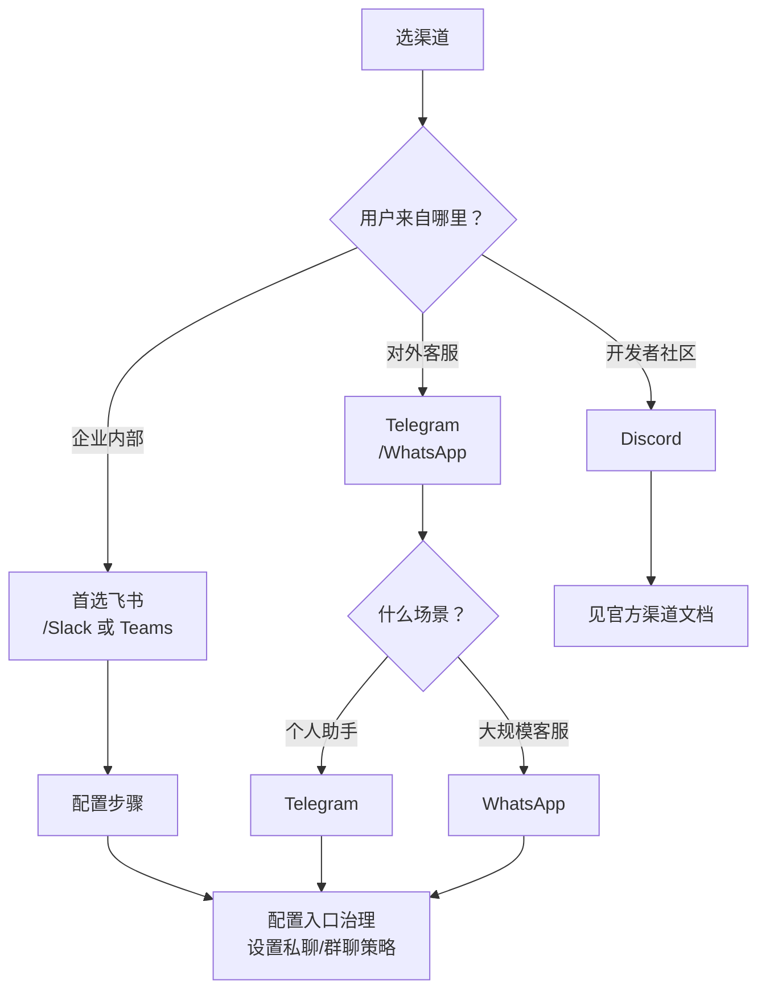

## 7.1 渠道接入与入口治理

当你的 OpenClaw 从本地开发扩展到真实生产环境时，首先面临的决策是：该接入哪些渠道？是 Telegram 的私聊机器人、WhatsApp 的 24 小时客服、还是飞书企业群助手？不同渠道有着完全不同的用户心理、安全风险与交互模式。本节会帮你理清这些选择。

**渠道选择决策树**

下面的决策树可以快速帮你判断优先级：



本节以 Telegram 与 WhatsApp 为例，走通从凭据配置到消息收发的接入思路，然后讲解多账号隔离策略。需要特别说明的是：**本次 live 审计实例只实际验证了 Telegram**；WhatsApp 部分保留为基于官方文档整理的接入说明，使用前应在你自己的环境里再次复验。飞书接入因为涉及开放平台授权，单独放在 [7.2](7.2_lark_integration.md)。

### 7.1.1 入口治理的第一原则：私聊与群聊分开

不管接哪个渠道，入口治理都从两个策略字段开始：`dmPolicy`（私聊）和 `groupPolicy`（群聊）。两者独立配置，互不干扰。

建议以“谨慎起步”为默认：群聊只在被 @ 时响应，私聊收敛到允许列表或配对审批。

### 7.1.2 Telegram：机器人令牌与私聊、群聊策略

**为什么选 Telegram**

Telegram 最适合两类场景：（1）个人开发者或小团队的私聊助手——既不需要企业级权限流程，也不受防火墙限制；（2）开源社区的技术讨论组——API 开放，易于二次开发，用户群体对机器人友好。如果你的场景不是这两类，就应该直接跳过 Telegram，选更适合的渠道。

**接入方式**

Telegram 渠道基于机器人令牌接入。`dmPolicy` 支持 `pairing`、`allowlist`、`open`、`disabled` 四种选项，建议以白名单和提及门控作为安全起步。详见官方文档：[https://docs.openclaw.ai/channels/telegram](https://docs.openclaw.ai/channels/telegram)。

示例配置：

```jsonc
{
  channels: {
    telegram: {
      botToken: '${TELEGRAM_BOT_TOKEN}',
      dmPolicy: 'allowlist',
      allowFrom: ['tg:987654321'],
      groupPolicy: 'allowlist',
      groupAllowFrom: ['tg:987654321'],
      groups: { '*': { requireMention: true } },
    },
  },
  messages: {
    groupChat: {
      mentionPatterns: ['@openclaw'],
    },
  },
}
```

### 7.1.3 WhatsApp：优先收敛触发面

**为什么选 WhatsApp**

WhatsApp 是全球最大的私人通讯平台，用户基数庞大，特别是在欧洲、拉丁美洲、亚洲市场。选择 WhatsApp 的人通常有一个明确的商业目标：大规模客服或 B2C 业务助手。相比 Telegram 需要用户主动查阅，WhatsApp 用户对消息提醒的反应更敏感，所以适合对响应时间有要求的场景。但同时，WhatsApp 的触发面更大，风险也更高，所以入口治理必须更严格。

**接入方式**

WhatsApp 渠道运行在自身账号上，触发面天然更大。以下内容以官方文档和常见部署方式为依据整理，**并非本次审计实例的 live 复验结果**。官方推荐尽量使用专用号码；个人号码加 `selfChatMode: true` 是受支持的回退模式：

- **专用号码（推荐）**：为 OpenClaw 使用独立的 WhatsApp 身份，DM 策略更清晰。
- **个人号码回退**：将 `selfChatMode` 设为 `true`，并将个人号码加入 `allowFrom`。

详见官方文档：[https://docs.openclaw.ai/channels/whatsapp](https://docs.openclaw.ai/channels/whatsapp)。

示例配置：

```jsonc
{
  channels: {
    whatsapp: {
      dmPolicy: 'pairing',
      allowFrom: ['+15555550123'],
      groupPolicy: 'allowlist',
      groupAllowFrom: ['+15555550123'],
      groups: { '*': { requireMention: true } },
    },
  },
  messages: {
    groupChat: {
      mentionPatterns: ['@openclaw'],
    },
  },
}
```

配对流程建议纳入运维验收：

```bash
openclaw pairing list whatsapp
openclaw pairing approve whatsapp <CODE> --notify
```

### 7.1.4 多账号隔离：把外部入口与内部入口拆开

多账号的价值不在“多开”，而在隔离：把外部支持入口与内部运维入口拆到不同账号，让不同入口具备不同的门控策略。WhatsApp 支持通过 `accounts` 字段提供多账号配置：

```jsonc
{
  channels: {
    whatsapp: {
      accounts: {
        support: {
          dmPolicy: 'pairing',
          allowFrom: ['+15555550123'],
          groupPolicy: 'allowlist',
          groupAllowFrom: ['+15555550123'],
          groups: { '*': { requireMention: true } },
        },
        ops: {
          dmPolicy: 'allowlist',
          allowFrom: ['+15555550999'],
          groupPolicy: 'allowlist',
          groupAllowFrom: ['+15555550999'],
          groups: { '*': { requireMention: true } },
        },
      },
    },
  },
}
```

登录不同账号：

```bash
openclaw channels login --channel whatsapp --account support
```

多账号落地后，建议在日志与告警中把账号标识作为一等维度，便于审计与责任归因。

### 7.1.5 验收与排障：先探针后回放

渠道相关问题的排障顺序建议固定为三步：

1. **自检与状态**：用 `doctor` 与 `status --deep` 确认依赖与配置被加载。
2. **渠道检查**：用 `channels capabilities` 确认当前渠道能力与配置入口正常。
3. **链路回放**：用结构化日志按 `traceId` 回放一次请求链路。

```bash
openclaw doctor
openclaw status --deep
openclaw channels capabilities
openclaw logs --follow --json
```

常见问题速查：
- **群聊不触发**：优先检查 `groups.*.requireMention` 与 `messages.groupChat.mentionPatterns`。
- **越权执行**：优先检查工具策略是否默认拒绝高风险工具组。
- **群聊误触发**：检查提及门控与允许列表。

对于管理员账号、关键群或固定业务号码，建议进一步用路由绑定固定接管——这是下一节 [7.3 路由基础](7.3_routing_basics.md) 的主题。
