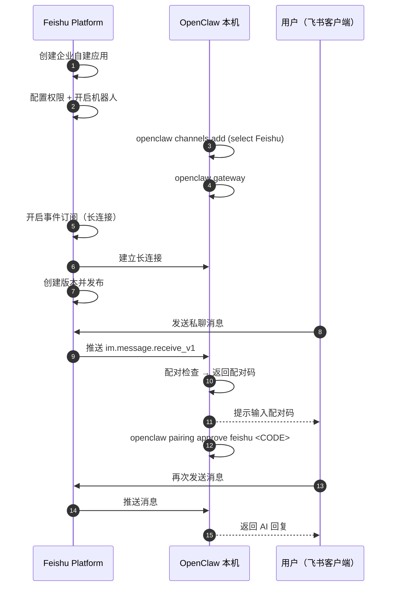

## 7.2 飞书专项接入指南：让它能在群里陪你聊天

接通飞书不仅需要配置 OpenClaw 侧，还需要在飞书开放平台完成一系列授权。很多新手在第一步“长连接订阅”就会失败。本节将详细梳理一条尽量稳妥的“端到端”飞书接入流。

> [!NOTE]
> 本节主要依据当前官方接入文档与经验流程整理。**本次 live 审计实例并未实际配置飞书渠道**，因此这里的页面顺序、字段名和平台按钮文案仍应在你自己的飞书环境中复验。

### 7.2.1 整体时序与防坑预警

提示：飞书接入会引入外部平台变量。若你仍在搭建本地基准环境，建议先完成[第三章](../03_minimal_loop/README.md)的基础配置并稳定复验后，再开始本节操作。

常见失败点速查（建议先过一遍再动手）：

- 长连接订阅失败：优先确认已经先在 OpenClaw 里运行 `openclaw channels add` 并选择 Feishu 完成渠道绑定，同时让 Gateway 处于运行态；否则飞书后台的长连接配置可能保存失败。
- 消息不触发：先检查群聊是否启用、是否要求 @、群是否在允许列表；再回看日志是否命中门控规则。
- 私聊要先配对：若启用了配对策略，首次私聊通常会先得到配对码，批准后才会进入正常对话。

不管你接的是哪家平台，基本都遵循同一条流水线，但 **飞书有个极为容易出错的步骤顺序**：

1. ✅ **飞书侧**：创建应用 -> 配置权限 -> 开启机器人能力
2. ✅ **OpenClaw 侧**：运行 `openclaw channels add`，在向导中选择 Feishu 并填写 App ID/App Secret
3. ✅ **OpenClaw 侧**：启动 Gateway（`openclaw gateway` 或 `openclaw gateway status` 确认已运行）
4. ✅ **飞书侧**：回到平台开启“事件订阅（长连接）”并添加事件
5. ✅ **飞书侧**：创建版本并发布应用

如下的时序图展示了飞书接入的端到端交互流程：



图 7-1：飞书接入的端到端交互流程

**血的教训**：最容易踩坑的不是“先发布还是先订阅”，而是**在 OpenClaw 还没配置 Feishu 渠道、Gateway 也没跑起来时，就去飞书后台开启长连接**。这时“事件订阅”页往往会直接保存失败。发布应用仍然是上线前的必做步骤，但它不是长连接保存失败的唯一前置条件。

### 7.2.2 在飞书开放平台配置应用

1. 打开 [飞书开放平台](https://open.feishu.cn/app)，点击“创建企业自建应用”，获取 `App ID` 和 `App Secret`。
2. **权限配置（批量导入推荐）**：点击左侧“权限管理属性”，选择“批量导入权限”，粘贴以下内容避免遗漏：

```json
{
  "scopes": {
    "tenant": [
      "aily:file:read",
      "aily:file:write",
      "application:application.app_message_stats.overview:readonly",
      "application:application:self_manage",
      "application:bot.menu:write",
      "cardkit:card:read",
      "cardkit:card:write",
      "contact:user.employee_id:readonly",
      "corehr:file:download",
      "event:ip_list",
      "im:chat.access_event.bot_p2p_chat:read",
      "im:chat.members:bot_access",
      "im:message",
      "im:message.group_at_msg:readonly",
      "im:message.p2p_msg:readonly",
      "im:message:readonly",
      "im:message:send_as_bot",
      "im:resource"
    ],
    "user": [
      "aily:file:read",
      "aily:file:write",
      "im:chat.access_event.bot_p2p_chat:read"
    ]
  }
}
```

3. 在“应用能力”中找到 **机器人** 卡片并开启。
4. 先不要急着发布，继续完成 OpenClaw 侧的渠道配置与长连接订阅；版本创建与发布放到 [7.2.4](#724-开启事件订阅并在飞书进行第一次对话) 一并完成。

### 7.2.3 在 OpenClaw 侧完成绑定

当前 OpenClaw 正式发行版已内置 Feishu 插件，因此正常安装后**不需要**先手动执行 `plugins install`。当前官方首选路径是使用渠道添加向导，在向导中选择 Feishu 并填写 App ID/App Secret；本地构建若仍暴露 `channels login --channel feishu`，可把它视为兼容入口，而不是首选路径：

```bash
openclaw channels add
```

> [!NOTE]
> **旧版或自定义构建的例外**：
> 如果你使用的是较老版本，或当前构建没有打包 Feishu 插件，再手动安装即可：
> ```bash
> openclaw plugins install @openclaw/feishu
> ```
> 只有遇到“找不到 Feishu 插件”这类错误时，才需要走这条兼容路径。

- 首选扫码流程完成授权和配置。
- 若向导提示无法扫码创建，再输入收集好的 `App ID` 与 `App Secret`。
- 对国内版选择 `domain: "feishu"`；全球版 Lark 选择 `domain: "lark"`。自定义端点应使用完整 `https://...` URI，不要写裸域名。
- 建议初次接入时：**群聊先选 disabled，后续配置通了再更改**。

配置完毕后查看连通性：

```bash
openclaw channels list
openclaw gateway status
```

### 7.2.4 开启事件订阅并在飞书进行第一次对话

1. 先在终端启动网关：`openclaw gateway`。
2. 回到飞书开发者后台的“事件与回调”页面，**开启长连接**，并添加事件 `im.message.receive_v1`（接收消息）。
3. 确认事件订阅保存成功后，再到“版本管理与发布”里创建版本并发布应用。
4. 去飞书电脑端搜索你的机器人，发送一句私聊“你好”。
5. 如果你启用了配对策略，此时会收到一个配对码（Pairing code）。复制这段码并在终端执行 `openclaw pairing approve feishu <CODE>` 完成批准。
6. 如果仍然没有回复，优先检查 `openclaw gateway status` 和 `openclaw logs --follow`，确认长连接已建立、事件已进入网关。
