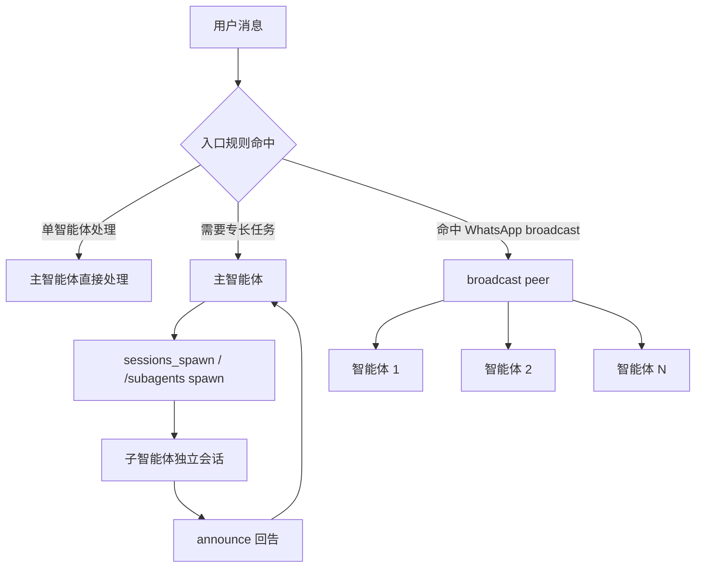

## 7.4 协作模式：子智能体与广播组

在 7.3 节中，我们解决的是“消息先交给谁”。本节继续往下走，回答两个工程问题：当单个智能体不够用时，如何把任务委派给别的智能体；当同一条消息需要多个智能体同时给出视角时，如何在不串话的前提下并行处理。OpenClaw 当前把这两类协作能力分成了两条线：**子智能体**负责“派一个新会话出去做事再回报”，**广播组**负责“同一入口同时触发多个智能体”。

为了避免把这两条线混在一起，可以先看整体关系图：



图 7-3：子智能体委派与广播组并行的关系总览

### 7.4.1 子智能体：用 `sessions_spawn` 派生独立会话

OpenClaw 的子智能体能力对应的真实运行接口是 `sessions_spawn`。官方文档把它定义为：在**隔离会话**里启动一次子智能体运行，并在完成后把结果回告给请求者所在的聊天通道。

真实可用的关键参数包括：

- `task`：子任务文本，必填。
- `agentId`：目标智能体 ID；是否允许跨 agent 派生，由 `agents.list[].subagents.allowAgents` 控制。
- `model`、`thinking`：覆盖子智能体的模型与思考强度。
- `runTimeoutSeconds`：子任务超时时间。
- `thread`、`mode`：在支持线程绑定的渠道里请求 thread-bound 交付。
- `cleanup`：运行后删除还是保留子会话。
- `sandbox`：`inherit` 或 `require`，用于限制子会话是否必须在沙箱下运行。
- `attachments`：内联附件支持，由 `tools.sessions_spawn.attachments.*` 控制。

运行时约束也要写清楚：

- 子智能体总是从一个新的 `agent:<agentId>:subagent:<uuid>` 会话启动。
- 子智能体默认继承“全工具集减去 session 工具”，可用 `tools.subagents.tools.allow/deny` 进一步收窄。
- 默认只启用一层派生；若把 `agents.defaults.subagents.maxSpawnDepth` 调到 2，则 depth-1 子智能体可继续派生，depth-2 叶子子智能体仍不能再调用 `sessions_spawn`。
- 子智能体会在 `agents.defaults.subagents.archiveAfterMinutes` 设定的时间后自动归档，默认 60 分钟。

手工排障或演示时，可以用 slash command 观察派生过程：

```bash
/subagents spawn <agentId> <task>
/subagents list
/subagents log <id>
/subagents kill <id|all>
```

适合子智能体的典型场景，是“主智能体判断意图，子智能体执行专长任务”。例如入口助手负责理解用户是在报故障、问退款，还是要查日志；真正做日志检索、订单核验、配置检查的，是能力边界更窄、工具权限更受控的子智能体。

### 7.4.2 广播组：让同一条消息触发多个智能体

广播组和子智能体不同。它不是“派一个新任务出去”，而是对**同一个入站 peer** 同时运行多个智能体。根据 OpenClaw 官方文档，广播组当前的作用域是 **WhatsApp web 渠道专用**，还不是通用的多渠道特性。

配置方法是真实存在的顶层 `broadcast` 字段：

- `broadcast.strategy`：`parallel` 或 `sequential`。
- `broadcast.<peerId>`：目标 WhatsApp peer 对应的智能体 ID 数组。

其中键的含义也很明确：

- 群聊键使用 WhatsApp group JID，例如 `120363403215116621@g.us`。
- 私聊键使用 E.164 电话号码，例如 `+15551234567`。

```jsonc
{
  broadcast: {
    strategy: "parallel",
    "120363403215116621@g.us": ["reviewer", "writer"],
    "+15551234567": ["assistant", "logger"],
  },
}
```

广播组不会绕过门控规则。它只有在“OpenClaw 本来就应该响应这条消息”的前提下才生效，例如群聊提及门控、允许列表、渠道激活条件都已经通过。命中广播组后，系统不再只选一个智能体，而是对配置里的所有智能体分别运行。

和广播组配套需要理解的是“共享什么、隔离什么”：

- **隔离的**：每个智能体有自己的 session key、会话历史、工作区、工具策略和记忆文件。
- **共享的**：同一个 peer 的近期群上下文缓冲区会被各广播智能体共同看到。

这意味着广播组适合“多视角评审”“多角色协作回复”这类需求，但不适合拿来模拟单条消息跨渠道扩散。

### 7.4.3 消息队列与回告：`messages.queue` 和 announce step

协作一旦并发起来，最先出问题的通常不是模型，而是消息重叠、重复回复和回告打架。OpenClaw 把这部分拆成两层：

1. **入站消息队列**：控制同一会话内多条消息如何排队。
2. **子智能体 announce step**：控制子任务完成后如何把结果回给请求者。

真实存在的队列配置是 `messages.queue`，而不是额外的“Announce Queue”协议。官方文档定义了以下队列模式：

- `steer`：尽量把新消息直接注入当前运行。
- `followup`：等当前轮结束后再开下一轮。
- `collect`：把兼容的排队消息合并成一次后续 followup。
- `steer-backlog`：先注入当前轮，再保留一条后续跟进。
- `steer+backlog` / `steer_backlog`：`steer-backlog` 的等价写法（运行时规范化为同一模式）。
- `interrupt`：遗留模式，终止当前轮后处理最新消息。
- `queue` / `queued`：遗留 one-at-a-time steering 模式，不等价于 `steer`。

当前默认模式是 `steer`，默认防抖约为 `500ms`。

配套键包括：

- `messages.queue.mode`
- `messages.queue.debounceMs`
- `messages.queue.cap`
- `messages.queue.drop`
- `messages.queue.byChannel`
- `messages.queue.debounceMsByChannel`

```jsonc
{
  messages: {
    queue: {
      mode: "collect",
      debounceMs: 1000,
      cap: 20,
      drop: "summarize",
      byChannel: {
        discord: "collect",
        whatsapp: "steer",
      },
    },
  },
}
```

如果想按会话临时改行为，OpenClaw 还支持真实的 `/queue` 命令：

```bash
/queue collect
/queue collect debounce:2s cap:25 drop:summarize
/queue reset
```

子智能体完成后，系统会执行一轮 **announce step**。这一步不是自由扩展协议，而是已有固定语义：

- 子智能体完成后，结果回投到请求者所在聊天通道。
- 如果 announce 回复精确等于 `ANNOUNCE_SKIP`，则保持静默。
- 回告会被规范化为稳定事件块，至少包含运行状态、结果内容与后续回复指令；其中状态来自运行时结果，而不是模型自由生成。
- 如果没有可见的最终文本，系统会回退到经清洗后的最近一次 tool/toolResult 内容作为结果主体。

### 7.4.4 配置骨架：最小可用的协作组合

下面给出一个与当前 OpenClaw 配置形态一致的骨架示例：默认助手可以派生 `reviewer` 与 `writer`，所有子智能体都走收窄后的工具集；某个 WhatsApp 群命中广播组后，同时触发 `reviewer` 与 `writer`。

```jsonc
{
  agents: {
    defaults: {
      subagents: {
        archiveAfterMinutes: 60,
        runTimeoutSeconds: 120,
      },
    },
    list: [
      {
        id: "assistant",
        default: true,
        workspace: "~/.openclaw/workspace",
        subagents: { allowAgents: ["reviewer", "writer"] },
      },
      {
        id: "reviewer",
        workspace: "~/.openclaw/workspace-reviewer",
      },
      {
        id: "writer",
        workspace: "~/.openclaw/workspace-writer",
      },
    ],
  },

  tools: {
    subagents: {
      tools: {
        deny: ["group:runtime"],
      },
    },
    sessions_spawn: {
      attachments: {
        enabled: true,
        maxFiles: 5,
      },
    },
  },

  messages: {
    queue: {
      mode: "collect",
      debounceMs: 1000,
      cap: 20,
      drop: "summarize",
    },
  },

  broadcast: {
    strategy: "parallel",
    "120363403215116621@g.us": ["reviewer", "writer"],
  },
}
```

这个组合表达了三条非常实用的工程原则：

1. 子智能体允许列表要显式写死，不要默认放开 `["*"]`。
2. 子智能体的工具范围应比主智能体更窄，而不是更宽。
3. 广播组只给少数明确 peer 使用，否则很容易把单条消息放大成多条并发响应。

### 7.4.5 验收与排障：先验证路由，再验证并发，再验证回告

多智能体协作排障时，建议固定为三层：

1. **入口是否命中正确 agent**：先检查绑定与广播规则。
2. **并发是否按预期排队**：再检查 `messages.queue` 模式。
3. **子任务结果是否回告成功**：最后看 announce step 与结构化日志。

常用命令可以收敛为：

```bash
openclaw agents list --bindings
openclaw channels capabilities
openclaw status --deep
openclaw logs --follow --json
```

如果出现“只触发了一个智能体”，先核对该 peer 是否在 `broadcast` 里；如果出现“子智能体做完了但主聊天没看到结果”，优先在日志里搜索 announce 相关条目，并确认模型没有返回 `ANNOUNCE_SKIP`。

### 7.4.6 本节小结

OpenClaw 的协作能力不是一团泛化的“多智能体编排”，而是几项边界清楚的真实机制：

- `sessions_spawn` 负责启动隔离子会话并在完成后回告。
- `broadcast` 负责在 WhatsApp 指定 peer 上同时运行多个智能体。
- `messages.queue` 负责管理同一会话里的入站并发。

把这三者分清楚，才能在设计协作系统时明确回答三个问题：谁来做、怎么并发、结果回到哪里。
