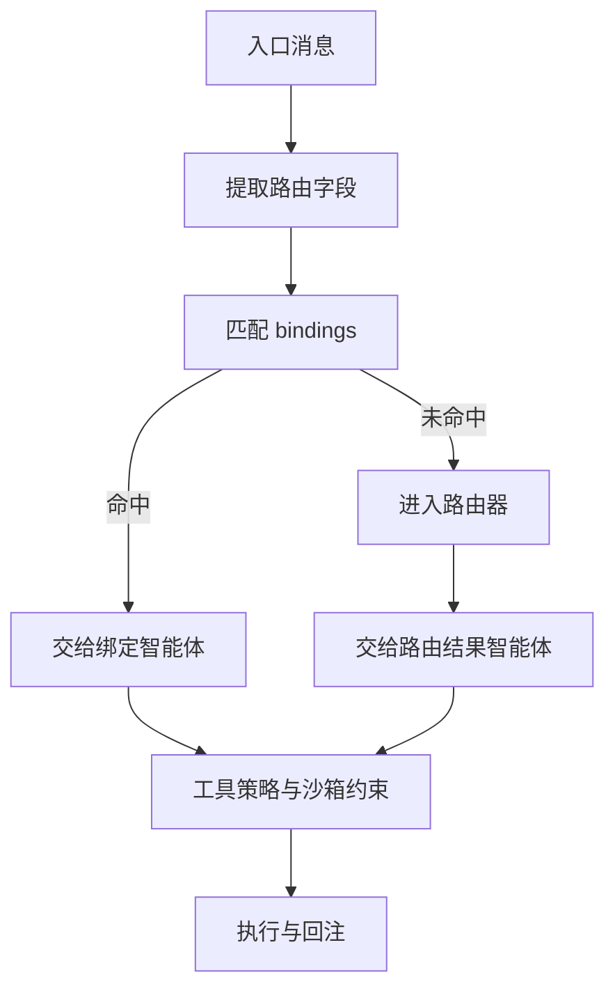

## 7.4 路由基础：从单智能体到多智能体

路由解决的不是“模型能不能做”，而是“这条消息应该交给哪个智能体接管，以及它被允许做什么”。本节以 openclaw 的多智能体路由为主线，说明路由决策链、绑定规则的优先级、以及如何用可观测手段把路由做成可回放、可审计、可排障的工程能力。

### 7.4.1 路由要解决的核心问题：所有权、权限与状态隔离

在多智能体系统里，一条消息进入后必须尽快确定三件事：由谁处理（所有权）、能做什么（工具与权限）、状态写到哪里（会话与记忆）。如果不把这三件事拆清楚，就会出现两类常见故障：

1. 责任不清：多个智能体同时响应或互相覆盖状态，导致输出不一致。
2. 越权执行：低可信入口触发高风险工具，故障从“答错一句话”升级为“写错一条数据”。

openclaw 将“由谁接管”下沉为多智能体路由与绑定机制，并把“能做什么”交给工具策略与沙箱工具约束去兜底。路由层最重要的目标是把消息的处理权稳定地收敛到一个确定的智能体上，然后让后续执行在可控边界内进行。相关概念与配置细节见官方文档的多智能体路由与绑定说明：[https://docs.openclaw.ai/concepts/multi-agent](https://docs.openclaw.ai/concepts/multi-agent)，[https://docs.openclaw.ai/concepts/multi-agent#routing-rules-how-messages-pick-an-agent](https://docs.openclaw.ai/concepts/multi-agent#routing-rules-how-messages-pick-an-agent)。

### 7.4.2 决策链：先绑定后路由，绑定命中时直接接管

openclaw 的典型决策链可以概括为”先匹配绑定，再进入路由器”。绑定用于把某些来源的消息稳定地交给指定智能体处理，从而减少模型分类的不确定性。官方文档明确了绑定的优先级与用途，并给出了基于 `channel`、`accountId`、`peer`（含 `kind` 与 `id`）等字段的匹配方式。绑定命中时，系统会直接将消息交给绑定的智能体处理。[https://docs.openclaw.ai/concepts/multi-agent](https://docs.openclaw.ai/concepts/multi-agent)

为了把这条链路讲清楚，下面用一个简化流程图刻画路由的关键分叉点。



图 7-2：多智能体路由中“绑定优先”的关键分叉

工程上建议把高风险或高确定性的入口优先落到绑定里，把需要意图理解的入口交给路由器。

### 7.4.3 绑定落地：用最小规则把高风险入口固定到受控智能体

绑定的好处是把”路由正确性”从概率问题变成规则问题。官方文档的配置结构中，`bindings` 是**顶层数组**（与 `agents`、`channels` 同级），每条绑定通过 `agentId` 指向目标智能体，通过 `match` 对象描述匹配条件。下面的示例展示了”渠道与对端绑定到特定智能体”的配置形态。在实际工程中，建议把涉及写入或外部副作用的能力都集中在少量受控智能体内，然后只给这些智能体配置严格的工具允许列表，工具策略的写法详见 [5.2 工具策略：允许、拒绝与分层策略](../05_tools_skills/5.2_tool_policy.md)。

```javascript
{
  // bindings 是顶层数组，不嵌套在 agents 内
  bindings: [
    {
      agentId: “work”,
      match: {
        channel: “whatsapp”,
        peer: { kind: “direct”, id: “+15551234567” },
      },
    },
    {
      agentId: “work”,
      match: {
        channel: “telegram”,
        peer: { kind: “direct”, id: “987654321” },
      },
    },
  ],

  agents: {
    list: [
      {
        id: “work”,
        name: “工作助手”,
        workspace: “~/.openclaw/workspace-work”,
        agentDir: “~/.openclaw/agents/work/agent”,
      },
    ],
  },
}
```

> [!WARNING]
> `bindings` 必须写在配置文件的**顶层**，不能嵌套在 `agents.list` 的某个智能体对象内。嵌套写法不会被识别，导致绑定静默失效。

当系统规模增长到”多账号、多群、多入口”时，建议把绑定策略拆成两层：

1. 入口层绑定：按 `channel`、`peer`、`accountId` 绑定到入口智能体，负责治理触发规则与上下文预处理。
2. 任务层路由：入口智能体再将任务分发给领域智能体，或使用子智能体并行处理。子智能体机制见 [https://docs.openclaw.ai/tools/subagents](https://docs.openclaw.ai/tools/subagents)。

验证绑定是否生效时，不建议靠”发消息看看”。更可靠的做法是先用命令查看绑定清单，再用探测命令确认渠道状态：

```bash
openclaw agents list --bindings
openclaw channels status --probe
```

#### 完整多智能体路由配置示例

下面展示一个真实场景配置：一个团队同时使用 Telegram 和 WhatsApp，需要根据消息来源与风险等级将任务路由到不同智能体。

**场景描述**
- `assistant`：默认助手，处理日常问题，无外部工具权限
- `devops`：运维智能体，绑定特定 Telegram 群组（DevOps-team），拥有 `exec`（执行命令）和 `ssh`（远程连接）工具
- `writer`：写作智能体，绑定特定 WhatsApp 对端（产品编辑），拥有 `document`（文档编辑）工具，无执行权

**完整配置**

```javascript
{
  agents: {
    list: [
      {
        id: “assistant”,
        default: true,                    // 标记为默认智能体
        name: “默认助手”,
        workspace: “~/.openclaw/workspace-assistant”,
        agentDir: “~/.openclaw/agents/assistant/agent”,
        model: “anthropic/claude-sonnet-4-6”,
        tools: { allow: [“group:fs”, “group:web”], deny: [“group:runtime”] },
      },
      {
        id: “devops”,
        name: “运维智能体”,
        workspace: “~/.openclaw/workspace-devops”,
        agentDir: “~/.openclaw/agents/devops/agent”,
        model: “anthropic/claude-sonnet-4-6”,
        tools: { allow: [“group:runtime”, “group:fs”, “group:web”] },
        sandbox: { mode: “all”, scope: “agent” },
      },
      {
        id: “writer”,
        name: “写作智能体”,
        workspace: “~/.openclaw/workspace-writer”,
        agentDir: “~/.openclaw/agents/writer/agent”,
        model: “anthropic/claude-sonnet-4-6”,
        tools: { allow: [“group:fs”, “group:web”], deny: [“group:runtime”] },
      },
    ],
  },

  // bindings 是顶层数组，按 match 条件将消息路由到指定 agentId
  bindings: [
    {
      agentId: “devops”,
      match: {
        channel: “telegram”,
        peer: { kind: “group”, id: “-1001234567890” },  // DevOps-team 群组 ID
      },
    },
    {
      agentId: “writer”,
      match: {
        channel: “whatsapp”,
        peer: { kind: “direct”, id: “+8615600000000” },  // 产品编辑对端号码
      },
    },
  ],

  channels: {
    telegram: { enabled: true },
    whatsapp: { enabled: true },
  },
}
```

**绑定优先级与匹配顺序**

官方文档明确了绑定命中时的优先级顺序（最具体的规则优先匹配）。当一条消息进入时，系统按以下顺序尝试匹配：

1. **Peer match**（精确对端匹配）：`peer: { kind, id }` 完全匹配，优先级最高。用于 DM 或已知固定对端的场景。
2. **parentPeer match**（线程继承匹配）：匹配父级消息的对端，用于线程路由继承。
3. **guildId + roles**（Discord 角色匹配）：同时匹配 Discord 服务器 ID 与角色列表。
4. **guildId**（Discord 服务器匹配）：仅匹配 Discord 服务器 ID。
5. **teamId**（Slack 工作区匹配）：匹配 Slack 的 workspace ID。
6. **accountId match**（账号精确匹配）：匹配特定的渠道账号实例。
7. **Channel-level match**（渠道级匹配）：`accountId` 为 `"*"` 或省略，匹配整个渠道。
8. **Fallback**（默认智能体）：当所有绑定都未命中时，使用 `agents.list` 中 `default: true` 的智能体，若无则取第一个。

> [!NOTE]
> 当一条绑定中包含多个 match 字段时，所有字段都必须同时满足（AND 语义）。第一条命中的绑定即生效，后续不再检查。

在上面的示例中，来自 DevOps-team 群的消息会优先命中 `devops` 的对端绑定，来自产品编辑号码的消息会优先命中 `writer` 的对端绑定，其他来源的消息默认路由到标记了 `default: true` 的 `assistant`。

**验证绑定加载与优先级**

```bash
# 查看所有智能体及其绑定
openclaw agents list --bindings

# 查看特定智能体的绑定详情
openclaw agents info devops --bindings

# 用结构化日志验证路由决策
openclaw logs --follow --json --filter “routing”
```

### 7.4.4 可观测与防失控：把路由原因写进日志

多智能体系统的排障难点在于“看起来像模型问题，实际上是路由与策略问题”。建议从一开始就把两类信息写进可检索日志：

1. 路由原因：命中哪个绑定或路由器为什么选择该智能体。
2. 执行边界：该智能体当次请求使用了哪些工具策略与沙箱约束。

openclaw 提供了结构化日志与诊断能力，便于在控制台或日志流中回放链路。排障时可先用 `status` 与 `logs` 定位是否为配置、配对或渠道状态问题，再回到路由策略本身做收敛：

```bash
openclaw status --deep
openclaw logs --follow --json
```

工程层面还需要显式防止路由环路。如果允许智能体之间互相转交任务，建议实现跳数限制或链路去重，并在日志里记录链路标识；当同一条链路反复在智能体间往返时，直接中止并返回可操作的错误提示。

### 7.4.5 记忆存储隔离：每个智能体独立的文件与索引

路由把消息收敛到正确的智能体，但记忆隔离才能保证不同智能体之间的知识不会交叉污染。OpenClaw 在物理层面实现了双重隔离：**记忆源文件**按工作目录分离，**向量索引**按智能体 ID 分离。

```text
~/.clawdbot/memory/              # 索引存储目录（状态目录）
├── main.sqlite                  # 主智能体的向量索引
└── work.sqlite                  # 工作智能体的向量索引

~/clawd/                         # 主智能体的工作目录（记忆源文件）
├── MEMORY.md
└── memory/
    └── 2026-01-26.md

~/clawd-work/                    # 工作智能体的工作目录（记忆源文件）
├── MEMORY.md
└── memory/
    └── 2026-01-26.md
```

每个智能体在 `agents.list` 中声明独立的 `workspace` 路径（如 7.4.3.1 示例中的 `~/.openclaw/workspace-assistant`、`~/.openclaw/workspace-devops`），其 `MEMORY.md` 和 `memory/` 目录各自独立。索引文件则统一存放在 `~/.clawdbot/memory/` 状态目录中，以 `agentId` 命名的 SQLite 文件区分——`memory_search` 只会查询当前智能体对应的索引文件，不会跨库检索。

这种设计的工程意义在于：

- **默认零信任**：即使未开启沙箱模式，智能体的 `memory_search` 和 `memory_get` 也只能访问自己工作目录下的文件，索引层做了 agentId 级别的物理隔离。
- **可审计**：每个智能体的记忆变更历史独立追踪，出现记忆污染时可精确定位到具体的 agentId 和时间点。
- **独立生命周期**：删除或重建某个智能体时，只需清理对应的工作目录和 SQLite 索引文件，不影响其他智能体的记忆。

> **⚠️ 注意**：如果未开启严格沙箱模式（`sandbox.mode: "all"`），智能体理论上可以通过文件系统工具直接读取其他智能体的工作目录。建议在多智能体生产部署中，为每个智能体显式配置 `sandbox` 参数，确保文件系统访问范围收敛到自身的 `workspace` 路径。
