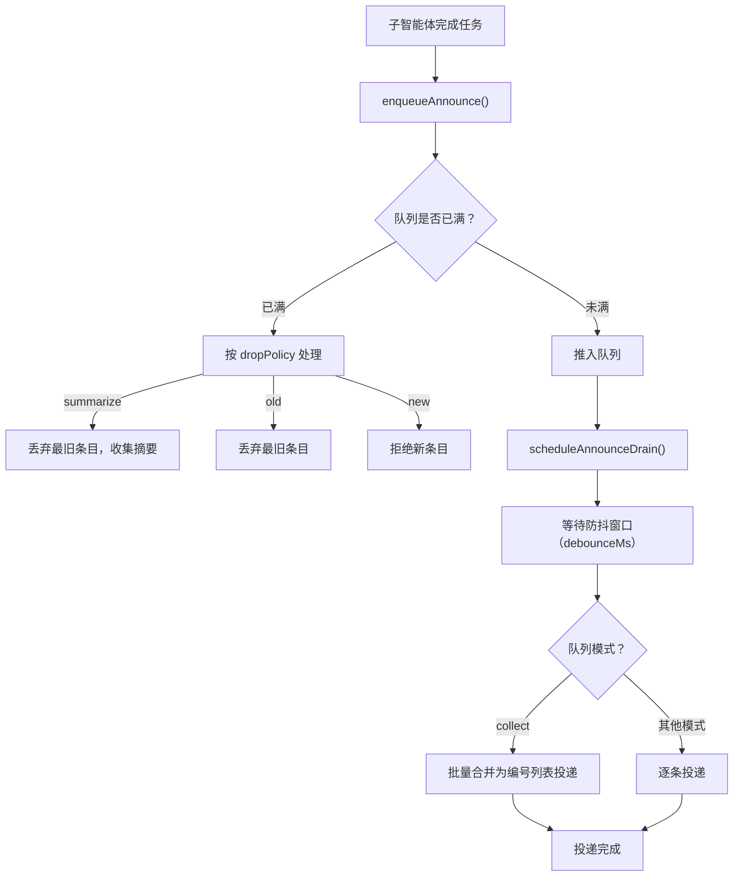

## 7.5 协作模式：子智能体与广播组

多智能体不仅用于入口路由，也用于把复杂任务拆成可并行的子任务，并把结果投递到多个目标群或多个对端。本节基于 OpenClaw 的子智能体与广播组能力，给出两种常用协作模式的配置骨架与验收命令，并补充一套面向工程交付的交接协议，避免协作在“口头描述”上失真。

### 7.5.1 子智能体：并行拆解与汇总

子智能体是主智能体通过调用内置工具或 slash command 动态派生的任务执行单元，用于把一个复杂任务拆成多个可并行的分支，由主智能体负责协调与汇总。官方文档说明了子智能体的触发方式（slash command 与工具调用）、并发控制与嵌套深度限制：[https://docs.openclaw.ai/tools/subagents](https://docs.openclaw.ai/tools/subagents)。

主智能体可通过 slash command 手动派生，也可在自动化场景中通过 `spawn_subagent` 工具调用触发。基本 slash command 参考：

```bash
/subagents spawn <agentId> <task>   # 派生子智能体执行指定任务
/subagents list                     # 查看当前所有子智能体
/subagents log <id>                 # 查看子智能体运行日志
/subagents kill <id|all>            # 终止子智能体
```

**具体例子：客服意图路由与权限物理隔离**

设计一个主入口智能体 `CustomerReception`，它自身不绑定任何外部写的工具，只负责安抚用户并判断意图：
- 当识别到用户说“我要退款”时，它将任务及订单号移交给拥有内网支付系统写入权限的子智能体 `RefundAgent`。
- 当用户说“接口一直报 500”时，它移交给拥有只读日志查询权限的子智能体 `TechSupport`。
这种模式通过物理隔离保证了即使作为主入口的智能体受到“提示词注入攻击（Prompt Injection）”，也无法直接执行越权的高危指令。

子智能体的工程价值在于边界清晰：每个子智能体对应一个独立的 `agentId` workspace，可以配套不同的工具策略与记忆策略，从而在“能力”与“风险”之间做收敛。

### 7.5.2 广播组：把结果投递到多个目标

广播组用于把同一条输入消息同时分发给多个智能体并行处理，适合“多角色评审、多语言支持、批量告警”这类场景。官方文档给出了广播组的配置结构与字段含义：[https://docs.openclaw.ai/channels/broadcast-groups](https://docs.openclaw.ai/channels/broadcast-groups)。

广播组通过顶层 `broadcast` 字段配置，以群 ID 或手机号为键，映射到处理该对话的智能体 ID 数组。默认并行执行，也支持顺序执行：

```json5
{
  broadcast: {
    strategy: 'parallel',                           // 可选，默认 parallel
    '120363000000000000@g.us': ['alfred', 'baerbel'], // WhatsApp 群 → 两个智能体同时响应
    '+15555550123': ['support', 'logger'],          // DM 号码 → 两个智能体同时响应
  },
}
```

广播属于高影响动作，建议与工具策略配合使用：默认只允许特定智能体触发广播，并在日志中记录广播组名、目标清单摘要与触发原因，便于审计与回滚。

### 7.5.3 Announce Queue：子智能体结果投递的队列协议

子智能体完成任务后，需要把结果“通知”回父智能体或目标会话。OpenClaw 并不是简单地直接发送消息，而是通过一套完整的 **Announce Queue（通知队列）** 协议来管理投递，解决了并发投递冲突、跨渠道路由、消息丢失与重试等工程难题。

**队列生命周期：入队 → 防抖 → 排空 → 投递**



**核心配置参数**：

| 参数 | 默认值 | 说明 |
|------|--------|------|
| `debounceMs` | 1000（1 秒） | 防抖窗口，等待更多消息聚合 |
| `cap` | 20 | 队列最大深度 |
| `dropPolicy` | `"summarize"` | 溢出策略：`summarize`（丢弃并收集摘要）、`old`（丢弃最旧）、`new`（拒绝新条目） |
| `mode` | — | 队列行为模式：`steer`、`followup`、`collect`、`steer-backlog`、`interrupt`、`queue` |

参数解析优先级：内联选项 → 会话级设置 → 按渠道防抖配置（`messages.queue.debounceMsByChannel`）→ 渠道插件默认值 → 全局配置 → 硬编码默认值。

**跨渠道消息合成**：当队列中的消息来自不同渠道或不同会话时，系统通过 `deliveryContextKey`（`channel|to|accountId|threadId`）检测跨渠道情况。单渠道时批量合并投递（如 `collect` 模式下编号为"Queued #1"、"Queued #2"等）；跨渠道时强制逐条投递，避免混淆不同目标的路由。

**失败重试与指数退避**：投递失败时，队列条目不会丢弃，而是通过指数退避重试：`Math.min(1000 × 2^consecutiveFailures, 60000)` 毫秒。对于瞬态错误（如网关不可用、网络超时），直接投递路径额外提供 5s → 10s → 20s 三级重试；对于永久错误（如渠道不存在、用户被封禁），立即失败不重试。

**幂等性保障**：每条通知携带 `announceId`（格式：`announce:v1:{sessionKey}:{runId}`），系统在投递侧做去重，防止因重试导致的重复消息。

**Inbound Debounce（入站消息防抖）**：与 Announce Queue 独立的另一套机制，用于聚合用户快速连续发送的多条消息。按发送者/会话键独立缓冲，每收到新消息重置超时窗口，超时后批量交给智能体处理。带媒体附件的消息会跳过防抖立即处理。

排障时，如果子智能体的结果未按预期送达，可以用以下命令确认队列状态与投递链路：

```bash
# 确认子智能体是否成功完成
openclaw logs --follow --json --filter "announce"

# 确认目标会话是否在线
openclaw status --deep
```

### 7.5.4 交接协议：把协作结果写成可复验的结构

协作最常见的失败不是模型能力不足，而是交接信息不完整，导致主智能体无法验证子任务结果或无法继续执行。建议把交接协议固定成结构化模板，至少包含以下字段：

1. 结论：一句话结论与适用范围。
2. 证据：来源链接或日志线索，必要时附 `traceId`。
3. 操作：可执行命令或配置片段。
4. 验证：预期输出与异常分支的下一步。

下面给出一个可复用的交接模板，适合在子智能体完成后回传给主智能体或写入审计记录。

```text
交接摘要
- 结论：
- 证据：
- 已执行命令：
- 建议执行命令：
- 验证点：
- 风险与回滚：
```

### 7.5.4.1 子智能体协作配置示例

下面展示一个真实场景配置：日报汇总系统，主智能体每天触发，并行派生两个子智能体分别检查代码提交与任务完成情况，最后汇总结果广播到指定群。

**场景描述**
- `coordinator`：日报协调者（主智能体），每天 09:00 UTC+8 自动触发，负责派生子任务并汇总结果
- `code-reviewer`：代码审查智能体，检查最近24小时 Git 提交历史，拥有 `git_log`、`git_diff` 等只读工具
- `task-tracker`：任务追踪智能体，查询任务管理系统（如 Jira）中当天完成的任务，拥有 `jira_query` 工具
- 汇总结果广播到 Slack 通知群和项目管理群

**完整配置**

```json5
{
  agents: {
    list: [
      {
        id: "coordinator",
        displayName: "日报协调者",
        model: "gpt-5.2",
        tools: ["spawn_subagent", "summarize_reports", "broadcast_message"],
        // coordinator 不直接绑定渠道，由定时任务触发
        systemPrompt: "你是日报汇总者。每天9点时，派生两个子智能体分别检查代码和任务，收集它们的结果后，形成日报摘要并广播到指定群。"
      },
      {
        id: "code-reviewer",
        displayName: "代码审查智能体",
        model: "gpt-5.2",
        toolGroups: ["git_readonly"],  // Git 只读工具
        tools: ["git_log", "git_diff", "git_blame"],
        systemPrompt: "你是代码审查员。分析最近24小时的 Git 提交，统计代码行数变化、模块改动、以及可能的风险。最后用JSON格式返回结果。"
      },
      {
        id: "task-tracker",
        displayName: "任务追踪智能体",
        model: "gpt-5.2",
        toolGroups: ["jira_readonly"],  // Jira 只读工具
        tools: ["jira_search", "jira_get_issue"],
        systemPrompt: "你是任务追踪员。查询今天完成的所有任务（状态为 Done），统计完成数量、优先级分布、以及关键风险项。最后用JSON格式返回结果。"
      }
    ]
  },

  // 定时触发 coordinator 生成日报（字段名为 cron，不是 schedules）
  cron: [
    {
      id: "daily_standup",
      agentId: "coordinator",
      expression: "0 9 * * 1-5",         // 周一至周五 09:00（本地时区）
      task: "生成今日日报",
      payload: {
        date: "${DATE}",
        reviewAgents: ["code-reviewer", "task-tracker"],
      },
    },
  ],

  // 定时任务触发后的结果广播
  broadcast: {
    strategy: "sequential",  // 顺序广播，确保消息顺序
    // Slack 通知群
    "C1234567890": ["coordinator"],    // Slack 频道，由 coordinator 发送汇总
    // WhatsApp 项目管理群
    "120363000000000000@g.us": ["coordinator"],  // WhatsApp 群，由 coordinator 发送汇总
    // 团队负责人直邮
    "+86 13800000000": ["coordinator"]  // 团队负责人号码
  }
}
```

**主智能体的派生逻辑**

coordinator 在被定时任务触发时，应执行以下逻辑：

```json5
{
  mainAgentLogic: {
    step1: "解析定时任务 payload，确认 reviewAgents 列表",
    step2: "使用 spawn_subagent 工具派生 code-reviewer：task = '分析最近24小时 Git 提交'",
    step3: "使用 spawn_subagent 工具派生 task-tracker：task = '统计今日完成的任务'",
    step4: "等待两个子智能体完成（并行），各设 30 秒超时",
    step5: "从子智能体结果中提取 JSON 结果，合并到日报模板",
    step6: "使用 broadcast_message 工具将日报分别投递到 Slack、WhatsApp、邮件",
    step7: "记录交接结果：包括子智能体执行状态、汇总时间戳、广播确认
  },
  expectedOutput: {
    "format": "JSON",
    "fields": {
      "date": "2026-03-06",
      "codeMetrics": {
        "commits": 12,
        "filesChanged": 34,
        "linesAdded": 450,
        "linesRemoved": 200
      },
      "taskMetrics": {
        "completed": 8,
        "byPriority": {
          "high": 2,
          "medium": 5,
          "low": 1
        }
      },
      "broadcastResults": {
        "slack": "sent",
        "whatsapp": "sent",
        "email": "sent"
      }
    }
  }
}
```

**子智能体交接协议示例**

当 code-reviewer 完成后，应返回结构化结果：

```json5
{
  traceId: "trace_20260306_001",
  subAgentId: "code-reviewer",
  status: "completed",
  conclusion: "过去24小时有12次提交，主要集中在用户认证模块，无 critical 风险发现",
  evidence: {
    source: "git.company.com/project",
    timeRange: "2026-03-05T09:00:00Z ~ 2026-03-06T09:00:00Z",
    link: "https://git.company.com/project/commits"
  },
  metrics: {
    commits: 12,
    filesChanged: 34,
    linesAdded: 450,
    linesRemoved: 200
  },
  riskItems: [
    {
      severity: "warning",
      description: "认证模块 password_hash 函数修改，建议code review",
      affectedFiles: ["src/auth/password.js"]
    }
  ],
  nextAction: "已投递给 coordinator，等待任务追踪结果汇总"
}
```

task-tracker 的交接结果类似：

```json5
{
  traceId: "trace_20260306_002",
  subAgentId: "task-tracker",
  status: "completed",
  conclusion: "今日完成 8 个任务，包括 2 个高优先级功能、5 个中等优先级缺陷修复、1 个低优先级优化",
  evidence: {
    source: "jira.company.com",
    queryFilter: "project = PROJECT AND resolved >= '2026-03-06' AND status = Done",
    link: "https://jira.company.com/issues/?jql=..."
  },
  metrics: {
    completed: 8,
    byPriority: {
      high: 2,
      medium: 5,
      low: 1
    }
  },
  riskItems: [
    {
      severity: "warning",
      description: "3 个任务仍在 Code Review 阶段，可能影响明日发版",
      relatedTasks: ["PROJ-1234", "PROJ-1235", "PROJ-1236"]
    }
  ],
  nextAction: "已投递给 coordinator，等待最终汇总"
}
```

**验证与监控**

配置完成后，建议通过以下命令验证：

```bash
# 查看定时任务状态
openclaw cron list

# 查看定时任务详情
openclaw cron info daily_standup

# 手动触发一次日报生成（用于验证）
openclaw cron trigger daily_standup

# 查看子智能体执行日志
openclaw logs --follow --json --filter "subagent"

# 查看广播投递日志
openclaw logs --follow --json --filter "broadcast"
```

如果子智能体未在超时时间内返回，coordinator 应实现降级逻辑（如使用缓存结果或跳过该项）并在日报中标记异常。

### 7.5.5 验收与排障：先看配置是否加载，再看链路是否命中

多智能体协作的排障顺序建议固定为：

1. 用 `status --deep` 确认广播组配置是否被加载。
2. 用 `channels status --probe` 确认目标渠道在线。
3. 用结构化日志按 `traceId` 回放一次完整协作链路。

```bash
openclaw status --deep
openclaw channels status --probe
openclaw logs --follow --json
```

如果出现“广播未送达”，优先检查目标群标识和渠道在线状态；如果子智能体未响应，检查 `agentId` 是否在 `agents.list` 中正确声明、工具策略是否允许 `spawn_subagent`。

### 7.5.6 本节小结

子智能体通过动态 spawn 机制把复杂任务并行化并保持边界清晰，广播组通过 `broadcast` 顶层配置把消息稳定投递到多个智能体。两者都应配合工具策略与结构化日志使用，把协作做成可审计、可回放链路。通过固定交接协议模板，可以显著减少协作中的信息丢失与不可复验问题。
