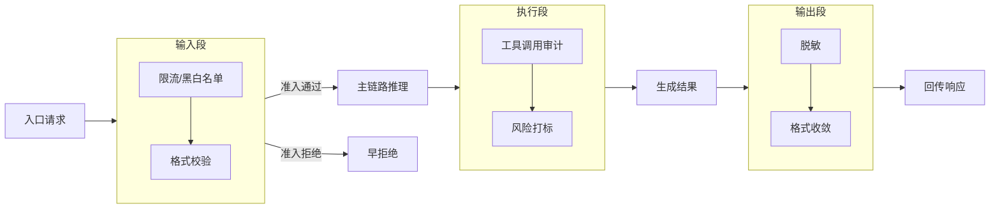

## 8.1 Hooks 生命周期与事件切入点

本节讨论 Hooks 的工程落点：把治理逻辑从主执行链解耦出来，并保证 Hook 自身不会成为新故障源。

> [!NOTE]
> 本节讨论的 Hook 模式属于通用工程最佳实践。具体到实现侧的注册方式与事件列表可能随版本演进：以 `doctor`/`status --deep`/结构化日志的实际输出为自证入口，本节聚焦 Hooks 的职责边界与稳定性约束。

### 8.1.1 Hooks 的职责边界

Hooks 适合承载横切能力，而不是业务主流程。常见场景包括：

- 输入治理：限流、黑白名单、格式校验。
- 执行观测：工具调用审计、风险打标、策略记录。
- 输出治理：脱敏、格式收敛、审计补充字段。

边界原则：Hook 负责“治理与观测”，主链负责“任务推进”。

### 8.1.2 三段生命周期：输入、执行、输出

建议把 Hook 固定在三个阶段，避免职责混乱。下面的流程图展示了 Hook 如何在主链路的三个阶段切入：



图 8-1：Hooks 在主链路三段生命周期中的切入点

| 阶段 | 目标 | 禁止事项 |
| --- | --- | --- |
| 输入段 | 早拒绝、降噪、准入校验 | 长耗时外部调用、不可逆写入 |
| 执行段 | 记录关键决策、风险拦截 | 改写核心业务状态 |
| 输出段 | 脱敏和格式治理 | 临时扩权、绕过策略放行 |

### 8.1.3 稳定性约束：超时、降级、幂等

Hook 本身必须受约束，否则会拖垮主链。

- 超时上限：每个 Hook 都要有独立超时，超时后按策略降级。
- 失败语义：明确 fail-open 或 fail-closed，不要默许默认行为。
- 幂等要求：重试情况下不得产生重复外部副作用。

对审计类 Hook，建议默认 fail-open 并告警；对合规拦截类 Hook，建议默认 fail-closed。

### 8.1.4 结构化事件：保证可审计与可回放

建议所有 Hook 事件使用统一结构，最少包含：时间、链路、阶段、动作、结果。

```json
{
  "ts": "YYYY-MM-DDTHH:MM:SSZ",
  "trace_id": "t-YYYYMMDD-001",
  "stage": "input",
  "hook": "rate_limit_guard",
  "event": "rejected",
  "reason": "rate_limit_exceeded"
}
```

### 8.1.5 验收与排障

上线后建议固定做两类检查：

1. 正常流量：确认 Hook 不引入明显时延。
2. 异常流量：确认拦截和降级行为符合预期。

```bash
openclaw status --deep
openclaw logs --follow --json
cat runtime.log | jq -r 'select(.component=="hook") | .event' | sort | uniq -c | sort -nr | head
```
