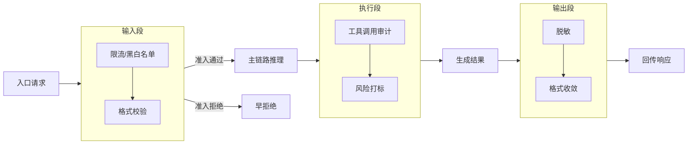

## 8.1 Hooks 生命周期与事件切入点

本节讨论 Hooks 的工程落点：把治理逻辑从主执行链解耦出来，并保证 Hook 自身不会成为新故障源。先从 OpenClaw 提供的具体 Hook 能力入手，再展开设计模式与稳定性约束。

### 8.1.1 Hooks 的职责边界

Hooks 适合承载横切能力，而不是业务主流程。常见场景包括：

- 输入治理：限流、黑白名单、格式校验。
- 执行观测：工具调用审计、风险打标、策略记录。
- 输出治理：脱敏、格式收敛、审计补充字段。

边界原则：Hook 负责“治理与观测”，主链负责“任务推进”。

### 8.1.2 OpenClaw 的 Hook 机制与当前配置入口

在当前版本中，Hook 体系首先体现为 **Gateway 内建 hooks**，而不是要求用户默认维护一套 `.openclaw/hooks/<name>/HOOK.md + handler.ts/js` 目录。live `config.get` 和 `config.schema` 里明确暴露的是：

- `hooks.internal.enabled`
- `hooks.internal.entries.session-memory.enabled`
- `hooks.internal.entries.boot-md.enabled`

也就是说，当前版本更稳妥的理解方式是：**Hook 是 Gateway 生命周期中的内建切入点，但 `hooks.internal.entries` 在配置层是开放字典，不应被理解成“当前版本只有固定两个内置项”**。本机当前只观测到 `session-memory` 与 `boot-md` 两个已启用项；是否存在更多 entry、附加目录加载或安装记录，应以本地版本的 `config schema`、`--help` 与官方文档为准。

当前实例可直接观察到的最小配置形态如下：

```jsonc
{
  hooks: {
    internal: {
      enabled: true,
      entries: {
        "session-memory": { enabled: true },
        "boot-md": { enabled: true }
      }
    }
  }
}
```

此外，OpenClaw 的工具策略（`tools.deny`/`tools.allow`，详见 [5.2](../05_tools_skills/5.2_tool_policy.md)）和结构化日志事件（`openclaw logs --follow --json`）提供了补充性的治理与观测能力，与 Hook 机制协同工作。

> [!NOTE]
> 如果你使用的是较早版本、实验性构建或插件化 Hook 方案，可能仍会看到目录式 Hook 或专门的 `openclaw hooks ...` 管理命令。但在当前版本里，更可靠的自证入口是 `config.get`、`config.schema`、`doctor` 与结构化日志，而不是先假定某套 Hook CLI 一定存在。

### 8.1.3 三段生命周期：输入、执行、输出

建议把 Hook 固定在三个阶段，避免职责混乱。下面的流程图展示了 Hook 如何在主链路的三个阶段切入：


```mermaid
flowchart LR
  subgraph input["输入段"]
    I1["限流/黑白名单"] --> I2["格式校验"]
  end
  subgraph exec["执行段"]
    E1["工具调用审计"] --> E2["风险打标"]
  end
  subgraph output["输出段"]
    O1["脱敏"] --> O2["格式收敛"]
  end

  req["入口请求"] --> input
  input -->|"准入通过"| main["主链路推理"]
  main --> exec
  exec --> result["生成结果"]
  result --> output
  output --> resp["回传响应"]
  input -->|"准入拒绝"| reject["早拒绝"]
```

图 8-1：Hooks 在主链路三段生命周期中的切入点

| 阶段 | 目标 | 禁止事项 |
| --- | --- | --- |
| 输入段 | 早拒绝、降噪、准入校验 | 长耗时外部调用、不可逆写入 |
| 执行段 | 记录关键决策、风险拦截 | 改写核心业务状态 |
| 输出段 | 脱敏和格式治理 | 临时扩权、绕过策略放行 |

### 8.1.4 稳定性约束：超时、降级、幂等

Hook 本身必须受约束，否则会拖垮主链。

- 超时上限：每个 Hook 都要有独立超时，超时后按策略降级。
- 失败语义：明确 fail-open 或 fail-closed，不要默许默认行为。
- 幂等要求：重试情况下不得产生重复外部副作用。

对审计类 Hook，建议默认 fail-open 并告警；对合规拦截类 Hook，建议默认 fail-closed。

### 8.1.5 结构化事件：保证可审计与可回放

建议所有 Hook 事件使用统一结构，最少包含：时间、链路、阶段、动作、结果。

```jsonc
{
  "ts": "YYYY-MM-DDTHH:MM:SSZ",
  "trace_id": "t-YYYYMMDD-001",
  "stage": "input",
  "hook": "rate_limit_guard",
  "event": "rejected",
  "reason": "rate_limit_exceeded"
}
```

### 8.1.6 验收与排障

上线后建议固定做两类检查：

1. 正常流量：确认 Hook 不引入明显时延。
2. 异常流量：确认拦截和降级行为符合预期。

```bash
openclaw status --deep
openclaw logs --follow --json
cat runtime.log | jq -r 'select(.type=="log") | .log | select(.event) | .event' | sort | uniq -c | sort -nr | head
```

> 注意：实际字段名请以 `logs --json` 输出为准。建议验收前先“不带过滤规则”打印一条原始日志，明确具体的日志字段结构，再运用 `jq` 过滤。
