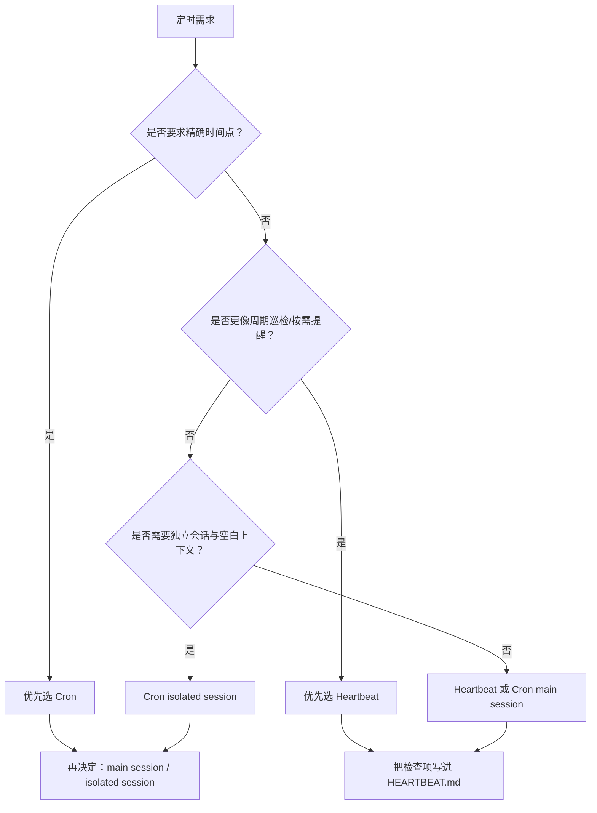

## 8.2 定时作业设计与调度策略

本节聚焦于**精确时间点**的无人值守作业。典型场景包括：每天下午 3 点生成日报、每周一早上 9 点发送周报、每个月 1 号跑一遍成本清算。这些任务的共同点是“必须在这个时间执行，不能晚也不能早”。OpenClaw 为此提供了两层定时能力：

- **内建 Cron**（Gateway 原生调度，零外部依赖）：推荐大多数情况使用
- **外部 Crontab 集成**（宿主机级调度）：当需要与已有运维流水线对接时使用

无论用哪一层，核心目标都不是“定时触发一次”，而是“重复执行也不会失控”——这意味着幂等性、失败恢复、可观测性的完整设计。

> [!NOTE]
> 内建 Cron 的具体命令与事件名可能随版本演进：以 `openclaw cron --help`、`status --deep` 与结构化日志的实际输出为自证入口。

**Cron vs Heartbeat：首轮判断逻辑**

如果你拿不准该选 Cron 还是 Heartbeat，这里只做**首轮分流**：**优先问“是否要求精确时间点”**。如果是，用 Cron；如果不是（比如“只要每半小时检查一遍是否有新工单，有就通知”），用 Heartbeat。更细的会话、上下文和模型差异，统一放到 [8.3.8 Heartbeat vs Cron](8.3_heartbeat.md#838-heartbeat-vs-cron：选型决策树) 再展开，避免同一问题在两节里重复讲两遍。



图 8-2：Cron 与 Heartbeat 的首轮选型分流图

### 8.2.1 内建 Cron：Gateway 原生调度

OpenClaw 内建了 Cron 调度器，支持标准五段式 cron 表达式，也支持带秒字段的六段式写法，并可配合 `--at` 创建一次性定时提醒。作业在 Gateway 进程内执行，无需配置宿主机的 crontab 或 systemd timer。

当前 CLI 需要先区分两类 payload：

- **主会话任务**：使用 `--system-event`，通常配合 `--session main`，由主会话心跳链路执行。
- **隔离任务**：使用 `--message`，通常配合 `--session isolated`，在专用 `cron:<jobId>` 会话里运行；默认会走 `announce` 交付，除非显式 `--no-deliver`。

**创建定时作业：**

```bash
# 主会话任务：工作日 9:00 注入系统事件，并立即唤醒心跳处理
openclaw cron add --name "daily_standup_event" \
  --cron "0 9 * * 1-5" \
  --session main \
  --system-event "从 Slack 和 Jira 拉取昨日进展，生成站会摘要并写回主会话" \
  --wake now

# 隔离任务：一次性提醒，在独立会话里执行并主动投递摘要
openclaw cron add --name "review_reminder" \
  --at "2026-03-23T15:00:00" \
  --session isolated \
  --message "提醒：下午 3 点代码评审" \
  --announce
```

> [!NOTE]
> 以上命令参数以实际 CLI 版本为准。使用 `openclaw cron --help` 确认当前可用的参数格式。当前版本对**不带时区**的 `--at` 时间按 UTC 解释；若要按本地墙上时间理解，应显式传入 `--tz <IANA 时区>`。

**管理与巡检：**

```bash
openclaw cron list              # 查看所有已注册作业及下次触发时间
openclaw cron edit <jobId> --no-deliver
openclaw cron runs --id <jobId> # 查看指定作业的执行历史
openclaw cron remove <jobId>    # 移除指定作业
openclaw status --deep          # 在全局状态中查看 cron 调度器健康度
```

内建 Cron 作业有两种会话模式（详见 [8.3.8 选型决策树](8.3_heartbeat.md#838-heartbeat-vs-cron：选型决策树)）：

- **主会话模式**（`--system-event` / `--session main`）：作业通过系统事件注入主会话，由心跳链路执行，共享完整上下文，默认属于“静默任务”而不是主动通知。
- **隔离会话模式**（`--message` / `--session isolated`）：作业在独立的 `cron:<jobId>` 会话中执行，空白上下文起步，适合不需要历史对话的独立任务；若不额外配置，默认会对结果做 `announce` 投递。

### 8.2.2 外部 Crontab 集成

当需要与已有运维流水线（Ansible、Terraform、CI/CD）对接，或者作业逻辑涉及宿主机层面操作（文件清理、日志轮转、备份）时，可以使用宿主机的 crontab 或 systemd timer 来编排，通过 CLI 调用 OpenClaw。

```bash
# crontab 条目
0 9 * * 1-5 /opt/openclaw/jobs/daily_standup.sh >> /var/log/oc_jobs/standup.log 2>&1
```

外部调度时，幂等与防重入需要由调用方自行保证（见 8.2.3、8.2.4）。

### 8.2.3 四个工程约束：幂等、防重入、可观测、可恢复

无论使用内建 Cron 还是外部 Crontab，生产环境中的定时任务至少要满足：

- 幂等：重复执行不产生重复副作用。
- 防重入：上一次未完成时不能并发冲突。
- 可观测：每次执行有状态、耗时和错误分类。
- 可恢复：失败后有明确重试与人工接管路径。

内建 Cron 在 Gateway 层面已经内置了部分防重入保护（同一 jobId 不会并发执行）。外部 Crontab 则需要自行实现，常用方案是带 TTL 的分布式锁：

```bash
# 获取锁成功才执行任务
redis-cli SET oc_job_lock:daily_report "<instance_id>" NX EX 600
```

释放锁时要校验锁持有者，避免误删其他实例锁。

### 8.2.4 幂等键与失败分流

**幂等键**：推荐以“作业名 + 窗口开始时间”作为键，保证同一调度窗口内重试不产生重复副作用。

```text
idempotency_key = "daily_report:v2:" + window_start_ts
```

**失败分流**：错误应按类型分流：

- 瞬时错误（超时、503、限流）：有界重试，指数退避。
- 配置错误（401/403、参数错误）：立即终止并告警。
- 数据冲突（写入不一致）：冻结任务并触发人工介入。

不应将所有失败都作为“重试”来处理。

### 8.2.5 运行验收与日常巡检

建议把定时作业纳入固定巡检。

```bash
openclaw cron list
openclaw status --deep
openclaw logs --follow --json
```

验收时重点看三项：

1. 是否出现重入。
2. 是否出现重复副作用。
3. 失败后是否能在规定时间内恢复或升级处理。

> [!TIP]
> 踩坑实录：定时任务的“幽灵执行”
>
> 设置了每天 9:00 的站会摘要任务，但偶尔会在 9:00 和 9:03 各执行一次。排查发现是 Gateway 重启时 cron 调度器重新加载，如果重启时间恰好在任务触发窗口内，就会产生重复执行。解决方案：在任务逻辑中加入幂等检查（如检查今天是否已发送过摘要），或使用 `openclaw cron list` 确认任务状态后再重启。
