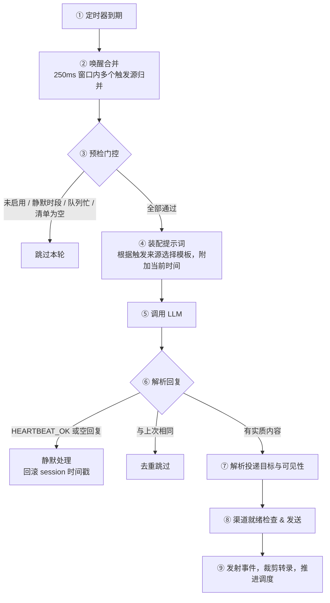

## 8.3 Heartbeat 心跳机制：周期性巡检与主动通知

上一节讨论的是面向精确时间点的 Cron 作业；本节介绍 OpenClaw 内建的另一个调度原语——**Heartbeat（心跳）**。如果说 Cron 回答的是”在指定时间执行什么操作”，那 Heartbeat 回答的是”当前是否存在需要关注的事项”。

> [!TIP]
> 不确定选 Heartbeat 还是 Cron？快速判断：需要精确时间 → Cron；需要周期性感知并按需通知 → Heartbeat。详细对比见 [8.3.8 选型决策树](#838-heartbeat-vs-cron)。

### 8.3.1 核心概念

Heartbeat 是网关层面的**周期性智能体轮次**：系统按固定间隔触发一次智能体检查。本次审计实例里，live `health` 与 `status` 快照显示默认智能体的心跳节奏为 `30m`；在其他认证或部署模式下，默认值仍可能调整。默认情况下心跳运行在主会话中，但也可以通过 `isolatedSession: true` 改为每次使用全新的会话。智能体读取工作区中的 `HEARTBEAT.md` 清单，检查收件箱、日历、待办等状态，然后做出两种回应之一：

- **无事发生**：回复 `HEARTBEAT_OK`，网关将其视为确认信号并按当前可见性设置静默处理。
- **有事需要关注**：返回告警文本，网关按 `target`、`to`、`accountId` 和渠道可见性规则决定是否投递到指定渠道。

这意味着你无需为每个周期性检查写单独的 Cron 作业——一个心跳轮次可以批量处理多个巡检项，且仅当存在需要关注的事项时才发送消息，天然避免信息轰炸。

### 8.3.2 完整生命周期：从定时器到消息投递

下图展示了心跳从定时器触发到消息投递的完整链路。排障时按图定位故障发生在哪一步，是最快的切入方式。



图 8-3：心跳从定时器触发到消息投递的完整链路

几个关键设计决策值得注意：

- **定时器是 per-agent 的。** 每个智能体独立维护自己的心跳间隔和上次执行时间，多智能体场景下各自按自己的节奏心跳，不会相互阻塞。
- **唤醒合并防止风暴。** 多个触发源（定时器到期、Cron 事件、exec 完成）可能在短时间内同时请求心跳，系统会自动归并为一次执行。
- **会话模式可切换。** 默认使用主会话；若开启 `isolatedSession: true`，则每次心跳都在全新会话里运行，避免把完整历史带入巡检。

### 8.3.3 HEARTBEAT_OK 协议与上下文模式

心跳的核心协议很简单：智能体读取 `HEARTBEAT.md` 后，如果无事发生回复 `HEARTBEAT_OK`（网关静默丢弃）；有事需要关注则回复告警文本（网关投递到渠道）。

心跳轮次注入的上下文取决于 `lightContext` 配置：

| 模式 | 注入的文件 | 适用场景 |
|------|-----------|---------|
| **完整模式**（默认） | SOUL.md、README.md、TOOLS.md、MEMORY.md、HEARTBEAT.md 等全部引导文件 | 需要完整上下文做判断 |
| **轻量模式**（`lightContext: true`） | **仅 HEARTBEAT.md** | 巡检清单明确，不需要其他上下文，节省 token |

默认提示词可通过 `heartbeat.prompt` 完全替换（注意是替换而非合并）。若启用 `isolatedSession: true`，主对话历史不会注入到心跳轮次；若只想保留 `HEARTBEAT.md`，可配合 `lightContext: true` 进一步压缩上下文。

> [!NOTE]
> 关于 HEARTBEAT_OK 的精确解析规则、提示词模板和内部标记机制，见 [8.3.9 参考：内部机制](#839-参考-内部机制)。

### 8.3.4 配置详解

最小配置只需保留默认值即可工作。完整配置如下：

```jsonc
{
  agents: {
    defaults: {
      heartbeat: {
        every: "30m",                // 默认通常为 30m；Anthropic OAuth/setup-token 模式下当前默认值为 1h；"0m" 禁用
        model: "anthropic/claude-sonnet-4-6", // 可选：为心跳使用更便宜的模型
        prompt: "Read HEARTBEAT.md if it exists...", // 自定义提示词（完全替换，非合并）
        target: "none",              // "none" | "last" | 具体渠道名
        to: "+15551234567",          // 渠道内的具体接收者
        accountId: "ops-bot",        // 多账号渠道的账号 ID
        directPolicy: "allow",      // "allow" | "block"（屏蔽私聊投递）
        lightContext: false,         // true 时只注入 HEARTBEAT.md，减少 token 消耗
        isolatedSession: false,      // true 时每次心跳使用全新会话，不复用主对话历史
        includeReasoning: false,     // true 时额外发送推理过程
        ackMaxChars: 300,            // HEARTBEAT_OK 后允许的最大字符数
        activeHours: {               // 活跃时段限制
          start: "09:00",            // HH:MM，闭区间
          end: "22:00",              // HH:MM，开区间；"24:00" 表示午夜
          timezone: "Asia/Shanghai"  // "user" | "local" | IANA 时区
        }
      }
    }
  }
}
```

#### 作用域与优先级

心跳配置有两个维度的层叠：

**智能体维度：** `agents.defaults.heartbeat` 设置全局默认；`agents.list[].heartbeat` 为特定智能体覆盖。一旦任何一个智能体声明了 `heartbeat` 块，**只有那些声明了的智能体**才会运行心跳。

**渠道可见性维度：** `channels.defaults.heartbeat` → `channels.<channel>.heartbeat` → `channels.<channel>.accounts.<id>.heartbeat`，按从宽到窄的顺序覆盖，控制 `showOk`、`showAlerts`、`useIndicator` 三个开关。

#### 多智能体配置示例

```jsonc
{
  agents: {
    defaults: {
      heartbeat: { every: "30m", target: "last" }
    },
    list: [
      { id: "main", default: true },       // 无 heartbeat 块 → 不运行心跳
      {
        id: "ops",
        heartbeat: {                         // 只有 ops 智能体运行心跳
          every: "1h",
          target: "telegram",
          to: "12345678:topic:42",
          accountId: "ops-bot"
        }
      }
    ]
  }
}
```

### 8.3.5 HEARTBEAT.md 清单与活跃时段

#### 心跳清单

`HEARTBEAT.md` 是放在智能体工作区根目录下的一个可选文件，充当心跳巡检清单。默认提示词会指示智能体读取并严格执行它；若同时启用 `lightContext: true`，它还会成为唯一保留下来的工作区引导文件。

```markdown
# Heartbeat 巡检清单

- 扫描收件箱，有紧急邮件则摘要通知
- 检查未来 2 小时的日历事件
- 如果有后台任务完成，汇报结果
- 如果空闲超过 8 小时，发送一条简短问候
```

设计要点：

- **保持精简。** 这个文件每次心跳都会被注入上下文，膨胀的清单直接转化为 token 开销。
- **空文件等于关闭。** 如果 `HEARTBEAT.md` 只包含空行和 Markdown 标题（如 `# Heading`），网关会跳过心跳轮次以节省 API 调用。文件不存在时，心跳仍然会运行，但智能体需要自行决定做什么。
- **智能体可以自我修改。** 你可以在正常对话中让智能体更新 `HEARTBEAT.md`，也可以在心跳提示词中写上“如果清单过时，自行更新”。
- **不要放敏感信息。** API Key、电话号码等不应出现在此文件中——它会成为提示词的一部分。

#### 活跃时段

`activeHours` 在心跳触发前做时区感知的过滤，支持跨午夜的窗口。不在窗口内的心跳被跳过，日志记录原因 `quiet-hours`。

常见模式：

| 目标 | 配置 |
|------|------|
| 工作时间才心跳 | `activeHours: { start: "09:00", end: "18:00" }` |
| 全天候运行 | 不设 `activeHours`（默认行为） |
| 避免深夜打扰 | `activeHours: { start: "08:00", end: "24:00" }` |

> [!WARNING]
> `start` 和 `end` 不能相等（如 `08:00` 到 `08:00`），这会被视为零宽度窗口，心跳将永远被跳过。

### 8.3.6 渠道可见性与事件系统

#### 可见性控制

可见性控制决定了心跳消息是否真正发送到渠道：

```yaml
channels:
  defaults:
    heartbeat:
      showOk: false        # 默认不发 HEARTBEAT_OK 确认
      showAlerts: true      # 默认发送告警内容
      useIndicator: true    # 默认发射 UI 指示器事件
  telegram:
    heartbeat:
      showOk: true          # Telegram 上也显示 OK 确认
  whatsapp:
    accounts:
      work:
        heartbeat:
          showAlerts: false  # work 账号不接收告警
```

当三个开关都关闭时，外部可见性会降到最低；是否完全跳过该轮次以及日志形态，建议以当前版本的实际日志输出为准。

#### 事件系统

每次心跳执行都会发射事件，供 UI 和监控消费：

| status | 含义 | 触发场景 |
|--------|------|---------|
| `sent` | 消息已投递 | 告警内容成功发送到渠道 |
| `ok-empty` | 空回复 | LLM 无输出，可选发送 HEARTBEAT_OK |
| `ok-token` | Token 确认 | 回复仅含 HEARTBEAT_OK，已剥离 |
| `skipped` | 跳过 | alerts-disabled / duplicate / quiet-hours / no-target 等 |
| `failed` | 失败 | LLM 调用或投递过程出错 |

指示器类型映射：`ok-empty` / `ok-token` → `“ok”`（绿色）；`sent` → `“alert”`（黄色）；`failed` → `“error”`（红色）。在 WebChat 的 Debug 页面中，可以看到最近的心跳事件 JSON 快照。

### 8.3.7 手动触发与系统事件

不必等待下一个心跳周期，可以立即触发：

```bash
# 立即唤醒心跳
openclaw system event --text "检查是否有紧急的跟进项" --mode now

# 等到下一个心跳周期再处理
openclaw system event --text "检查项目状态" --mode next-heartbeat
```

如果多个智能体配置了心跳，`--mode now` 会按当前版本的心跳选择规则触发对应智能体的心跳。

系统事件不仅限于手动——Cron 作业和异步命令（exec）完成时也会产生事件，心跳会在下一次触发时自动纳入处理。系统会检查待处理的事件队列，针对不同事件类型生成专属提示词（如 Cron 提醒内容会被直接嵌入提示词体内，见 [8.3.3 用户消息体](#833-heartbeat_ok-协议与上下文模式)）。

### 8.3.8 Heartbeat vs Cron：选型决策树

前面的 [8.2 节](8.2_cron_jobs.md) 已经给出“精确时间点 vs 周期巡检”的首轮分流。本节不再重复那一层，而是只补充**会话模式、上下文装配与模型控制**这三个更细的差异，帮助你在两者都可行时做最终判断。

```text
需要在精确时间点运行？
  是 → 用 Cron
  否 → 继续…

需要与主会话隔离？
  是 → Heartbeat 可启用 `isolatedSession: true`；若同时还需要精确时间点与独立运行历史，优先用 Cron（isolated session）
  否 → 继续…

可以和其他周期性检查合并？
  是 → 用 Heartbeat（添加到 HEARTBEAT.md）
  否 → 用 Cron

是一次性提醒？
  是 → 用 Cron + --at
  否 → 继续…

需要不同的模型或思考深度？
  是 → 用 Cron（isolated）+ --model/--thinking
  否 → 用 Heartbeat
```

**最佳实践：二者配合使用。** Heartbeat 处理日常周期性巡检（收件箱、日历、通知），一个轮次批量完成多项检查；Cron 处理需要精确时间的独立作业（日报、周会回顾、定点提醒）。这样既减少 API 调用次数，又保证关键作业的时间精度。

| 维度 | Heartbeat | Cron（main session） | Cron（isolated session） |
|------|-----------|---------------------|------------------------|
| 会话 | 主会话（默认）/ 可设 `isolatedSession` | 主会话（通过系统事件） | `cron:<jobId>` 独立会话 |
| 上下文 | 完整历史 | 完整历史 | 空白起步 |
| 模型 | 可覆盖 | 主会话模型 | 可覆盖 |
| 输出 | 非 OK 才投递 | 心跳提示词 + 事件 | 默认 announce 摘要 |
| 时间精度 | 近似（受队列负载影响） | 精确（支持五段式，亦可用六段式秒字段） | 精确 |
| Token 开销 | 一个轮次处理多项检查 | 加入下次心跳（无额外轮次） | 每作业一个完整轮次 |

#### 成本控制建议

心跳运行的是完整的智能体轮次，不加控制的话 token 消耗可观。几个降本手段：

- **精简 HEARTBEAT.md**：清单越短，每次注入的 token 越少。
- **使用 `lightContext: true`**：心跳轮次只注入 `HEARTBEAT.md`，不加载完整的工作区引导文件。
- **使用便宜的模型**：通过 `heartbeat.model` 为心跳指定更经济的模型（如 Haiku），核心对话仍用高端模型。
- **设置 `target: "none"`**：如果只需要内部状态更新而不需要外发消息，跳过投递流程。
- **拉长间隔**：将 `every` 调到 `1h` 或更长，可以显著减少调用次数；如果你使用的是 Anthropic OAuth/setup-token，当前默认值本来就是 `1h`。
- **限制活跃时段**：夜间跳过心跳可以省下约 1/3 的调用量。

### 8.3.9 参考：内部机制

本小节整理心跳的内部实现细节，适用于排障源码或开发 OpenClaw 插件时参考，日常配置和使用可跳过。

#### 唤醒合并与优先级

系统用 250ms 的合并窗口将多个触发源归并为一次执行，按优先级保留最高等级的唤醒原因：ACTION > DEFAULT > INTERVAL > RETRY。

#### 提示词模板

**常规心跳（定时器到期）：**

```text
Read HEARTBEAT.md if it exists (workspace context). Follow it strictly.
Do not infer or repeat old tasks from prior chats.
If nothing needs attention, reply HEARTBEAT_OK.
Current time: 2026-03-09 14:30 (Asia/Shanghai) / 06:30 UTC
```

尾部时间行自动追加，格式固定为 `Current time: [本地时间] ([时区]) / [UTC时间] UTC`。

**Cron 事件触发：**

```text
A scheduled reminder has been triggered. The reminder content is:
[Cron 事件的提醒文本]
Handle this reminder internally. Do not relay it to the user unless
explicitly requested.
Current time: ...
```

**异步命令（exec）完成触发：**

```text
An async command you ran earlier has completed. The result is shown in
the system messages above. Handle the result internally. Do not relay
it to the user unless explicitly requested.
Current time: ...
```

#### isHeartbeat 标记的调用链效应

心跳轮次通过 `isHeartbeat: true` 标记传递给整个调用链：

| 环节 | 效应 |
|------|------|
| 模型选择 | 可使用 `heartbeat.model` 覆盖默认模型 |
| 引导上下文 | `lightContext: true` 时切换为轻量过滤（仅 HEARTBEAT.md） |
| 工具错误告警 | 可通过配置抑制工具错误告警，避免干扰心跳判断 |
| 转录裁剪 | 回复 HEARTBEAT_OK 后裁剪 transcript，避免上下文污染 |

#### HEARTBEAT_OK 解析规则

| 位置 | 行为 |
|------|------|
| 回复**开头或结尾** | 被识别为确认 token，剥离后若剩余文本 ≤ `ackMaxChars`（默认 300），整条回复被丢弃 |
| 回复**中间** | 不做特殊处理，视为普通文本 |
| 非心跳轮次中出现 | 开头/结尾的 `HEARTBEAT_OK` 被静默剥离并记录日志；仅含此 token 的消息被丢弃 |

系统还会处理 LLM 偶尔添加的格式标记——`<b>HEARTBEAT_OK</b>` 和 `**HEARTBEAT_OK**` 都会被正确识别和剥离。

#### 系统提示词注入

当 `promptMode` 不是 `"minimal"` 时，网关在系统提示词中注入心跳协议说明。使用轻量上下文模式（`lightContext: true`）时该段落不会被注入。
