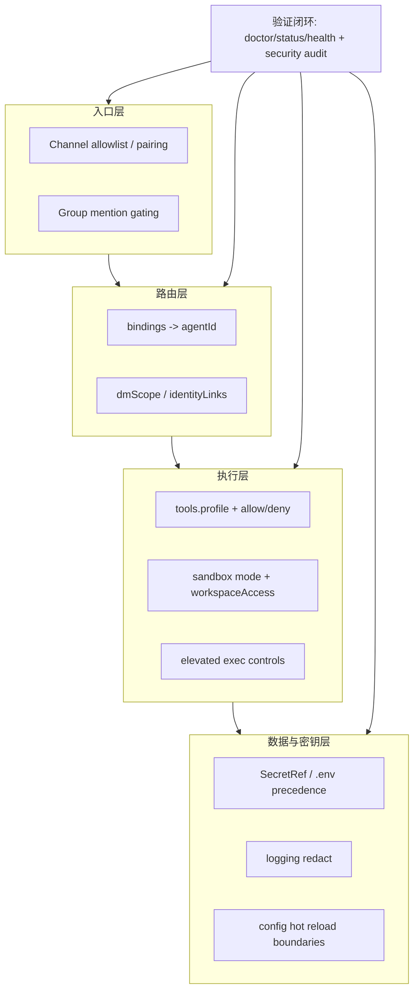

## 8.4 安全基线与审计流程

安全基线的目标不是写一份“配置清单”，而是把高风险能力关进确定性的边界里，并让每一次关键决策都可追溯、可复盘。本节基于 OpenClaw 官方安全与配置文档，给出一套可落地的安全与审计完整流程：分层边界怎么划、审计事件怎么记、密钥怎么注入、以及如何用自检命令把基线变成可验证流程。

### 8.4.1 纵深防御：把边界分层，并让每层都可验证

OpenClaw 的官方安全模型建立在**“个人助手模型（trusted operator boundary）”**的基础假设上。它并不原生提供抵抗恶意多租户的硬隔离。如果在未经硬性安全保护的情况下把网关暴露给外界，系统的信任链会非常脆弱。

在智能体系统里，风险来源不是单一入口，而是“入口渠道 + 路由 + 工具 + 密钥 + 记忆”的组合链路。纵深防御的最小可行分层可以拆为四层，并为每层定义可验证的控制点：

1. **入口层**：渠道门控、群聊触发规则、允许列表与提及规则。建立**极其保守的默认执行面**：建议把非主会话（如群聊）默认全部压入沙箱（Docker Sandbox），甚至设置 `workspaceAccess=none` 或只读。这样能极大降低由于 `allowFrom` 或 `dmPolicy` 配置扩大而导致的凭据被越权抓取的风险。
2. **路由层**：用绑定优先把高风险入口固定到受控智能体，避免把路由正确性变成概率问题。详见 [7.4 路由基础](../07_multi_agent/7.4_routing_basics.md)。
3. **工具层**：用工具策略做允许、拒绝与分层策略，拒绝规则优先于允许规则，避免因配置叠加导致越权。详见 [5.2 工具策略：允许、拒绝与分层策略](../05_tools_skills/5.2_tool_policy.md)。
4. 运行与数据层：把密钥改为环境注入（详见 [4.2 模型供应商接入与认证方式](../04_config_models/4.2_provider_access.md)），开启日志脱敏，把诊断输出落盘到可管控路径，并控制保留期与访问权限。

**安全分层与验证证据链示意：**



验证这些分层是否真正生效，优先使用系统自检与状态探测，而不是先在生产入口“试一试”。推荐的最小验证组合如下：

```bash
openclaw doctor
openclaw status --deep
openclaw channels status --probe
openclaw models status --check
openclaw security audit
```

### 8.4.2 审计事件四元组：把因果链写成结构化记录

审计的核心是回答四个问题：谁在何时通过什么入口做了什么，以及系统为什么允许或拒绝。为了避免日志沦为无法检索的文本堆，建议把关键动作统一抽象为结构化审计事件，并固定四个字段维度：

1. 主体：用户、对端标识、渠道账号，以及被路由到的智能体标识。
2. 动作：工具名称、参数摘要、目标资源标识。
3. 依据：命中的绑定、命中的工具策略规则、以及拒绝原因。
4. 结果：成功、失败、被拒绝、需要人工确认。

OpenClaw 支持输出结构化日志，并提供日志跟随能力。排查“为何被拒绝”或“为何路由到某智能体”时，可先跟随日志流，再按字段过滤。下面给出一个示例，用于从 JSON 日志中抽取与路由和工具调用相关的事件摘要。

```bash
openclaw logs --follow --json | jq -c 'select(.event=="routed" or .event=="tool_call" or .event=="tool_denied") | {ts, trace_id, event, agentId, channelId, peerId, tool, reason}'
```

> **注意：实际字段名请以 `logs --json` 输出为准。** 建议验收前先“不带过滤规则”打印一条原始日志，明确是 `trace_id` 还是 `traceId` 等具体的 JSON 规范，再运用 `jq` 过滤。

如果发现“同一入口在不同时间触发了不同能力”，优先检查是否存在多账号配置、群聊策略差异、或工具策略叠加导致的边界漂移。

### 8.4.3 密钥与爆炸半径：用环境注入与最小权限降低损失上限

密钥治理的目标是限制泄露后的可用范围与可用时间。OpenClaw 的配置支持将密钥以 `${VAR}` 甚至 `SecretRef` 对象形式获取，避免把明文密钥写进配置文件或落盘在代码仓库中。

> [!NOTE]
> OpenClaw 会从进程环境变量、当前目录 `.env`、以及 `~/.openclaw/.env` 读取变量引用，且遵循**“`.env` 不覆盖已有环境变量”**的优先级规则。

下面示例展示了常见的密钥注入形态：可使用简单的插值，或是依赖 `SecretRef` 将它对接统一凭据管线。实际部署时建议为不同环境配置不同的 `keyId`。

```json5
{
  models: {
    providers: {
      openai: {
        keys: {
          // 方式一：字符串插值
          prod: { apiKey: "${OPENAI_API_KEY}" },
          // 方式二：更安全的 SecretRef 指定
          staging: { apiKey: { source: "env", provider: "default", id: "OPENAI_API_KEY_STAGING" } }
        }
      }
    }
  }
}
```

爆炸半径控制通常需要三条硬规则：

1. 入口隔离：群聊与私聊使用不同的策略与默认智能体，避免低可信入口直接触发写入能力。
2. 权限隔离：高风险工具只允许出现在少数受控智能体的工具组里，并通过拒绝规则兜底。
3. 密钥隔离：不同能力使用不同密钥或不同权限范围的凭据，避免“一个密钥通吃全系统”。

### 8.4.4 反面案例：智能体自改配置的死循环

即使做好了上述隔离，如果没有对核心配置文件（如 `openclaw.json`）做好读写防护，仍可能发生严重的工程灾难。

> [!CAUTION]
> **警惕“AI 把自己改死”** ：在真实案例中，有用户赋予了智能体全局文件系统的读写权限。当系统出现小故障时，智能体触发了“自我修复”幻觉，开始修改自己的 `openclaw.json`。
> 
> 
> 由于它并不完全理解参数格式，改错了配置。OpenClaw 监测到配置变更后自动重启，刚启动又抛出配置错误崩溃。随后如果由进程守护再次拉起，就会陷入无限报错循环。最糟糕的情况是消耗大量的日志空间或调用配额。**防护建议：** 1. 生产环境中，**不要关闭进程的用户级权限限制** 。运行 OpenClaw 的用户账号不应该对配置文件所在的目录具有写入权限（可以由部署流水线或其他专门的账号管理）。
2. 控制配置热重载边界及行为。在调整前，请参考官方设定：

| 概念 | 配置字段 | 默认值 | 别名或补充说明 |
| --- | --- | --- | --- |
| 配置热重载模式 | `gateway.reload.mode` | 依据环境而定 | 可选值：`hot`, `restart`, `hybrid`, `off`。旧版可能提及的 `autoRestartOnConfigChange` 为不存在或弃用的字段。 |

在 `openclaw.json` 中可设置 `gateway.reload.mode: 'hot'` 或是设为 `'off'` 完全关闭文件监听。这能避免“修改后立即引发系统频繁异常重启”。
3. 在 `tools.deny` 列表中明确封禁配置所在的路径。
4. 如果确实需要修改配置并排障，推荐使用传统的运维配置下发方案，而不是让 OpenClaw 自己修改自己。

### 8.4.5 演练与回归：把安全基线变成可重复的验证循环

安全基线如果不演练，就会在变更中失效。建议把验证拆成两类：

1. 自检回归：每次发布与配置变更后，固定跑一组命令，确保核心链路可用且边界未漂移。
2. 故障注入：在受控环境中故意引入无效密钥、断网、或渠道不可用，观察系统是否给出明确的错误与降级路径。

自检回归可以从最小组合开始：

```bash
openclaw doctor
openclaw health --json
openclaw status --deep
```

当发现异常时，先用 `doctor` 与 `status` 定位是配置、依赖还是运行时状态，再根据日志中的 `traceId` 做回放定位。对于涉及敏感信息的日志与诊断输出，务必结合官方安全建议开启脱敏与屏蔽环境变量输出，避免把“排障数据”变成新的泄露通道。相关建议见 [https://docs.openclaw.ai/gateway/security](https://docs.openclaw.ai/gateway/security)。
