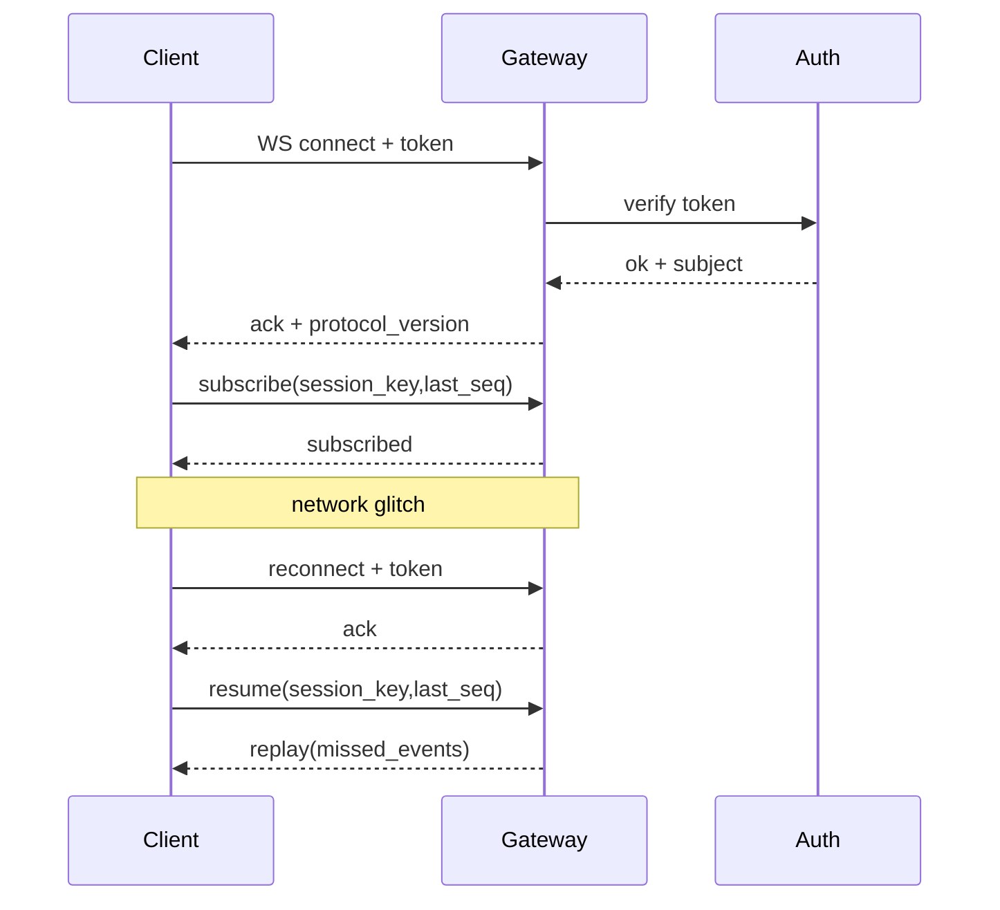

## 9.2 WebSocket 握手、鉴权与连接生命周期

本节从可运维角度讲清长连接的三类问题：握手阶段要把身份与协议上下文一次建好；连接生命周期要有心跳与关闭原因；重连与恢复要能对账，避免重复订阅与事件丢失。并给出一组可直接使用的诊断命令与日志筛选方法，用于定位断线发生在鉴权、网络还是服务端背压。

### 9.2.1 握手阶段：身份与协议上下文必须明确

WebSocket 握手的工程意义不是建立一条通道，而是建立可验证的身份与协议上下文。

- 身份校验：令牌是否有效，是否与预期来源绑定，是否需要配对审批。
- 协议协商：客户端能力与服务端能力是否一致，例如是否支持进度流与压缩。
- 上下文初始化：会话键与订阅范围如何确定。

握手失败应尽早拒绝并记录拒绝原因。把失败拖到执行阶段，会把问题伪装成模型或工具异常。

### 9.2.2 生命周期：心跳、背压与关闭原因

长连接的难点在长期。生命周期需要三个可观测信号。

- 心跳：用于发现半开连接与僵尸连接。
- 背压：当客户端处理不过来时，服务端必须限速、分级丢弃或断开，避免内存膨胀。
- 关闭原因：关闭码与原因必须落盘，才能复盘“谁先断、为什么断”。

官方 Gateway 与安全章节提供了对连接与鉴权边界的说明：https://docs.openclaw.ai/gateway 与 https://docs.openclaw.ai/gateway/security。

### 9.2.3 重连与恢复：防重复订阅与防丢事件

重连要解决两个问题。

- 防重复订阅：重连后重复订阅同一流会导致重复处理与重复副作用。
- 防丢事件：断线期间错过的关键事件需要能恢复或至少能对账。

实现方式取决于具体客户端，但验收点一致：重连后系统状态可查询，且不会出现“同一输入触发两次写入”。

### 9.2.4 时序图：握手、订阅与恢复

下面展示一个最小握手与恢复序列。



图 9-2：最小握手与恢复序列

### 9.2.5 纵深鉴权：三层认证、限流与渠道健康监控

官方 Gateway 的鉴权远不止"验一个 token"。理解完整的鉴权架构有助于在排查连接被拒时快速定位是哪一层出了问题。Gateway 实现了三层独立鉴权 + 多维限流 + 渠道健康监控的纵深架构。

**三层鉴权架构**：

| 层级 | 职责 | 细节 |
|------|------|------|
| **设备层** | 设备身份建立 | v2/v3 版本化载荷，含平台与设备族元数据，密码学签名（时间戳 + nonce） |
| **连接层** | 连接凭据解析 | 从配置/环境变量/密钥输入多源解析，支持令牌/密码优先级模式与回退 |
| **用户层** | 用户身份验证 | 四种认证模式：`token`、`password`、`trusted-proxy`、`none`；支持 Tailscale 身份、可信代理头提取 |

完整鉴权链路的执行顺序：解析客户端 IP（代理感知）→ 检查限流器 → 尝试 Tailscale 认证 → 尝试令牌认证（安全时间常量比较） → 尝试密码认证 → 尝试可信代理认证 → 记录失败或重置限流计数器。

**WebSocket 连接的两阶段认证**：握手时先验证共享密钥（Phase 1），再验证设备令牌（Phase 2），两者使用独立的限流作用域（`shared-secret` 与 `device-token`），互不干扰。未授权连接还有 **Flood Guard** 保护：超过 10 条未认证消息直接断开连接。

**多维限流架构**：

| 参数 | 默认值 | 说明 |
|------|--------|------|
| 最大尝试次数 | 10 | 滑动窗口内允许的最大失败次数 |
| 时间窗口 | 60,000ms（1 分钟） | 滑动窗口长度 |
| 锁定时长 | 300,000ms（5 分钟） | 触发锁定后的冷却期 |
| 回环豁免 | 默认开启 | 本地 CLI 永不被锁定 |

限流按 `{scope, clientIp}` 独立计数，四个作用域互不干扰：`default`、`shared-secret`、`device-token`、`hook-auth`。内存中滑动窗口实现，每 60 秒自动清理过期条目。认证成功时重置失败计数器。

控制面还有独立的写保护限流：每设备每分钟最多 3 次写操作，按 `{deviceId}|{clientIp}` 分桶。

**渠道健康监控**：

Gateway 内建渠道健康监控，每 5 分钟检查一次所有活跃渠道的健康状态。检查维度包括：

| 健康状态 | 含义 |
|----------|------|
| `healthy` | 正常运行 |
| `not-running` | 渠道未启动 |
| `busy` | 智能体仍在执行中 |
| `stuck` | 智能体长时间无活动（需区分真卡死与新生命周期） |
| `disconnected` | WebSocket 已断开 |
| `stale-socket` | 半死连接：连接看似存活但远端已停止发送事件（事件年龄 > 30 分钟） |
| `startup-connect-grace` | 启动宽限期（60 秒） |

关键安全阀：渠道连接宽限期 120 秒、每小时最多重启 10 次、冷却周期 2 个检查间隔（防止重启风暴）。`stale-socket` 检测是针对"半死 WebSocket"的专项能力——连接协议层未断开但远端已静默停止推送事件。

### 9.2.6 诊断命令：先确认服务健康，再看断线分布

操作示例：先确认服务是否健康与依赖是否可用，再结合日志分布定位断线原因。

```bash
openclaw health --json
openclaw status --deep
openclaw logs --follow --json
```

操作示例：从结构化日志中汇总连接关闭原因分布。字段名以实际日志为准。

```bash
cat runtime.log | jq -r 'select(.type=="log") | .log | select(.event=="ws_close") | .close_reason' | sort | uniq -c | sort -nr | head
```
