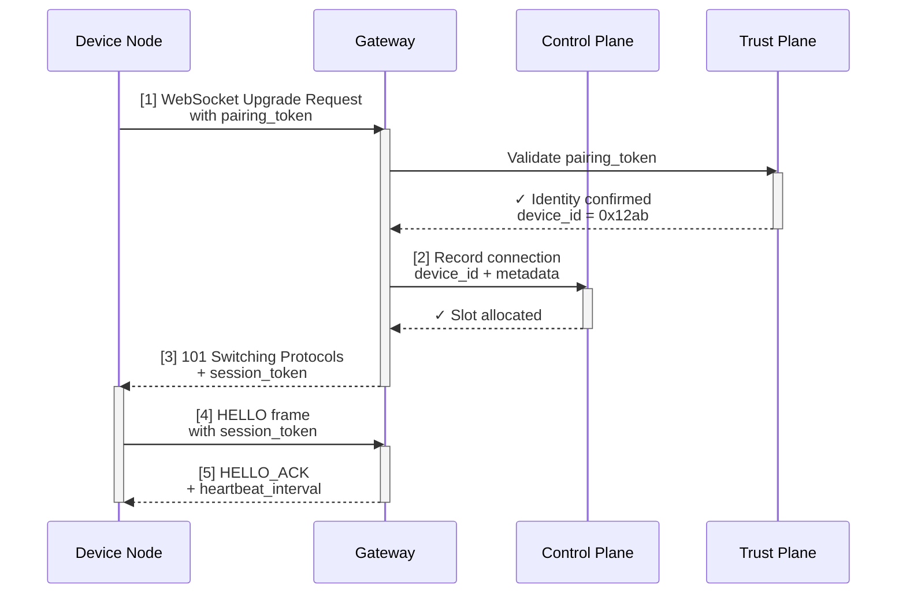

## 9.3 连接生命周期：握手、认证与心跳

OpenClaw Gateway 通过 WebSocket 长连接与远端设备进行持久通信。本节深入 WebSocket 连接的完整生命周期，包括握手、认证令牌交换、心跳保活、异常恢复，以及这些机制如何确保分布式系统中的可靠性。

### 9.3.1 为什么是 WebSocket

相比 HTTP 的请求-响应模式，WebSocket 长连接有三个优势：

1. **双向通信**：服务器可以主动推送消息给客户端（如"有新任务"、"请求批准"）
2. **低延迟**：无需每次都建立新连接、协议握手，延迟更低
3. **连接复用**：一条连接上可以并行处理多个逻辑流

但 WebSocket 的代价是需要精心处理连接生命周期、认证、超时、断线重连等细节。Gateway 的职责就是隐藏这些复杂性，为上层提供可靠的通信通道。

### 9.3.2 WebSocket 握手与认证流程

当一个设备（如家里的树莓派）想要连接到 Gateway 时，整个流程如下：



#### 步骤 1：HTTP Upgrade 与初始认证

设备发起 WebSocket 升级请求：

```
GET /ws/gateway HTTP/1.1
Host: gateway.example.com
Upgrade: websocket
Connection: Upgrade
Sec-WebSocket-Key: ...
Sec-WebSocket-Version: 13
Authorization: Bearer <pairing_token>
X-Device-Name: my_raspberrypi
X-Device-Version: 1.0.2
```

**关键字段解读**：

- `Authorization`：配对时获得的长期令牌，用于身份验证
- `X-Device-Name`、`X-Device-Version`：设备元数据，用于审计与兼容性检查
- `Sec-WebSocket-Key`：标准 WebSocket 握手的安全随机数

#### 步骤 2-3：信任平面验证 + 控制平面分配

**信任平面**验证 `pairing_token` 的有效性：

- 令牌是否存在、未过期
- 对应的设备是否被吊销
- 关联用户的租户是否被禁用

**控制平面**分配连接插槽：

- 生成 `session_token`（短期，本连接使用）
- 记录设备 ID → 会话映射
- 标记连接为"已认证，可接收请求"

#### 步骤 4-5：握手完成 + 心跳配置

设备收到 HTTP 101 响应后，连接升级为 WebSocket。设备立即发送 HELLO 帧：

```json
{
  "type": "HELLO",
  "session_token": "sess_7f9e2a...",
  "client_version": "1.0.2",
  "features": ["streaming", "multiplexing"]
}
```

Gateway 响应 HELLO_ACK：

```json
{
  "type": "HELLO_ACK",
  "heartbeat_interval_ms": 30000,
  "max_message_size": 16777216,
  "server_version": "2.1.0"
}
```

**重要约定**：

- 心跳间隔 30 秒：设备需要每 30 秒发一次 PING 帧（或数据帧）
- 如果 60 秒内未收到设备任何消息，Gateway 视为设备离线，主动关闭连接
- 客户端与服务器版本号交换便于检测不兼容情况

### 9.3.3 认证令牌的生命周期

OpenClaw 使用两层令牌机制：

| 令牌类型 | 生命周期 | 用途 | 刷新方式 |
|---------|---------|------|--------|
| **Pairing Token（配对令牌）** | 长期（数月至数年） | WebSocket 握手阶段的身份验证 | 手动密钥轮换（参考 9.5 节） |
| **Session Token（会话令牌）** | 短期（本连接） | 后续所有消息的认证 | 握手时颁发，连接断开失效 |

#### 配对令牌的签名机制

配对令牌通常是 JWT（JSON Web Token）或 HMAC 签名形式：

```
pairing_token = HMAC_SHA256(
  header + payload,
  signing_key
)
```

其中 `payload` 包含：

```json
{
  "device_id": "0x12ab",
  "user_id": "user_123",
  "issued_at": 1711100000,
  "expires_at": 1742636000,
  "scopes": ["read_session", "write_tool_result", "read_heartbeat"]
}
```

**关键点**：

- `device_id` 与 `user_id` 绑定，防止跨用户冒充
- `scopes` 限制该设备可以执行的操作（读会话、写工具结果、心跳）
- 令牌过期时，设备需要通过 DM（或其他渠道）从 Gateway 申请新的

#### 会话令牌的生成与撤销

会话令牌在握手时生成，与该条 WebSocket 连接一一对应：

```
session_token = HMAC_SHA256(
  connection_id + device_id + timestamp,
  session_signing_key
)
```

会话令牌只在当前连接有效。如果连接断开：

- Gateway 立即标记该 session_token 为已失效
- 设备重连时获得新的 session_token
- 旧的 session_token 无法用于后续操作

这样设计的好处是：即使一个 session_token 被截获，攻击者也无法利用它，因为没有对应的活跃 WebSocket 连接。

### 9.3.4 心跳与保活机制

在长连接中，网络中间件（代理、防火墙）可能因为空闲一段时间而主动断开连接。心跳机制用来防止这种"无辜掉线"。

#### 发送方（设备）

设备需要遵循以下规则：

1. **最少心跳频率**：每 `heartbeat_interval` 毫秒至少发送一次消息（可以是 PING 帧或有效数据帧）
2. **PING 帧**：如果超过 `heartbeat_interval` 没有数据帧要发，发送 WebSocket PING 帧
3. **探针式设计**：PING 帧是轻量级的，只包含 4 字节的 payload

```
PING frame: [0x89] [len] [opcode] [payload]
```

#### 接收方（Gateway）

Gateway 的检活逻辑：

1. 记录每个连接最后一条消息的时间戳 `last_message_time`
2. 启动后台定时器，每 10 秒检查一遍所有连接
3. 如果 `now - last_message_time > 2 * heartbeat_interval`：
   - 发送 PONG 帧询问设备是否还活着
   - 等待 5 秒，如果仍无回应，断开连接

```
if (now - last_message_time > 60s) {
  // 超过 2 倍心跳间隔（默认 30s × 2）无消息，主动断开
  connection.close(code=1000, reason="heartbeat_timeout");
  log_event("device_offline", device_id);
}
```

#### 典型场景举例

**场景 1：正常心跳**

- t=0s：设备发送数据帧"请求计算"
- t=10s：设备空闲，发送 PING
- t=20s：设备空闲，发送 PING
- t=30s：设备有新请求，发送数据帧
- t=40s：设备空闲，发送 PING
- ...（循环）

**场景 2：断网恢复**

- t=0s：连接正常，正在心跳
- t=35s：网络断网（设备物理断开）
- t=65s：Gateway 检测到 `now - last_message_time = 65s > 60s`，主动断开连接
- t=70s：设备网络恢复，试图继续使用旧连接，但 Gateway 已断开
- t=71s：设备收到 CLOSE 帧，自动重新发起 WebSocket 握手
- t=75s：新连接建立成功，分配新的 session_token

### 9.3.5 异常恢复与重连策略

设备与 Gateway 的连接可能因为多种原因断开：网络抖动、设备重启、Gateway 升级等。OpenClaw 设计了智能重连机制。

#### 重连的退避策略

设备应遵循指数退避（exponential backoff）：

```
attempt = 0
while not connected:
    delay = min(
        base_delay * (exponential_base ^ attempt),
        max_delay
    )
    attempt += 1
    wait(delay)
    try_connect()
```

典型参数：

- `base_delay` = 1 秒
- `exponential_base` = 2
- `max_delay` = 300 秒（5 分钟）

**时间序列示例**：

| 尝试次数 | 延迟时间 | 累计等待 |
|---------|---------|--------|
| 1       | 1s      | 1s     |
| 2       | 2s      | 3s     |
| 3       | 4s      | 7s     |
| 4       | 8s      | 15s    |
| 5       | 16s     | 31s    |
| 6       | 32s     | 63s    |
| 7       | 64s     | 127s   |
| 8-∞     | 300s    | ...    |

好处：

- 如果是暂时性故障（如网络抖动），快速重试
- 如果是持久性故障，逐步拉长等待，避免淹没 Gateway

#### 重连后的状态恢复

重连后，设备不需要从头推送所有状态。Gateway 的控制平面负责恢复：

1. **会话状态持久化**：所有已完成的步骤都被记录到存储（如 PostgreSQL）
2. **设备重连时**：控制平面加载该设备关联的所有未完成会话
3. **继续执行**：Agent 从上一个检查点继续执行，而不是重新开始

```
if device_reconnected(device_id):
    sessions = load_sessions_for_device(device_id)
    for session in sessions:
        if session.status == "waiting_for_device":
            resume_from_checkpoint(session)
```

这样设计的意义是：**即使设备断线数小时，重连后也能无缝恢复，用户不会丢失进度**。

### 9.3.6 连接与会话的关键差异

初学者常混淆"连接"与"会话"的概念。这里澄清一下：

| 维度 | 连接（Connection） | 会话（Session） |
|-----|-----------------|--------------|
| **作用** | 传输通道 | 状态容器 |
| **生命周期** | WebSocket 连接建立 → 断开 | 用户任务开始 → 完成/超时 |
| **绑定关系** | 1 连接 ↔ 1 设备 | 1 会话 ↔ 多个连接（设备可重连） |
| **中断后** | 连接丢失，设备需重连 | 会话状态被保存，设备重连后恢复 |
| **数据存储** | 内存中（连接信息） | 持久化存储（会话历史、工具结果） |

**关键体悟**：

- **连接** 是短暂的、易失的；**会话** 是持久的、可恢复的
- 用户不应该对连接中断敏感，Gateway 和设备共同确保任务继续执行
- 失败重试的粒度是"会话"，不是"连接"

### 9.3.7 跨 9.2、9.5、11.4 的协作

本节介绍的连接生命周期涉及多个其他平面的职责：

- **[9.2 控制平面职责](9.2_control_plane.md)**：连接建立后，控制平面记录设备-会话映射、分配资源插槽
- **[9.5 渠道配对与信任建立](9.5_pairing_trust.md)**：配对令牌的签发与吊销规则
- **[11.4 安全最佳实践](../11_reliability_security/11.4_guardrails.md)**：令牌签名算法、加密传输、防中间人攻击

### 9.3.8 本节小结

WebSocket 握手与连接生命周期是 OpenClaw Gateway 实现可靠通信的基础：

1. **握手阶段**：信任平面验证身份，控制平面分配插槽，双方交换配置参数
2. **认证机制**：两层令牌（配对令牌 + 会话令牌）确保每条连接的合法性
3. **心跳保活**：周期性发送 PING/PONG，防止代理中间件误断
4. **异常恢复**：指数退避重连、会话状态持久化，确保服务连续性
5. **概念区分**：连接是传输层，会话是业务层；设备可重连，任务不丢失

后续章节会继续讨论事件一致性（9.4）、设备配对流程（9.5）以及安全加固（第 11 章）。
