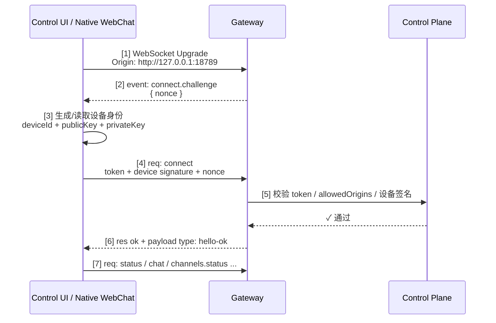

## 9.3 连接生命周期：握手、认证与心跳

OpenClaw Gateway 通过 WebSocket 长连接与远端设备进行持久通信。本节深入 WebSocket 连接的完整生命周期，包括握手、认证令牌交换、心跳保活、异常恢复，以及这些机制如何确保分布式系统中的可靠性。

### 9.3.1 为什么是 WebSocket

相比 HTTP 的请求-响应模式，WebSocket 长连接有三个优势：

1. **双向通信**：服务器可以主动推送消息给客户端（如“有新任务”、“请求批准”）
2. **低延迟**：无需每次都建立新连接、协议握手，延迟更低
3. **连接复用**：一条连接上可以并行处理多个逻辑流

### 9.3.2 WebSocket 握手与认证流程

当前 Control UI / 原生 WebChat 的握手不再是旧资料里常见的 `pairing_token -> session_token -> HELLO/HELLO_ACK` 两阶段流程，而是包含以下关键步骤：（1）WebSocket Upgrade 建立传输层连接，（2）Gateway 发出 **`connect.challenge`** 事件携带 `nonce`，（3）客户端生成/读取设备身份，（4）客户端用 `nonce` 签名后发送 `connect` RPC，（5）控制平面校验 token / allowedOrigins / 设备签名，（6）Gateway 响应连接成功，（7）客户端发送业务请求。只有第（6）步通过后，连接才真正进入可用状态。



图 9-1：WebSocket 握手与 challenge-response 认证流程

这个流程里，控制面会同时检查三类边界：

- **Gateway 连接凭据**：由 `gateway.auth.mode` 与连接来源决定，可包括 token、password、deviceToken、bootstrapToken、trusted-proxy、Tailscale Serve 身份头或显式 `none`。
- **Origin 白名单**：由 `gateway.controlUi.allowedOrigins` 控制。
- **设备身份签名**：要求客户端使用 challenge 中的 `nonce` 对连接载荷签名。

本次 live 日志里最典型的拒绝原因就是：

- `CONTROL_UI_ORIGIN_NOT_ALLOWED`
- `CONTROL_UI_DEVICE_IDENTITY_REQUIRED`

换言之：**WebSocket Upgrade 只是传输层建立，真正的认证发生在 challenge 之后的 `connect` RPC**。

### 9.3.3 当前令牌与设备身份的分工

按照当前 live 行为，Control UI 链路更像是“五类认证材料”协同，而不是“长期 pairing_token + 短期 session_token”的固定组合：

| 材料 | 生命周期 | 用途 |
|------|---------|------|
| **Gateway Token / Password** | 可轮换 | 常见于首次接入，证明调用者具备控制面访问权限 |
| **已签发的 `deviceToken`** | 已配对设备可复用 | 让已批准设备在重连时优先复用既有设备信任 |
| **`bootstrapToken`** | 引导期短生命周期 | 某些首次配对 / token handoff 场景下的过渡材料 |
| **设备身份（deviceId + publicKey + privateKey）** | 本地长期保存 | 证明“这就是之前见过的同一设备” |
| **Challenge Nonce** | 单次握手有效 | 防重放，要求每次连接都重新签名 |

在浏览器/Control UI 场景里，设备身份通常保存在本地存储中；连接时先收到 `connect.challenge`，再用其中的 `nonce` 生成签名，最后把 `device.id`、`publicKey`、`signature`、`signedAt` 一起发给 Gateway。

Control UI 首连常见的是“共享 token/password + 设备签名 + nonce”，而已批准设备的重连则可能优先复用 Gateway 曾签发的 `deviceToken`。

这意味着当前排障重点也发生了变化：

- 不是先查“session_token 有没有过期”，而是先查 `Origin`、共享密钥 / `deviceToken`、设备签名链与 `nonce` 是否同时满足。
- 如果 token 正确但仍连接失败，往往是 `allowedOrigins`、配对批准状态，或设备身份签名链路没有通过。

### 9.3.4 心跳与保活机制

在长连接中，网络中间件（代理、防火墙）可能因为空闲一段时间而主动断开连接。心跳机制用来防止这种“无辜掉线”。

当前 Gateway 的保活逻辑可以拆成两层：服务端发送 WebSocket ping，并按策略广播 `tick`；客户端根据 `hello-ok.policy.tickIntervalMs` 维护连接活性。TypeScript Gateway client 会把任意事件或响应作为 liveness 信号；只有在连接空闲、没有未完成请求，并且超过约 `2 * tickIntervalMs` 没有任何活动时，才会以 `4000 "tick timeout"` 关闭连接并触发重连。Swift/OpenClawKit 与浏览器 Control UI 的 watchdog 行为并不完全相同，下面只是 TS 客户端的概念化伪代码：

```javascript
if (pendingRequests === 0 && now - lastActivityTime > tickIntervalMs * 2) {
  client.close(code=4000, reason="tick timeout");
  reconnect();
}
```

### 9.3.5 异常恢复与重连策略

设备与 Gateway 的连接可能因为多种原因断开：网络抖动、设备重启、Gateway 升级等。OpenClaw 设计了智能重连机制。

#### 重连的退避策略

设备应遵循指数退避（exponential backoff）：

```python
attempt = 0
while not connected:
    delay = min(
        base_delay * (exponential_base ^ attempt),
        max_delay
    )
    attempt += 1
    wait(delay)
    try_connect()
```

典型参数：

- `base_delay` = 1 秒
- `exponential_base` = 2
- `max_delay` = 30 秒

#### 重连后的状态恢复

重连后，设备不需要从头推送所有状态；客户端应按当前协议重新握手、接收快照或刷新状态，并根据事件 `seq` / `stateVersion` 判断本地视图是否需要重取。当前公开协议不承诺“从任意检查点无缝恢复所有未完成会话”，书中不应把 PostgreSQL、checkpoint replay 或跨小时自动续跑写成稳定能力。

实践上，重连验收应关注三件事：连接是否重新认证成功、快照是否能反映当前 Gateway 状态、断线期间的外部副作用是否能通过日志或会话记录对账。

### 9.3.6 连接与会话的关键差异

初学者常混淆“连接”与“会话”的概念。这里澄清一下：

| 维度 | 连接（Connection） | 会话（Session） |
|-----|-----------------|--------------|
| **作用** | 传输通道 | 状态容器 |
| **生命周期** | WebSocket 连接建立 → 断开 | 用户任务开始 → 完成/超时 |
| **绑定关系** | 通常 1 连接携带 1 个设备身份；受信后端/控制路径可例外，设备也可重连 | 1 会话 ↔ 多个连接（设备可重连） |
| **中断后** | 连接丢失，设备需重连 | 会话历史可重新加载；未完成模型/工具工作需按幂等性复核或重试 |
| **数据存储** | 内存中（连接信息） | 会话历史、transcript 与可持久化的工具结果；不等同于任意任务 checkpoint |

### 9.3.7 本节小结

1. **握手阶段**：当前 Control UI 先收到 `connect.challenge`，再通过带 `nonce` 的签名 `connect` RPC 完成真正认证。
2. **认证机制**：当前关键材料是共享密钥 / `deviceToken` / 可能的 `bootstrapToken`、`gateway.controlUi.allowedOrigins` 与设备身份签名链，而不是旧资料里那种固定的 `pairing_token + session_token` 描述。
3. **心跳保活**：公开 keepalive 语义以 `hello-ok.policy.tickIntervalMs`、`tick` 与连接活动状态为准；客户端可以按实现再发额外保活流量，但不应把协议写死成固定 PING/PONG 或“只看 tick”。
4. **异常恢复**：指数退避重连、快照刷新与会话历史重载可提升连续性，但不承诺从任意检查点恢复未完成任务。
5. **概念区分**：连接是传输层，会话是业务层；设备可重连，外部副作用和中断中的工具执行必须通过日志或幂等重试对账。
