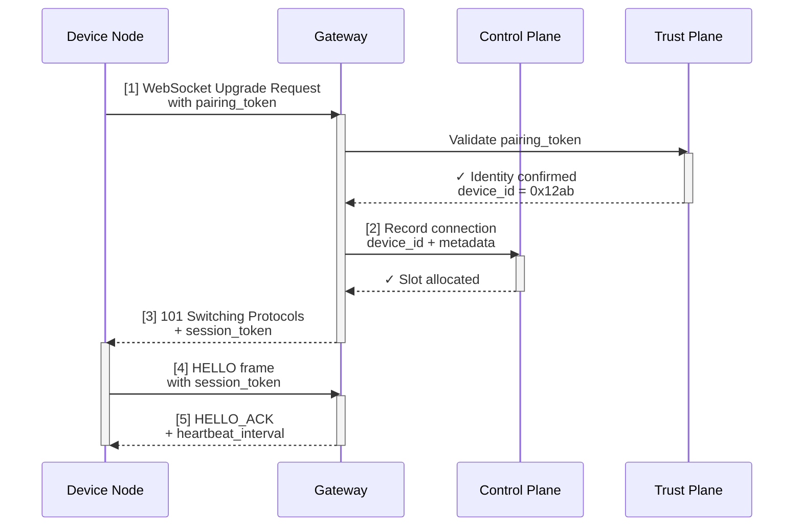

## 9.3 连接生命周期：握手、认证与心跳

OpenClaw Gateway 通过 WebSocket 长连接与远端设备进行持久通信。本节深入 WebSocket 连接的完整生命周期，包括握手、认证令牌交换、心跳保活、异常恢复，以及这些机制如何确保分布式系统中的可靠性。

### 9.3.1 为什么是 WebSocket

相比 HTTP 的请求-响应模式，WebSocket 长连接有三个优势：

1. **双向通信**：服务器可以主动推送消息给客户端（如"有新任务"、"请求批准"）
2. **低延迟**：无需每次都建立新连接、协议握手，延迟更低
3. **连接复用**：一条连接上可以并行处理多个逻辑流

### 9.3.2 WebSocket 握手与认证流程

当一个设备（如家里的树莓派）想要连接到 Gateway 时，整个流程如下：



设备发起 HTTP Upgrade 请求，携带握手阶段获得的长期 `pairing_token`。信任平面验证令牌有效性（是否存在、未过期、设备未被吊销、所属租户未被禁用），控制平面随即分配连接插槽并生成短期 `session_token`，Gateway 返回 101 升级成功。

连接升级后，设备立即发送 HELLO 帧（携带 `session_token` 和能力声明），Gateway 回应 HELLO_ACK 并下发心跳间隔（默认 30 秒）、最大消息大小等配置参数。心跳间隔约定完成后，连接进入正常运行状态；若 60 秒内未收到任何帧，Gateway 视设备离线并主动关闭连接。

### 9.3.3 认证令牌的生命周期

OpenClaw 使用两层令牌机制：

| 令牌类型 | 生命周期 | 用途 | 刷新方式 |
|---------|---------|------|--------|
| **Pairing Token（配对令牌）** | 长期（数月至数年） | WebSocket 握手阶段的身份验证 | 手动密钥轮换（参考 9.5 节） |
| **Session Token（会话令牌）** | 短期（本连接） | 后续所有消息的认证 | 握手时颁发，连接断开失效 |

配对令牌的 payload 包含：

```json
{
  "device_id": "0x12ab",
  "user_id": "user_123",
  "issued_at": 1711100000,
  "expires_at": 1742636000,
  "scopes": ["read_session", "write_tool_result", "read_heartbeat"]
}
```

**关键点**：

- `device_id` 与 `user_id` 绑定，防止跨用户冒充
- `scopes` 限制该设备可以执行的操作（读会话、写工具结果、心跳）
- 令牌过期时，设备需要通过 DM（或其他渠道）从 Gateway 申请新的

#### 会话令牌的生成与撤销

- Gateway 在握手时生成，与该条 WebSocket 连接一一对应
- 连接断开后，Gateway 立即标记该 `session_token` 为已失效
- 设备重连时获得新的 `session_token`，旧令牌无法用于后续操作

### 9.3.4 心跳与保活机制

在长连接中，网络中间件（代理、防火墙）可能因为空闲一段时间而主动断开连接。心跳机制用来防止这种"无辜掉线"。

Gateway 的检活逻辑：

```
if (now - last_message_time > 60s) {
  // 超过 2 倍心跳间隔（默认 30s × 2）无消息，主动断开
  connection.close(code=1000, reason="heartbeat_timeout");
  log_event("device_offline", device_id);
}
```

### 9.3.5 异常恢复与重连策略

设备与 Gateway 的连接可能因为多种原因断开：网络抖动、设备重启、Gateway 升级等。OpenClaw 设计了智能重连机制。

#### 重连的退避策略

设备应遵循指数退避（exponential backoff）：

```
attempt = 0
while not connected:
    delay = min(
        base_delay * (exponential_base ^ attempt),
        max_delay
    )
    attempt += 1
    wait(delay)
    try_connect()
```

典型参数：

- `base_delay` = 1 秒
- `exponential_base` = 2
- `max_delay` = 300 秒（5 分钟）

#### 重连后的状态恢复

重连后，设备不需要从头推送所有状态。Gateway 的控制平面负责恢复：

1. **会话状态持久化**：所有已完成的步骤都被记录到存储（如 PostgreSQL）
2. **设备重连时**：控制平面加载该设备关联的所有未完成会话
3. **继续执行**：Agent 从上一个检查点继续执行，而不是重新开始

```
if device_reconnected(device_id):
    sessions = load_sessions_for_device(device_id)
    for session in sessions:
        if session.status == "waiting_for_device":
            resume_from_checkpoint(session)
```

这样设计的意义是：**即使设备断线数小时，重连后也能无缝恢复，用户不会丢失进度**。

### 9.3.6 连接与会话的关键差异

初学者常混淆"连接"与"会话"的概念。这里澄清一下：

| 维度 | 连接（Connection） | 会话（Session） |
|-----|-----------------|--------------|
| **作用** | 传输通道 | 状态容器 |
| **生命周期** | WebSocket 连接建立 → 断开 | 用户任务开始 → 完成/超时 |
| **绑定关系** | 1 连接 ↔ 1 设备 | 1 会话 ↔ 多个连接（设备可重连） |
| **中断后** | 连接丢失，设备需重连 | 会话状态被保存，设备重连后恢复 |
| **数据存储** | 内存中（连接信息） | 持久化存储（会话历史、工具结果） |

### 9.3.8 本节小结

1. **握手阶段**：信任平面验证身份，控制平面分配插槽，双方交换配置参数
2. **认证机制**：两层令牌（配对令牌 + 会话令牌）确保每条连接的合法性
3. **心跳保活**：周期性发送 PING/PONG，防止代理中间件误断
4. **异常恢复**：指数退避重连、会话状态持久化，确保服务连续性
5. **概念区分**：连接是传输层，会话是业务层；设备可重连，任务不丢失
