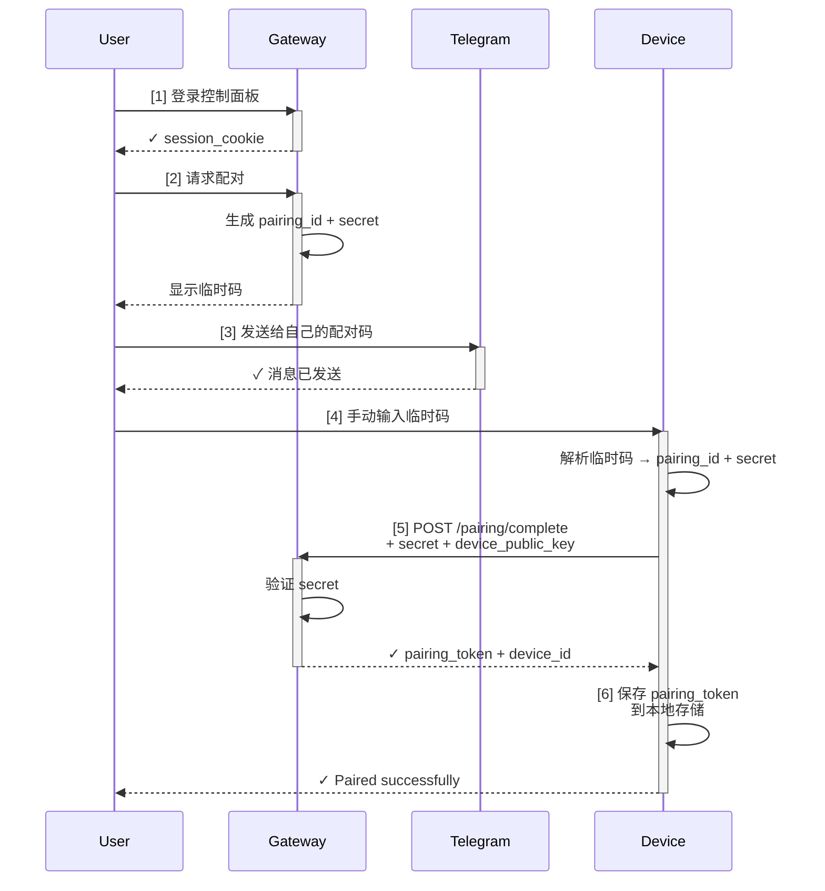
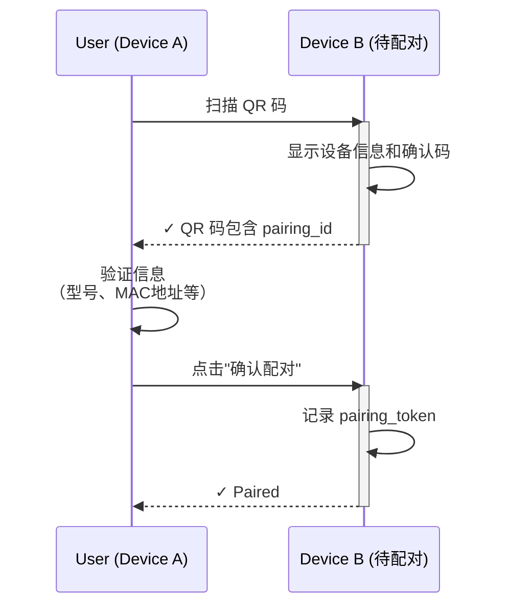

## 9.5 渠道配对与信任建立

分布式系统中最基础的问题是"你是谁，我凭什么信任你"。OpenClaw 通过**渠道配对**机制将陌生的远端设备与用户身份绑定，建立信任关系。本节讨论配对流程、密钥管理与吊销策略。

### 9.5.1 配对的必要性

想象你要给树莓派（部署在家里）一个"进入 Gateway 的通行证"。这个通行证需要满足：

1. **安全性**：只有你的树莓派能用，其他设备冒充不了
2. **隐私性**：通行证不能被网络窃听
3. **可管理性**：你可以随时吊销它，比如设备丢失或被侵入
4. **易用性**：配对过程不能太复杂，个人用户也能自助完成

这就是配对机制的目标。

### 9.5.2 配对的信任引导过程

配对本质上是一个"**信任引导（Trust Bootstrap）**"问题：Gateway 与设备第一次相遇时互不认识，需要通过某个信任源建立初始关系。

OpenClaw 采用 **DM 配对**（Direct Message Pairing）作为主要方案：

#### 第 0 步：用户登录 Gateway

用户通过网页或 App 登录 Gateway 的控制面板：

```
https://gateway.example.com/dashboard
登录: user_123 / password
获得: session_cookie + CSRF token
```

登录时的信任链已经存在：

- 用户知道自己的密码（本地知识）
- 通过 HTTPS 安全通道（网络加密）
- Gateway 的身份由 TLS 证书确保（PKI 信任）

#### 第 1 步：用户发起配对请求

用户在控制面板点击"添加设备"，输入设备信息：

```
设备名称: my_raspberrypi
设备类型: Raspberry Pi 4B
描述: Home automation hub
```

Gateway 生成配对邀请：

```
pairing_invitation:
  pairing_id: pair_7f9e2a
  user_id: user_123
  device_name: my_raspberrypi
  expires_at: <now + 1 hour>
  secret: <random 32 bytes>
```

#### 第 2 步：通过 DM 传递配对码

用户在支持的渠道（Telegram、WhatsApp、Discord 等）将配对码发送给自己：

**DM 内容（自动生成）**：

```
🔐 OpenClaw 配对码

设备: my_raspberrypi
配对 ID: pair_7f9e2a
临时码: 4a7f-9e2a-1c5b-8d3f
过期时间: 2026-03-22 16:00 UTC

⚠️ 安全提示：
- 这个码只有你能看到（你的私密消息）
- 有效期仅 1 小时，过期需重新生成
- 不要分享给任何人
- 在设备上输入这个码即可完成配对

输入命令: openclaw pair 4a7f-9e2a-1c5b-8d3f
```

关键设计点：

- **DM 通道是信任的**：这是用户与自己的私密通道（加密的、无第三方可见）
- **临时码**：只有 1 小时有效期，降低暴露风险
- **显式确认**：用户必须看到并手动在设备上输入，防止无意识的配对

#### 第 3 步：设备使用临时码完成握手

```
on device (raspberrypi):
  $ openclaw pair 4a7f-9e2a-1c5b-8d3f

输出:
  ✓ Paired successfully
  Device ID: 0x12ab
  Server: gateway.example.com
  User: user_123
```

设备内部的流程：

```
1. 解析临时码 → pairing_id + secret
2. 发起 HTTP POST 到 Gateway:
   POST /api/pairing/complete
   {
     "pairing_id": "pair_7f9e2a",
     "secret": <hex of secret>,
     "device_id": <random device_id>,
     "device_public_key": <ECDP256 public key>
   }

3. Gateway 验证:
   - pairing_id 是否存在且未过期
   - secret 是否匹配
   - 返回 pairing_token（长期令牌）

4. 设备保存:
   pairing_token = <long-term token>
   device_id = 0x12ab
   gateway_url = gateway.example.com
```

完成后，设备拥有了进入 Gateway 的"通行证"——`pairing_token`。

### 9.5.3 配对流程的完整时序图



**关键的信任转移**：

1. 用户登录 Gateway = 用户身份已验证（基于密码 + HTTPS）
2. 用户在 DM 中看到码 = 用户能私密访问该渠道
3. 设备拥有 secret = 设备能证明是用户手动配对的
4. pairing_token 颁发 = Gateway 承认该设备属于该用户

### 9.5.4 多个渠道的配对与一致性

一个用户可能在 Telegram、WhatsApp、Discord 等多个渠道使用 OpenClaw。这些是**渠道配对**，不是设备配对。

#### 渠道配对 vs 设备配对

| 维度 | 渠道配对（Channel Pairing） | 设备配对（Device Pairing） |
|-----|---------------------------|------------------------|
| **对象** | 某个用户在某个渠道的身份 | 运行 Agent 的物理设备 |
| **例子** | user_123 的 Telegram 账号 | 树莓派 (device_id=0x12ab) |
| **用途** | 接收消息、发送回复 | 执行工具、保存状态 |
| **数量** | 一个用户多个渠道 | 一个用户多个设备 |
| **配对方式** | 用户在渠道内点击"验证" | 通过 DM + 临时码 |
| **信任建立** | 由该渠道的身份系统保证 | 通过 DM（跨渠道信任）|

#### 多个设备的场景

用户可能在多个地方运行 OpenClaw Node：

```
用户 user_123
├── 设备 1: Raspberry Pi 4B (device_id=0x12ab)
│   └── pairing_token = token_abc123
├── 设备 2: 家里台式机 (device_id=0x45cd)
│   └── pairing_token = token_def456
└── 设备 3: 办公室 NAS (device_id=0x78ef)
    └── pairing_token = token_ghi789
```

每个设备都有独立的 pairing_token，但都映射到同一个用户 user_123。Agent 可以跨设备调度，比如"在台式机上执行计算密集任务，在 NAS 上保存结果"。

### 9.5.5 密钥轮换与吊销

长期令牌（pairing_token）的安全性需要定期维护。

#### 密钥轮换（Key Rotation）

用户可以主动轮换设备的令牌（比如定期安全卫生）：

```
on user dashboard:
  设备: my_raspberrypi
  上次轮换: 2025-01-15
  [轮换密钥] 按钮

流程:
  1. Gateway 生成新的 pairing_token
  2. 通过 DM 将新码发送给用户
  3. 用户在设备上运行: openclaw rotate <new_code>
  4. 设备保存新的 pairing_token，删除旧的
  5. Gateway 标记旧 token 为已失效
```

好处：

- 即使旧令牌被窃取，也无法再用
- 用户可以定期轮换（建议每 3 个月一次）
- 整个过程不需要中断设备运行

#### 令牌吊销（Token Revocation）

如果设备丢失或被侵害，用户可以立即吊销：

```
on user dashboard:
  设备: my_raspberrypi
  状态: 在线
  [吊销访问权限] 按钮 (危险操作)

流程:
  1. Gateway 立即标记 pairing_token 为已吊销
  2. 下一次该设备尝试连接时，握手会失败
  3. 设备无法再访问任何会话或工具
  4. 日志记录吊销事件（审计）
```

重要行为：

- **立即生效**：不等待设备重连，立即拒绝
- **不可恢复**：吊销后需要重新配对
- **留下审计痕迹**：记录吊销时间、原因（可选）

### 9.5.6 渠道配对的安全考虑

不同渠道的信任程度不同，配对流程需要根据渠道的安全性调整。

#### 信任等级矩阵

| 渠道 | 端到端加密 | 用户可信度 | 推荐配对方式 |
|-----|----------|----------|-----------|
| **Telegram** | ✓（私聊） | 高 | DM + 临时码 |
| **WhatsApp** | ✓ | 高 | DM + 临时码 |
| **Email** | ✗ | 中 | 不推荐（易被窃听） |
| **公开渠道（Discord 公群）** | ✗ | 低 | 不支持 |
| **本地 CLI（同一局域网）** | 看配置 | 高 | QR 码 + 本地验证 |

#### Email 的风险

如果用户通过邮件接收临时码，可能被中间人窃听：

```
❌ 不安全示例：
用户邮件 → 临时码发送 → 邮件服务器存储 →
黑客可能读取邮件服务器日志 → 冒充用户的设备
```

**最佳实践**：Email 仅作为备选方案，且配对码应该更短有效期（15 分钟），并要求额外的出带外确认（如短信）。

### 9.5.7 本地配对与 QR 码

对于局域网内的设备（同一办公室、家庭），可以使用更便捷的本地配对：



**优势**：

- 无需通过网络发送临时码
- QR 码包含的信息可由用户物理验证（设备外观、LED 灯闪烁确认等）
- 适合办公网络或家庭网络

### 9.5.8 与 9.2、11.4 的协作

本节的配对流程与其他章节的协作：

- **[9.2 控制平面](9.2_control_plane.md)**：配对后，控制平面维护设备-用户的映射，路由时使用
- **[9.3 WebSocket 握手](9.3_ws_handshake.md)**：pairing_token 用于 WebSocket 握手阶段的认证
- **[11.4 安全最佳实践](../11_reliability_security/11.4_guardrails.md)**：pairing_token 的签名算法、加密存储、吊销机制的详细实现

### 9.5.9 本节小结

渠道配对是 OpenClaw 信任的基石：

1. **信任引导**：通过用户已有的信任渠道（如私密 DM），建立与陌生设备的初始信任
2. **DM 配对流程**：用户登录→生成临时码→通过 DM 发送→设备输入→颁发长期令牌
3. **多渠道与多设备**：一个用户可以在多个渠道、多个设备上部署，每个都有独立的身份标识
4. **生命周期管理**：密钥轮换（定期更新）、吊销（紧急停用）、审计（完整日志）
5. **渠道特异性**：不同渠道的安全性不同，配对流程应相应调整

理解配对机制对于设计安全的分布式系统至关重要。它不仅建立了初始信任，也为后续的权限检查、审计、以及紧急吊销等机制奠定了基础。
