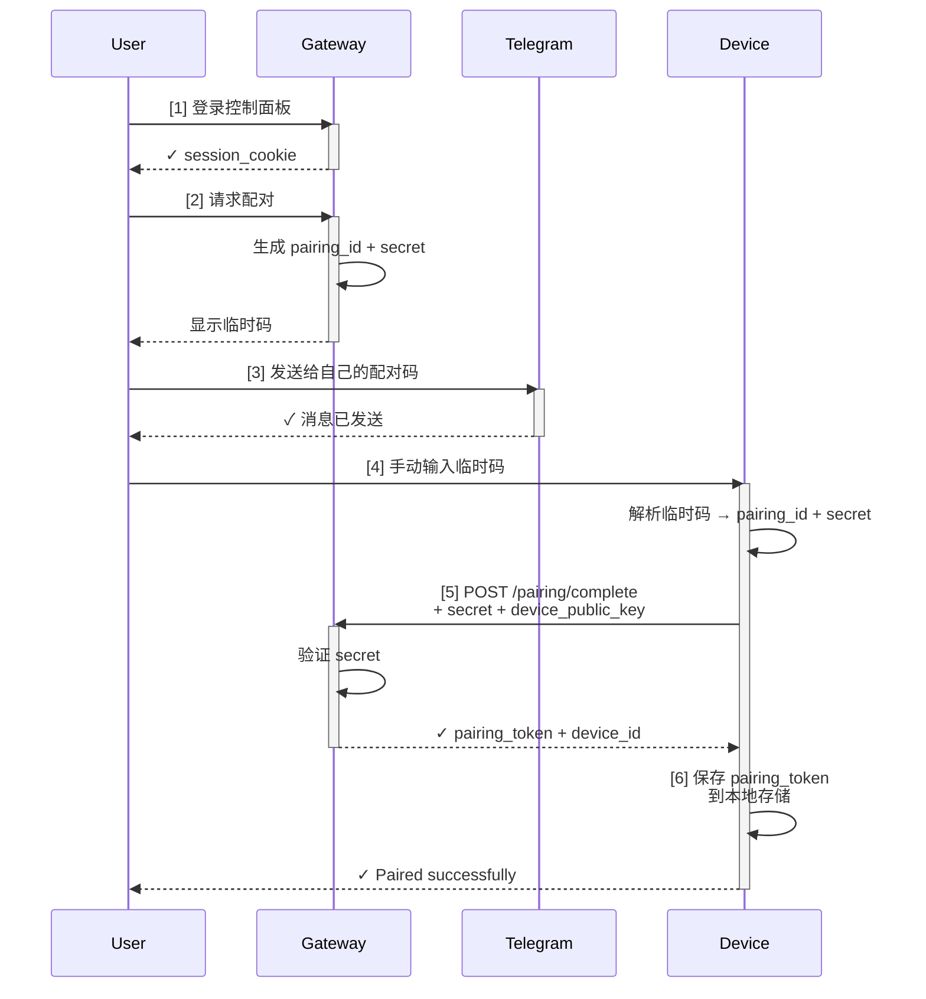

## 9.5 渠道配对与信任建立

分布式系统中最基础的问题是"你是谁，我凭什么信任你"。OpenClaw 通过**渠道配对**机制将陌生的远端设备与用户身份绑定，建立信任关系。本节讨论配对流程、密钥管理与吊销策略。

### 9.5.1 配对的必要性

想象你要给树莓派（部署在家里）一个"进入 Gateway 的通行证"。这个通行证需要满足：

1. **安全性**：只有你的树莓派能用，其他设备冒充不了
2. **隐私性**：通行证不能被网络窃听
3. **可管理性**：你可以随时吊销它，比如设备丢失或被侵入
4. **易用性**：配对过程不能太复杂，个人用户也能自助完成

这就是配对机制的目标。

### 9.5.2 配对的信任引导过程

配对本质上是一个"**信任引导（Trust Bootstrap）**"问题：Gateway 与设备第一次相遇时互不认识，需要通过某个信任源建立初始关系。

OpenClaw 采用 **DM 配对**（Direct Message Pairing）作为主要方案：

#### 第 0 步：用户登录 Gateway

用户通过网页或 App 登录 Gateway 的控制面板，信任链已经存在：

- 用户知道自己的密码（本地知识）
- 通过 HTTPS 安全通道（网络加密）
- Gateway 的身份由 TLS 证书确保（PKI 信任）

#### 第 1 步：用户发起配对请求

用户在控制面板点击"添加设备"，Gateway 生成配对邀请（含 pairing_id、user_id、过期时间与 32 字节随机 secret）。

#### 第 2 步：通过 DM 传递配对码

用户在支持的渠道（Telegram、WhatsApp、Discord 等）将配对码发送给自己：

**DM 内容（自动生成）**：

```text
🔐 OpenClaw 配对码

设备: my_raspberrypi
配对 ID: pair_7f9e2a
临时码: 4a7f-9e2a-1c5b-8d3f
过期时间: 2026-03-22 16:00 UTC

⚠️ 安全提示：
- 这个码只有你能看到（你的私密消息）
- 有效期仅 1 小时，过期需重新生成
- 不要分享给任何人
- 在设备上输入这个码即可完成配对

输入命令: openclaw pair 4a7f-9e2a-1c5b-8d3f
```

关键设计点：

- **DM 通道是信任的**：这是用户与自己的私密通道（加密的、无第三方可见）
- **临时码**：只有 1 小时有效期，降低暴露风险
- **显式确认**：用户必须看到并手动在设备上输入，防止无意识的配对

#### 第 3 步：设备使用临时码完成握手

设备解析临时码，发起 HTTP POST 到 Gateway（携带 pairing_id、secret、device_public_key）；Gateway 验证 secret 匹配且未过期，颁发长期 pairing_token；设备保存 pairing_token 至本地存储，完成配对。

### 9.5.3 配对流程的完整时序图



**关键的信任转移**：

1. 用户登录 Gateway = 用户身份已验证（基于密码 + HTTPS）
2. 用户在 DM 中看到码 = 用户能私密访问该渠道
3. 设备拥有 secret = 设备能证明是用户手动配对的
4. pairing_token 颁发 = Gateway 承认该设备属于该用户

### 9.5.4 多个渠道的配对与一致性

一个用户可能在 Telegram、WhatsApp、Discord 等多个渠道使用 OpenClaw。这些是**渠道配对**，不是设备配对。

#### 渠道配对 vs 设备配对

| 维度 | 渠道配对（Channel Pairing） | 设备配对（Device Pairing） |
|-----|---------------------------|------------------------|
| **对象** | 某个用户在某个渠道的身份 | 运行 Agent 的物理设备 |
| **例子** | user_123 的 Telegram 账号 | 树莓派 (device_id=0x12ab) |
| **用途** | 接收消息、发送回复 | 执行工具、保存状态 |
| **数量** | 一个用户多个渠道 | 一个用户多个设备 |
| **配对方式** | 用户在渠道内点击"验证" | 通过 DM + 临时码 |
| **信任建立** | 由该渠道的身份系统保证 | 通过 DM（跨渠道信任）|

一个用户可拥有多个设备（如树莓派、台式机、NAS），每个设备有独立的 pairing_token，均映射到同一用户，Agent 可跨设备调度。

### 9.5.5 密钥轮换与吊销

长期令牌（pairing_token）的安全性需要定期维护。

#### 密钥轮换（Key Rotation）

用户可以主动轮换设备的令牌（比如定期安全卫生）：

- Gateway 生成新的 pairing_token，通过 DM 将新码发送给用户
- 用户在设备上运行 `openclaw rotate <new_code>`，设备保存新令牌并删除旧的
- 即使旧令牌被窃取也无法再用；整个过程不需要中断设备运行

#### 令牌吊销（Token Revocation）

如果设备丢失或被侵害，用户可以立即吊销：

- **立即生效**：Gateway 立即标记 pairing_token 为已吊销，不等待设备重连
- **不可恢复**：吊销后设备无法再访问任何会话或工具，需要重新配对
- **留下审计痕迹**：记录吊销时间与原因，便于事后审查

### 9.5.9 本节小结

1. **信任引导**：通过用户已有的信任渠道（如私密 DM），建立与陌生设备的初始信任
2. **DM 配对流程**：用户登录→生成临时码→通过 DM 发送→设备输入→颁发长期令牌
3. **多渠道与多设备**：一个用户可以在多个渠道、多个设备上部署，每个都有独立的身份标识
4. **生命周期管理**：密钥轮换（定期更新）、吊销（紧急停用）、审计（完整日志）
5. **渠道特异性**：不同渠道的安全性不同，配对流程应相应调整
