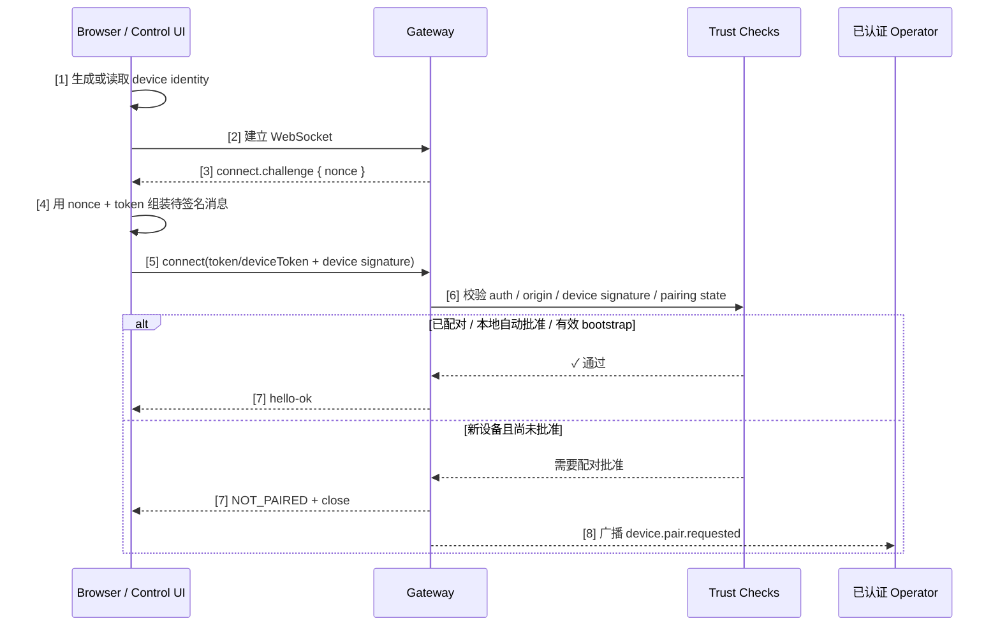

## 9.5 渠道配对与本地信任建立

分布式系统中最基础的问题是“你是谁，我凭什么信任你”。OpenClaw 仍然需要解决这个问题，但在当前版本里，**控制面访问**与**外部渠道配对**已经是两条需要分开理解的链路。本节重点解释当前控制面如何建立本地设备信任，以及这与历史上常见的 DM 配对方案有什么区别。

### 9.5.1 配对的必要性

无论是浏览器打开 Control UI，还是远端节点尝试接入 Gateway，系统都必须回答四个问题：

1. 这个调用者是否持有合法的控制面凭据？
2. 这个请求是否来自被允许的来源（Origin）？
3. 这是不是之前见过的同一台设备？
4. 如果设备或令牌泄露，能否立即吊销并重建信任？

这就是配对与信任链的意义。

### 9.5.2 当前控制面的信任引导过程

在最近的实现中，Control UI / 原生 WebChat 的主流程已经不再是“DM 临时码 + `POST /pairing/complete`”。当前更准确的理解方式是：

1. 浏览器或客户端本地生成/保存一份设备身份（`deviceId`、`publicKey`、`privateKey`）。
2. Gateway 建立 WebSocket 后主动下发 `connect.challenge`。
3. 客户端用 challenge 中的 `nonce` 对连接载荷签名，再发送 `connect` RPC。
4. Gateway 同时检查：
   - `gateway.auth` 中的 token/password 是否通过；
   - 当前 `Origin` 是否在 `gateway.controlUi.allowedOrigins` 中；
   - 设备签名是否和 `nonce` 匹配。
5. 如果设备尚未被批准，Gateway 会进入 `pairing required` / `device.pair.requested` 分支；只有在 loopback auto-approve 或部分已显式信任的场景下，才可能直接进入已知设备集合。后续同一设备再连接时，则依靠 `deviceId + publicKey + deviceToken + 签名` 维持信任连续性。

这意味着当前控制面的“配对”更像是**设备身份注册 + challenge-response 验证**，而不是把 DM 临时码作为主要入口。

### 9.5.3 当前控制面配对/信任建立时序

图 9-2：控制面设备身份信任建立时序

关键的信任转移如下：

1. 调用者持有有效的 gateway token 或 password。
2. 浏览器/客户端能从被允许的 Origin 发起连接。
3. 设备能对 challenge 中的 `nonce` 做正确签名，证明它持有之前生成的私钥。
4. Gateway 接受该设备身份，并把它纳入后续可识别设备集合。

### 9.5.4 当前控制面与历史 DM 配对的区别

早期资料里常见的 **DM 配对**（Direct Message Pairing）并不是完全无效，但它批准的是渠道 sender，不是远端设备或节点身份。远端节点/设备通常走 setup code、bootstrap token 与 Gateway device pairing；阅读旧资料时，务必区分下面两类流程：

| 流程 | 更适合的场景 | 当前应如何理解 |
|------|-------------|----------------|
| Control UI 设备身份 + challenge-response | 本地浏览器、原生 WebChat、控制台访问 | 当前控制面的主路径 |
| DM 临时码 / 配对码 | 渠道用户身份引导，例如控制“谁可以和机器人私聊” | 渠道侧 sender 配对能力，不是远端节点或 Control UI 设备身份的默认启动路径 |
| Setup code / bootstrap token | 远端节点、headless node 或需要节点预授权的接入 | 内置 QR/setup-code bootstrap 偏向 node 引导；非本地 Control UI/浏览器访问应先配置 allowed origins 与 token/password、Tailscale 或 trusted-proxy，再走设备身份与批准流程 |

如果你在日志里看到的是 `CONTROL_UI_ORIGIN_NOT_ALLOWED`、`CONTROL_UI_DEVICE_IDENTITY_REQUIRED` 这类错误，问题通常不在“有没有 DM 配对码”，而在 **Origin 白名单、gateway token 或设备签名链**。

### 9.5.5 令牌轮换与吊销

设备令牌、设备身份和控制面访问令牌的安全性都需要定期维护。

#### 令牌轮换

用户可以主动轮换设备令牌或重新建立设备身份绑定：

- Gateway 生成新的 device token，或要求设备重新完成 challenge-response 绑定。
- 客户端更新本地保存的 device token / identity 关联信息。
- 即使旧令牌被窃取也无法再用；整个过程是否需要重新审批，以当前版本策略为准。

#### 令牌吊销

如果设备丢失或被侵害，应立即吊销：

- **立即生效**：`devices revoke --device <id> --role <role>` 会吊销该 role 的 device token，不等待设备重连。
- **不等于删除配对记录**：吊销 token 会阻止该 token 重连；如需移除设备信任记录，应使用 `devices remove <deviceId>`。
- **留下审计痕迹**：记录吊销时间与原因，便于事后审查。

### 9.5.6 本节小结

1. **信任引导**：Gateway 必须同时验证控制面凭据、来源和设备身份。
2. **当前控制面流程**：设备身份生成 → `connect.challenge` → 带 nonce 的签名 `connect` → Gateway 验证通过。
3. **多渠道与多设备**：一个用户可以在多个渠道、多个设备上部署，每个都有独立的身份标识。
4. **生命周期管理**：令牌轮换（定期更新）、吊销（紧急停用）、审计（完整日志）。
5. **流程区分**：DM 临时码主要治理渠道 sender 身份；远端节点或控制面设备接入应看 setup code / bootstrap token 与设备签名链。
