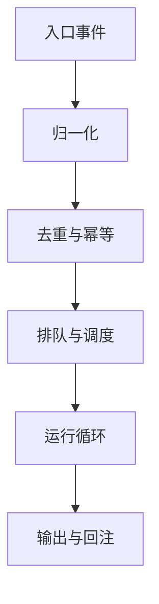
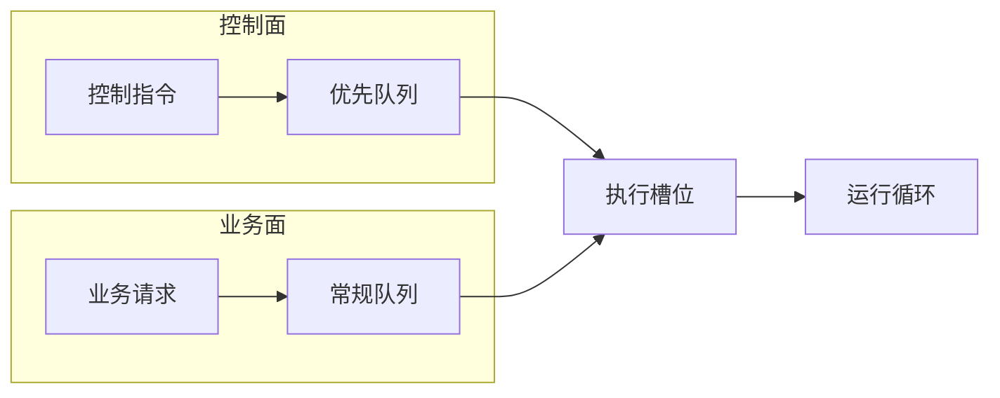

## 10.1 入口、排队与并发控制

本节聚焦 Agent 系统最容易被低估的一层：入口治理。讨论三件事：把渠道事件归一化为可调度任务；用幂等与去重把重放变成安全行为；用分层队列与槽位预算实现反压与公平性。最后给出一套可直接落地的指标与排障命令，用来判断瓶颈究竟发生在入口、模型还是工具侧。

> [!NOTE]
> 本节讨论的归一化、去重窗口和分层队列属于入口治理的通用工程模式。本书聚焦方法与证据链：字段名与实现细节若与你的版本不同，以 `--help`、`status --deep` 与结构化日志的实际输出为自证入口。

### 10.1.1 从渠道事件到可调度任务：归一化的边界与产物

渠道侧的事件常带有渠道特有的结构差异，例如群聊提及、引用、分片、编辑、撤回、重投递等。如果入口把这些差异原封不动交给运行时，后续会出现两类问题。

- 会话归属不稳定：同一语义被分配到不同会话，导致上下文错位。
- 幂等边界混乱：重复事件无法判定，导致重复执行或重复扣费。

入口更稳妥的责任边界是归一化：把任何渠道事件映射为内部统一的任务模型，并把关键字段变成可观测、可审计的证据。

- task_id：系统内部任务标识。
- event_key：去重键，见 10.1.2。
- session_key：会话归属键，见[第六章](../06_context_memory/README.md)。
- intent：意图分类，至少区分控制面与业务面，见 10.1.4。
- budget：预算边界，例如最大等待、最大模型调用次数、最大工具调用次数。

以下是入口完成归一化后，交给运行时的标准结构示例：

```json
{
  "task_id": "tk_8f4b2a9c",
  "event_key": "telegram:msg_9812:v1",
  "session_key": "user_456:proj_789",
  "intent": "business_query",
  "budget": {
    "maxWaitSeconds": 30,
    "maxModelCalls": 5,
    "maxToolCalls": 10
  },
  "payload": {
    "text": "帮我查询一下北京今天的天气"
  }
}
```



图 10-1：入口从事件到可调度任务的最小流水线

一个简单但有效的验收标准是：可以把任意一条线上消息还原为归一化产物，并解释清楚它为什么属于该会话、为什么会进入该队列、拿到哪些预算。

### 10.1.2 幂等与去重：让重放可控而不是灾难

重复事件是常态：渠道回调重试、网关重连重报、消费者故障恢复、网络抖动引发的重复投递。入口如果缺少幂等语义，后果往往不是多回答一次，而是重复产生副作用。

幂等不是做一个判重表就结束，而是先把系统不变量写清楚。

- 对同一个 event_key，业务面只允许产生一次可见副作用。
- 在重试与故障恢复中，允许重复执行纯计算，但禁止重复执行不可逆写操作。

一个可落地的实现方式是去重窗口加副作用提交点。

- 去重窗口负责短时间内的重复事件直接命中已有状态。
- 副作用提交点标记外部写入已发生，一旦跨过，就不再允许无差别重试，只能走补偿或对账。

操作示例：用 Redis 实现一个 10 分钟去重窗口。写入成功才继续执行，否则直接返回已处理。

说明：这里用 Redis 只是为了表达“原子写入 + TTL 去重窗口”的语义；实现可替换为任何支持等价原子语义的存储。

```bash
redis-cli SET oc_dedupe:${EVENT_KEY} 1 NX EX 600
```

在真正执行写工具之前，再写入一次提交点标记，避免重复写入外部系统。

```bash
redis-cli SET oc_commit:${EVENT_KEY} 1 NX EX 86400
```

注意：event_key 的选择比存储更重要。可操作的经验是至少包含三部分：渠道事件唯一标识、会话键、归一化版本号。归一化逻辑升级时，用版本号避免新旧键冲突。

本书[第九章](../09_gateway_protocol/README.md)对幂等与顺序保证做了更系统的讨论。

- [9.3 事件幂等与一致性保障](../09_gateway_protocol/9.3_event_idempotency.md)

### 10.1.3 反压与并发：把长时任务治理成预算问题

Agent 系统的任务驻留时间长，且会同时消耗多类资源：模型并发、工具并发、外部 API 额度、上下文内存、网关连接与输出带宽。把并发治理简化成一个全局并发上限通常会失效，因为瓶颈会在不同资源间迁移。

更可靠的方式是分层反压，把容量表达成预算，并让预算可观测。

- 入口反压：排队深度过大时，拒绝新任务并给出明确提示，而不是让请求在未知状态悬挂。
- 会话反压：限制单会话并行任务数，避免争用会话状态与记忆。
- 资源反压：分别对模型调用、工具调用与外部 API 配额设限。

操作示例：给任务设置最大等待时间，超过后主动取消并回注原因。以下用伪代码表达状态机逻辑。

```text
if now - enqueued_at > max_wait_seconds:
  mark task as cancelled
  release slot
  emit progress event: queue_timeout
```

验收建议：用压测把入口放大到峰值的 10 倍，观察是否满足三条底线。

- 系统延迟可预测：排队等待与端到端时延曲线稳定，不出现无界增长。
- 资源会释放：取消与超时会释放槽位，不出现占槽不干活。
- 成本可控：重试与退避不会把成本放大成雪崩。

取消、超时与重试的细节在 10.4 展开。

### 10.1.4 公平性与抢占：把控制面与业务面隔离

只用 FIFO 排队在两类场景容易崩坏：群聊或批处理带来大量长任务淹没控制指令；单一用户或单一渠道异常放量导致全局不可用。实践上建议把任务至少分成两条车道：控制面车道与业务面车道，并确保控制面具备优先或抢占语义。

- 控制面：停止、状态查询、诊断、紧急降级等，必须低延迟。
- 业务面：常规问答、文档分析、长链路工具调用等，允许排队与降级。



图 10-2：双车道加槽位的调度心智模型

操作示例：当业务队列拥堵时，仍保证控制面可用。下面是一个“调度策略伪配置”，用于表达双队列与槽位划分思路，不代表 OpenClaw 官方字段。

```json
{
  "scheduler": {
    "controlLane": {
      "concurrencySlots": 2,
      "maxQueueLength": 50,
      "timeoutSeconds": 10
    },
    "businessLane": {
      "concurrencySlots": 8,
      "maxQueueLength": 500,
      "timeoutSeconds": 60
    }
  }
}
```

### 10.1.5 指标与排障：用证据判断瓶颈在入口还是下游

入口治理的常见误区是实现了但无法验证。建议至少建立四类指标，并用它们作为压测验收门槛。

- 深度：队列长度、分层队列占比、拒绝率。
- 时延：排队等待、任务驻留、首字节时间、端到端时延。
- 资源：模型并发占用、工具并发占用、外部 API 配额、上下文大小。
- 可靠性：重试率、取消率、超时率、重复事件命中率。

操作示例：如果系统以 JSON 结构化日志输出 trace 字段，可用 jq 快速筛选。以下示例把同一 trace_id 的事件串起来。

```bash
cat runtime.log | jq -c 'select(.trace_id=="t-YYYYMMDD-001") | {ts, stage, event, cost_ms, err}'
```

操作示例：如果系统暴露 Prometheus 指标，可用 curl 拉取并筛选队列指标，名称因实现而异。

```bash
curl -s http://127.0.0.1:9090/metrics | grep -E 'queue|enqueue|dequeue|wait_seconds'
```
