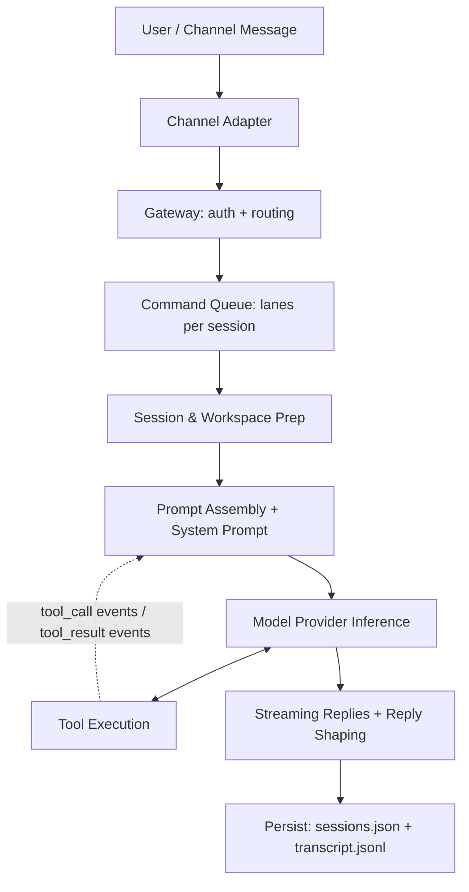
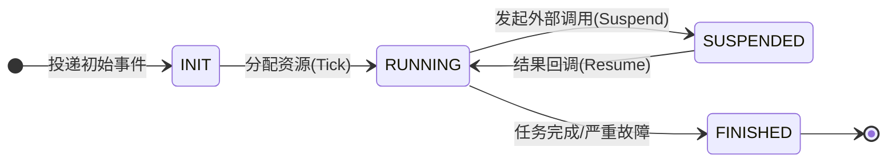
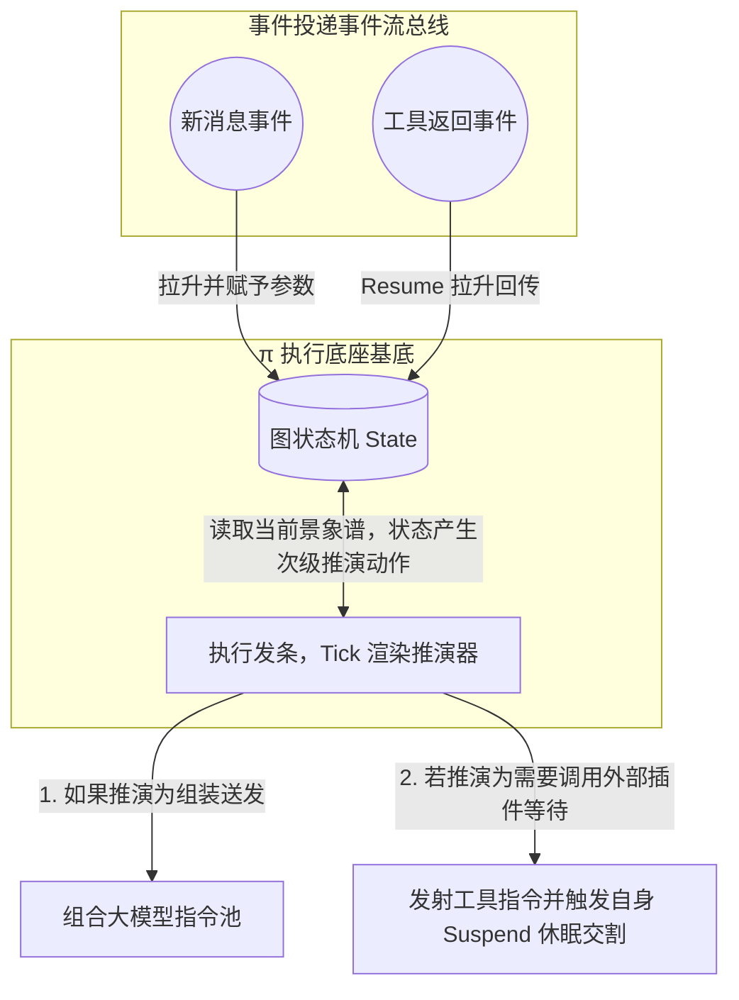
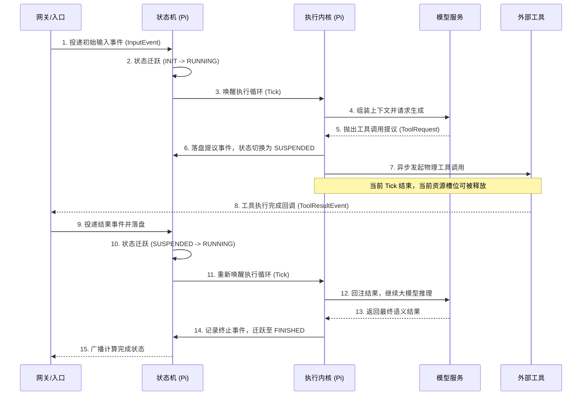

## 10.1 π 运行底座：重构智能体的心智模型

开发者初次接触智能体框架时，最容易犯的错误是把智能体等同于“一个带记忆的死循环大模型调用”。例如一段 Python `while True` 循环，一旦模型开始思考、调用耗时几分钟的工具接口，这个线程就被死死霸占；如果在此过程中网络闪断或者节点重启，这几分钟产生的几万个 Token 与中间思考便随风飘散。

为了支持企业级业务中动辄横跨十几小时、需要多人介入的业务流水线，OpenClaw 没有使用同步阻塞式的开发范式，而是使用了基于事件驱动的 **π（pi）** 运行底座。此底座的代码并非凭空构建，而是直接建立在 **[π (pi) 开源项目](https://github.com/badlogic/pi-mono/)** 的极简执行骨架之上。

**OpenClaw 端到端运行主链路图（官方基准）：**

### 10.1.1 引擎与外壳：Pi 与 OpenClaw 的定位

如果说 OpenClaw 是一个连接了各大聊天软件（如 WhatsApp、Telegram等）、能 24 小时在线处理杂务的“全能管家外壳（Wrapper）”，那么 **Pi 就是真正赋予这个管家“思考、写代码和执行能力”的底层大脑（Engine）**。

Pi（`pi-coding-agent` / `pi-mono`）由知名开源开发者 Mario Zechner（网络 ID 为 badlogic）创建。它的诞生初衷，是为了反抗市面上日益“臃肿”的 AI 智能体框架。作为一个专注于 AI 智能体的单体仓库（Monorepo），它在物理实现上清晰地划分了运行时层（如 `pi-agent-core` 处理状态流转、`pi-ai` 统一多模型调用接口）、基础设施层（如终端渲染库 `pi-tui`）以及应用层（如交互式的 `pi-coding-agent` 或 Slack 机器人 `pi-mom`）。

其架构理念深深影响了 OpenClaw，体现为以下几个极简特性：

- **极简内核与高度可扩展**：Pi 的引擎内核拒绝臃肿，默认只提供 Read、Write、Edit、Bash 四大底层高权限工具，并保持极短的系统提示词（System Prompt）。若需更高级的能力或定制工具，它依靠一种插件化架构，通过配置文件（如 `settings.json`）从 npm 或 Git 动态解析并加载扩展包。这种机制成功地将维护复杂度从内核剥离至包管理网络。
- **透明的记忆系统**：它不依赖黑盒的本地向量数据库，而是完全通过读取工程目录下的 `AGENTS.md` 或 `TODO.md` 等可见的纯文本文件来理解系统设定和项目架构。
- **YOLO 模式（完全自主执行）**：Pi 默认开启 YOLO (You Only Live Once) 模式。不同于传统框架在执行命令前总要求人工确认，Pi 在循环中不断读取、思考、执行，直到 LLM 认为任务完成。这一“不被打断”的哲学，正是 OpenClaw 能实现真正的异步后台挂机自动化的基础保证。

基于以上特性，这套极简到了只有三个核心组件的框架应运而生：**事件（Event）**、**状态机（StateMachine/Graph State）** 与 **执行内核（Executor）**。它们组成了一个完全异步、容错、可持续运行的心跳驱动系统（Tick-Based System）。

### 10.1.2 事件总线：系统唯一的流转图腾

在传统的 MVC 或者微服务 Web 开发里，我们习惯于用 API 接口和函数调用来传递数据和指令（例如 `call_llm(context)`）。
而在 π 框架中，所有对于系统状态的增量改变、对工具的调度期望、甚至模型吐出的字符，都不再是暂存内存的返回值，而是全部化作一个个 **Event（事件）** 丢入中心总线。

系统里发生的一切都是基于历史事件图谱构建的：

- 用户发送的消息是一个 `InputEvent`。
- 模型决定要调用 Google 搜索，它不直接触发请求代码，而是抛出一个 `ToolCallRequestedEvent`。
- 如果请求耗时超时了，会抛出一个 `TimeoutEvent`。

**为什么必须这么设计？**

因为只有数据（事件）是可以被持久化保存的，而运行到一半的线程与函数堆栈（CallStack）是无法恢复的。将一切化作事件日志，意味着即使即使被拔掉电源，备用服务器也可以通过读取“事件日志”恢复出断电前一刻的完整状态。

### 10.1.3 状态机：不可篡改的记忆闭环

所有的事件都被抛入总线后，系统必须根据事件决定下一步该干什么。这就引出了 π 框架的第二个支柱：**StateMachine（状态机）**。

初学者往往会疑惑：整个系统是共用一个状态机，还是有多个独立的状态机？在 π 的设计里，对此需要从**逻辑引擎**与**物理实例**两个层面来理解。简而言之：系统共用流转规则，每次任务独立数据实例。

- **逻辑引擎层面（单体共用）**：整个系统共用一套唯一的、极其死板的转换规则来负责调度所有流转。
- **物理实例层面（多体独立）**：每一个正在排队或者运转的任务，物理上都是一个强一致性的、互不干扰的有向无环图状态集合（Graph State）。如果系统同时并行处理一万个用户并发请求，物理上就会有一万个相互独立的状态图谱实例在被驱动。

在一次完整任务流中，每个状态实例的核心只发生如下四种主态转移：

1. **`INIT` (初始/待办)**：收到事件。此时只需要存储资源。
2. **`RUNNING` (活跃运转)**：正在执行，如向大语言模型请求结果，或正在组装上下文。
3. **`SUSPENDED` (物理挂起)**：一旦智能体决定调用一个耗时的物理工具（搜索、调用工具、等人工审批），状态机立刻将自身状态转化为 `SUSPENDED`。此时，系统会**立刻交出占据的 CPU 与内存线程句柄**，释放执行槽位。
4. **`FINISHED` (终态)**：任务圆满解答完毕或因为触碰预算额度底线（如深度超载、严重拒绝安全故障）而被硬阻断退出。

这种随时挂起和恢复（Suspend / Resume）的设计，使得系统能调度有限算力处理大量的并发请求。

状态在上述四种主态间的流转逻辑如下所示：

图 10-1：状态机主要状态流转

### 10.1.4 执行内核：Tick 心跳机制

如果系统被挂起了，谁来唤醒并具体拉动它走下一步？是靠 **Executor**（执行内核）。

执行内核就像是游戏引擎循环（Game Loop）里的发条。它仅通过一种称为 **Tick（滴答）** 的驱动机制来工作。一次 Tick 的使命非常简单：读取当前最新的图状态（State），推演出接下来应该执行的具体操作（例如，将前置提示词与刚刚获取的工具执行记录打包，向 LLM 发起新一轮的调用请求；或者决定不再继续推演，直接发出任务终结事件）。

完成这一步后，它便会“打卡下班”（将控制权交回底座）。由于它扮演的是极短周期的“短跑接力”角色，而非进行遥遥无期的“马拉松式蹲守”，这种设计能有效避免系统出现雪崩式的任务堵塞。

> [!NOTE]
> **Tick 是多久发一次的？（触发频率）**
> 
> 初学者常把这里的 Tick 和游戏引擎的固定帧率（如每秒 60 次）混淆。在 π 框架中，Tick **并没有固定的时间频率**，而是完全**事件驱动（Event-Driven）**的。
> 
> - **触发时机**：只有当总线接收到有效事件（如“收到新用户消息”、“工具执行完成并返回数据”）时，才会唤醒并触发一次 Tick，让执行内核进行下一步的状态核算与推演。
> - **静默休眠**：如果没有事件发生（例如系统正在等待大模型 API 响应，或者等待人类点击审批按钮），系统处于完全静默的“挂起（SUSPENDED）”态，不仅不发 Tick，也不会消耗由于轮询带来的任何 CPU 空转资源。

图 10-2：组件级执行推演关系图

### 10.1.5 综合流转周期时序

为了帮助建立直观认识，下面展示了 π 框架底层一次典型 Tick（滴答）流转周期的时序。可以看到，核心三组件是如何交替协作，并最终把原本阻塞的循环化整为零的：

图 10-3：单次 Tick 典型事件流转时序图

理解了 **所有计算均为短期驱动（Tick）、所有等待均为挂起归档（Suspend）、一切变化皆为事件留痕（Event）** 的 π (pi) 理念，我们才能在后续小节中去分析排队控制到底拦在哪一层、外部恶劣注入如何被图节点属性无情抛弃，以及故障链路到底是怎样的容灾自愈流程。

### 10.1.6 运行时鲁棒性：流式输出与错误恢复

除了底层架构设计的极简，π 框架在演进过程中也直面了诸多真实场景下的长尾 Bug，尤其是在大语言模型流式输出（Streaming）和工具调用（Tool Calling）的鲁棒性打磨上，为 OpenClaw 提供了不可或缺的工程参考：

- **流式 JSON 解析容错**：在对接不同提供商时，模型输出的工具调用参数极易出现“有效 JSON 数据与额外截断垃圾字符拼凑”的乱象。如果核心引擎在最终收束时使用标准的、严格的 `JSON.parse` 解析，往往会因为尾部的微小噪音而直接判定任务执行失败。引入宽容的流式 JSON 解析策略（如 `parseStreamingJson`），是框架实现低成本、高稳定性收益的典型环节。
- **可恢复错误的回注模型**：在传统的智能体循环中，一旦遇到提供商端网络闪断或者短暂数据解析失败，系统常常将其视为致命错误，强行中断长时任务流（如标记为 `stopReason=error` 退场）。但对于动辄运行数小时的自动化任务来说，这种脆弱性不可接受。更健壮的设计是将这些非逻辑性异常分类为“可恢复错误（Recoverable Error）”，转化为一条普通消息实体，重新回注给大语言模型。模型不仅能借此理解当前的异常状态，还能通过强大的上下文自省能力，尝试主动调整重试策略。

这种直面底层不稳定因素，并将“错误”融入“事件图谱”从而触发模型进行自我纠错的设计思路，补齐了后台异步长期挂机最后一块维稳短板。

> [!WARNING]
> **高权限底层工具的安全约束边界**
> 
> π 框架默认依赖的 Bash 与大范围文件读写功能，本质上是本地工作站的极高权限入口。当通过 npm 或 git 引入大量社区扩展包配置，或者把框架进一步包装为团队多人协同机器人（如 `pi-mom`）时，供应链投毒和越权命令执行风险就会急剧倍增。
> 
> 面向企业级和团队场景运行的开放智能体平台，无法仅通过内核代码的“自觉性”来确保安全。必须在底层驱动平台之上，通过系统级的容器沙箱（如 Docker 虚拟化挂载方案）和基于角色的最小权限访问控制机制来进行硬隔离限制。关于应对终端指令逃逸与沙箱架构落地的详细防御建议，读者可参考第十一章相关内容。
